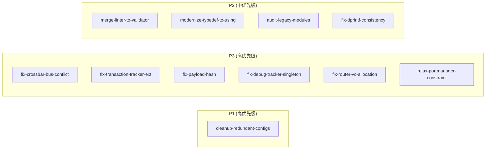

# OpenSpec Deps 分析报告

**生成时间**: 2026-05-25
**候选数量**: 11
**分析者**: spec-workflow/skills/deps

---

## 依赖图

**说明**: 所有 11 个 change 之间**无文件冲突、无 ADR 依赖、无接口依赖**。可以安全地按优先级顺序执行。

---

## Change 状态表

| 变更名称 | Phase | 状态 | 冲突 | 依赖 |
|----------|-------|------|------|------|
| cleanup-redundant-configs | P1.4 | ✅ ready | ✅ 无 | 无 |
| fix-crossbar-bus-conflict | P3.1 | ✅ ready | ✅ 无 | 无 |
| fix-transaction-tracker-ext | P3.2 | ✅ ready | ✅ 无 | 无 |
| fix-payload-hash | P3.3 | ✅ ready | ✅ 无 | 无 |
| fix-debug-tracker-singleton | P3.4 | ✅ ready | ✅ 无 | 无 |
| fix-router-vc-allocation | P3.5 | ✅ ready | ✅ 无 | 无 |
| relax-portmanager-constraint | P3.6 | ✅ ready | ✅ 无 | 无 |
| merge-linter-to-validator | P2.A | ✅ ready | ✅ 无 | 无 |
| modernize-typedef-to-using | P2.B | ✅ ready | ✅ 无 | 无 |
| audit-legacy-modules | P2.C | ✅ ready | ✅ 无 | 无 |
| fix-dprintf-consistency | P2.D | ✅ ready | ✅ 无 | 无 |

---

## 推荐执行顺序

所有 change **相互独立**，可按以下顺序执行（或任意顺序）：

| 顺序 | 变更名称 | Phase | 理由 |
|------|----------|-------|------|
| 1 | cleanup-redundant-configs | P1.4 | P1 最高优先级 |
| 2 | fix-crossbar-bus-conflict | P3.1 | P3 最高优先级 |
| 3 | fix-transaction-tracker-ext | P3.2 | — |
| 4 | fix-payload-hash | P3.3 | — |
| 5 | fix-debug-tracker-singleton | P3.4 | — |
| 6 | fix-router-vc-allocation | P3.5 | — |
| 7 | relax-portmanager-constraint | P3.6 | — |
| 8 | merge-linter-to-validator | P2.A | P2 最高优先级 |
| 9 | modernize-typedef-to-using | P2.B | — |
| 10 | audit-legacy-modules | P2.C | — |
| 11 | fix-dprintf-consistency | P2.D | — |

---

## 冲突警告

**文件冲突**: ✅ 未检测到任何文件冲突
**ADR 引用冲突**: ✅ 未检测到
**接口依赖冲突**: ✅ 未检测到

---

## 注意事项

1. **无 design.md**: 当前所有 change 只有 proposal.md，无 design.md。如果后续生成 design.md，可能产生接口依赖关系。
2. **fix-dprintf-consistency**: 作用域为 "DPRINTF usage site"（跨多个文件），建议单独执行。
3. **并行执行**: 由于所有 change 完全独立，可以考虑并行创建 worktree 执行多个 change（建议每批不超过 3 个 P3 change）。

---

## 后续步骤

进入 **Plan Phase 1**：基于上述推荐顺序，为各 change 创建 worktree 并执行。