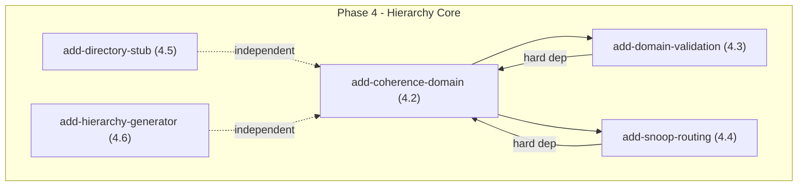

# OpenSpec Deps 分析报告

**生成时间**: 2026-05-28
**候选数量**: 5
**分析者**: spec-workflow/skills/deps
**来源**: Phase 4 Hierarchy Core changes

---

## 依赖图

**说明**:
- `add-domain-validation` 和 `add-snoop-routing` 依赖 `add-coherence-domain`
- `add-directory-stub` 和 `add-hierarchy-generator` 相互独立，可以并行

---

## Change 状态表

| 变更名称 | Phase | 任务数 | 依赖 | 状态 |
|----------|-------|--------|------|------|
| add-coherence-domain | 4.2 | 9 | 无 | ✅ ready |
| add-domain-validation | 4.3 | 6 | add-coherence-domain | ⏳ pending |
| add-snoop-routing | 4.4 | 4 | add-coherence-domain | ⏳ pending |
| add-directory-stub | 4.5 | 5 | 无 | ⏳ pending |
| add-hierarchy-generator | 4.6 | 6 | 无 | ⏳ pending |

---

## 推荐执行顺序

### Wave 1 (并行) - 2026-05-28
| 顺序 | 变更名称 | 理由 |
|------|----------|------|
| 1 | add-coherence-domain | 基础类，4.3/4.4 的前置条件 |
| 2 | add-directory-stub | 独立实现，可以并行 |

### Wave 2 (add-coherence-domain 完成后)
| 顺序 | 变更名称 | 理由 |
|------|----------|------|
| 3 | add-domain-validation | 依赖 add-coherence-domain |
| 4 | add-snoop-routing | 依赖 add-coherence-domain |

### Wave 3 (独立)
| 顺序 | 变更名称 | 理由 |
|------|----------|------|
| 5 | add-hierarchy-generator | Python 实现，独立于 C++ 核心 |

---

## 文件冲突分析

| 文件 | 涉及 Changes | 冲突风险 | 说明 |
|------|-------------|----------|------|
| `include/core/coherence_domain.hh` | add-coherence-domain, add-domain-validation, add-snoop-routing | 🔴 HIGH | 需串行执行 |
| `src/core/coherence_domain.cc` | add-snoop-routing | 🟡 MEDIUM | 需串行 |
| `src/core/module_factory.cc` | add-coherence-domain, add-domain-validation | 🟡 MEDIUM | 需串行 |
| `include/core/directory.hh` | add-directory-stub | 🟢 LOW | 独立文件 |
| `scripts/topology_generator.py` | add-hierarchy-generator | 🟢 LOW | Python 独立 |

---

## TDD 原则应用

根据 TDD (Test-Driven Development) 原则，建议执行顺序：

1. **先写测试，再实现代码**
   - 每个 change 应该先创建测试文件
   - 测试驱动实现

2. **并行 Wave 1**
   - `add-coherence-domain`: 先写 `test/test_coherence_domain.cc`
   - `add-directory-stub`: 先写 `test/test_directory.cc`

3. **串行 Wave 2**
   - `add-domain-validation`: 先写 `test/test_domain_boundary.cc`
   - `add-snoop-routing`: 先写 `test/test_snoop_routing.cc`

4. **独立 Wave 3**
   - `add-hierarchy-generator`: 先写 `test/python/test_hierarchy_generator.py`

---

## 注意事项

1. **串行化冲突文件**: `coherence_domain.hh` 被 3 个 change 引用，必须串行执行
2. **Wave 1 必须先完成**: 4.3/4.4 依赖 4.2 的实现
3. **Python 测试独立**: add-hierarchy-generator 的测试可以在任何时候运行

---

## 后续步骤

进入 **Plan Phase**：基于上述推荐顺序，为各 change 创建 worktree 并执行。

建议：
- 先创建 `add-coherence-domain` 和 `add-directory-stub` 的 worktree
- 然后按顺序创建其他 worktree