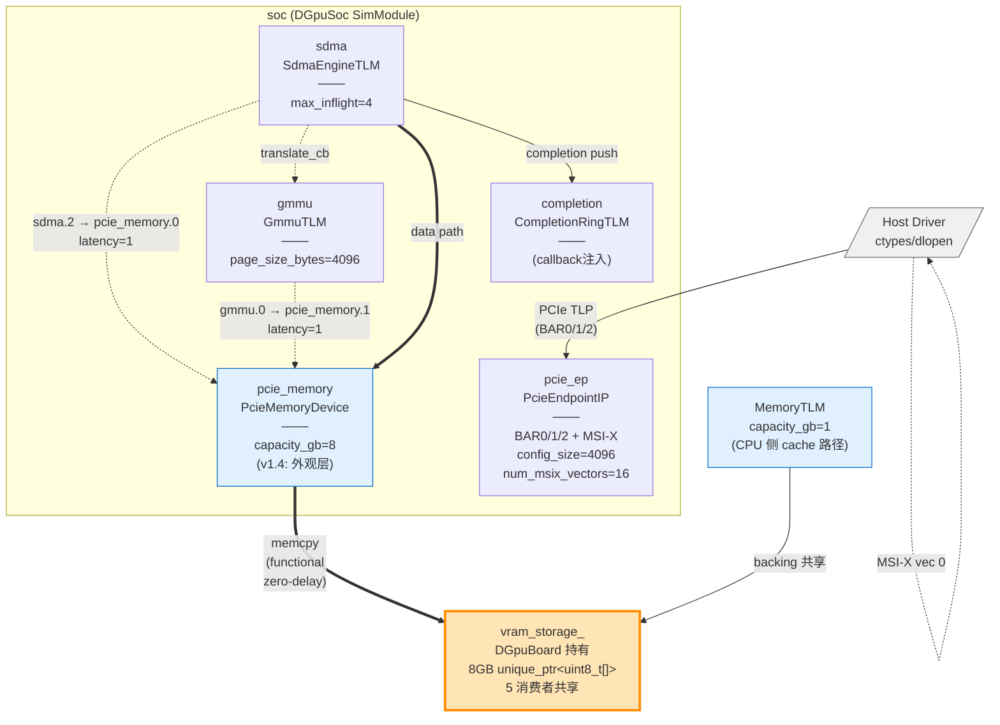
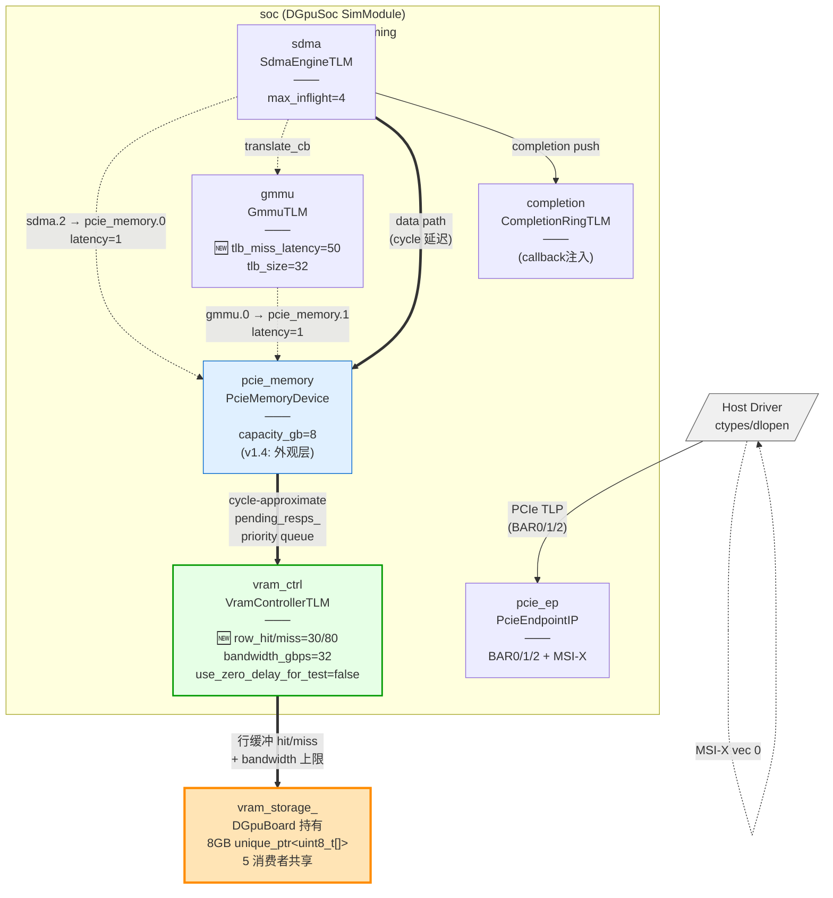
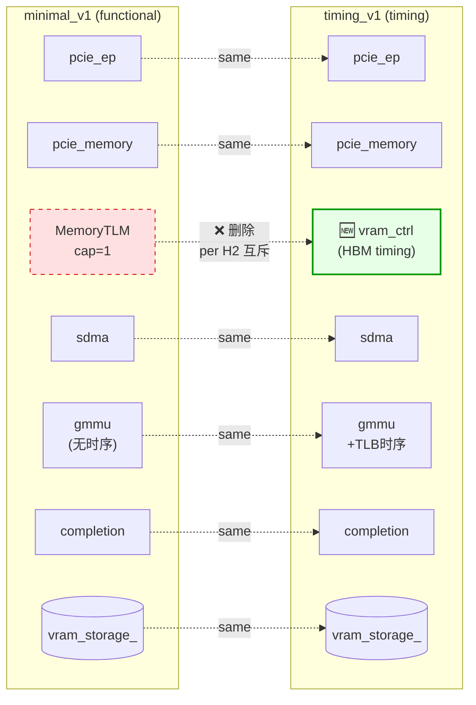
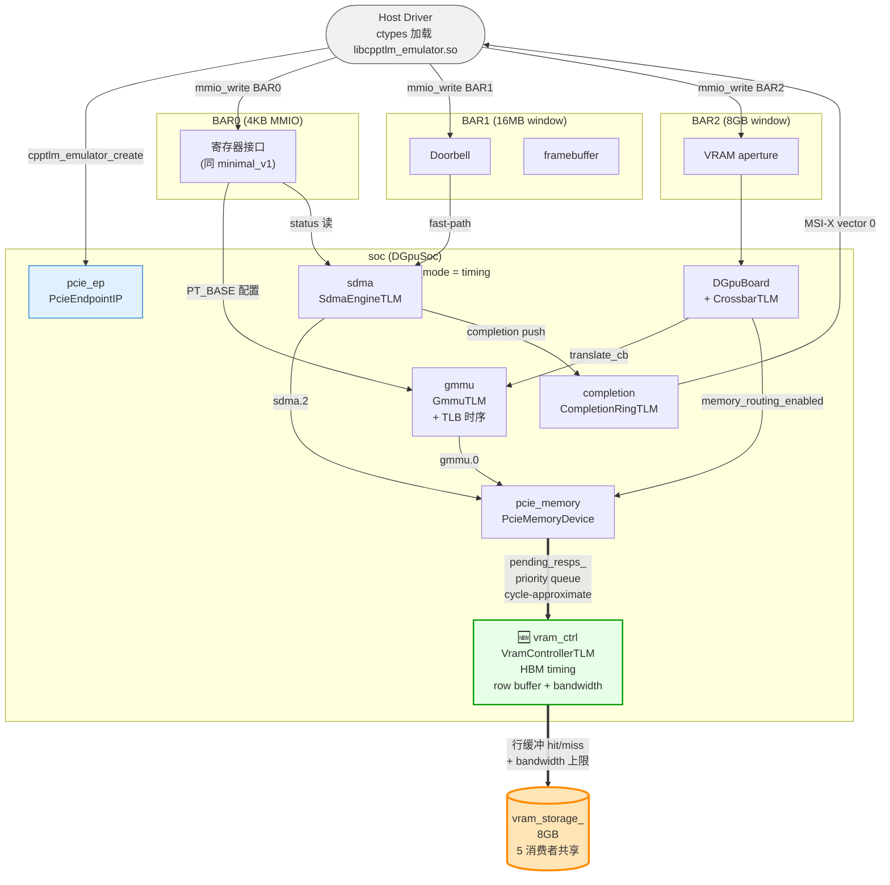
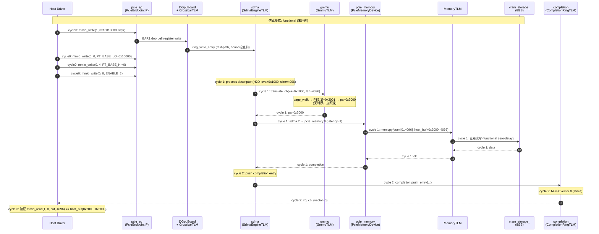
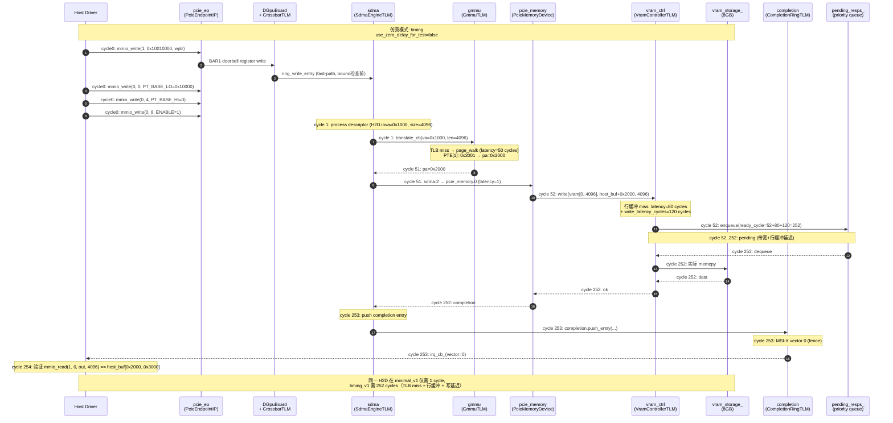
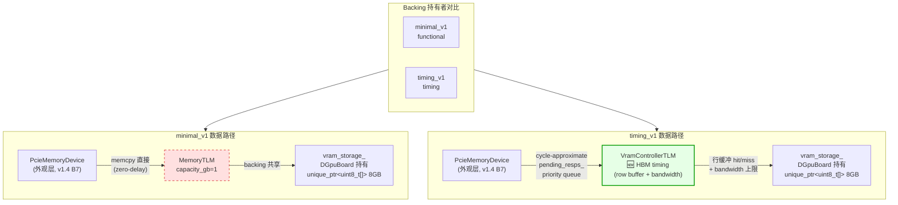
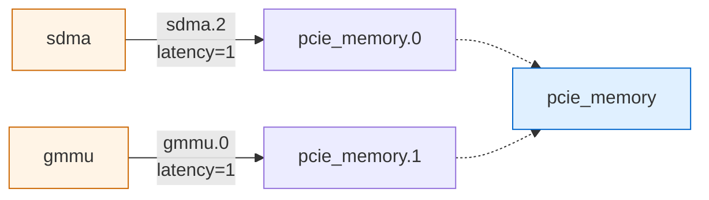

# minimal_v1 vs timing_v1: 数据流 + 拓扑连接对比

> **版本**: v1.0 — 2026-09-30
> **状态**: ✅ 已与代码真相对齐（D-AXI v1.4 + ADR-DGPU-11）
> **配套文档**:
> - [architecture.md](architecture.md) — Minimal DGpu SoC 业务架构视图
> - [timing-mode.md](timing-mode.md) — Timing-mode SoC MVP 详细设计
> - [D-AXI v1.4](../pcie/driver-visible-minimal-soc.md) — 单一 VRAM 真源 + 6 模块拓扑 + 7 实施铁律
> - [ADR-DGPU-11](../../adr/ADR-DGPU-11-timing-mode-soc-scope.md) — Timing-mode SoC 范围
> - [ADR-DGPU-05](../../adr/ADR-DGPU-05-vram-storage-ownership.md) — 单一 VRAM 真源
> - [ADR-DGPU-06](../../adr/ADR-DGPU-06-axi-mem-bundle-boundary.md) — AxiMemBundle vs PcieTlpBundle 边界
> - [D3-evolution-roadmap.md](d3-evolution-roadmap.md) — D3 演进路径

---

## 1. 一图概览（TL;DR）

> **3 个 dgpu config 代次说明**:
> - `dgpu_board_v1.json` (Stage 1.4-2.1, **2026-09-15**) — **早期 Board 视角**（完整 GPGPU compute path：cp/tmu/sq/GpuCluster）— **本对比文档不覆盖**，详见 [§13](#13-vs-dgpu_board_v1json早期-board-视角代次对照) 与 [../dgpu-board/architecture.md](../dgpu-board/architecture.md)
> - `dgpu_soc_minimal_v1.json` (D-AXI v1.4, **2027-02-09**) — 当前 functional-mode
> - `dgpu_soc_timing_v1.json` (D-AXI v1.4 + ADR-DGPU-11, **2027-02-11**) — 当前 timing-mode

| 维度 | `dgpu_soc_minimal_v1.json` | `dgpu_soc_timing_v1.json` |
|------|---------------------------|---------------------------|
| **仿真模式** | functional (隐式) | **timing** (`"simulation_mode": "timing"`) |
| **模块数** | **5** | **6** (+ VramControllerTLM) |
| **显式 connections** | 2 | 2 (per H2: 0 新增) |
| **routing flags** | 4 (`display=false`) | 3 (display 默认 false) |
| **framebuffer** | 16MB | 16MB |
| **数据路径终点** | `MemoryTLM` 直接 memcpy | `VramControllerTLM` 行缓冲 + bandwidth |
| **cycle advance** | 立即返 (zero-delay) | pending_resps_ priority queue |
| **GMMU 时序** | 无 (functional) | `tlb_miss_latency_cycles=50`, `tlb_size=32` |
| **VRAM 时序** | 无 | `row_hit/miss_cycles=30/80`, `bandwidth_gbps=32` |
| **顶层 config 字段** | `description` + 4 routing flags | + `simulation_mode` |
| **关联 spec** | `minimal-dgpu-soc-test-coverage` | `dgpu-soc-timing` |
| **tests cases** | 14 (含 ABI smoke) | 37 (`[dgpu_soc_timing]`) |
| **覆盖 scenarios** | 7 spec → 14 cases (200%) | 52 spec → 37 cases + SECTIONs (≥100%) |

**一句话差异**: minimal_v1 + VramControllerTLM + timing 时序参数 = timing_v1。connections 与 backing 真源不变。

---

## 2. 拓扑结构对比（Graph View）

### 2.1 minimal_v1 拓扑



**图例说明**:
- 实线箭头 (`-->`): PCIe TLP / PCIe 物理链路
- 虚线箭头 (`-.->`): JSON 显式连接 + 内部回调
- 双线箭头 (`==>`): functional-mode 数据路径（直接 memcpy）
- 橙色填充: **vram_storage_**（D-AXI 单一真源）

---

### 2.2 timing_v1 拓扑



**与 minimal_v1 差异**:
- 🟢 新增 `vram_ctrl` (VramControllerTLM) — 绿色高亮
- 🟢 `vram_ctrl → vram_storage_` 走 cycle-approximate 路径
- `MemoryTLM` 不在 timing_v1 拓扑中（被 VramControllerTLM 取代，per H2 互斥）
- GMMU 加 TLB 时序参数

---

### 2.3 拓扑对比 Side-by-Side



---

## 3. 数据流图（Data Flow Diagram）

### 3.1 minimal_v1 数据流（functional-mode）

```mermaid
flowchart TB
    Start([Host Driver<br/>ctypes 加载 libcpptlm_emulator.so])

    subgraph BAR0["BAR0 (4KB MMIO)"]
        Reg["寄存器接口<br/>GMMU_PT_BASE_LO/HI<br/>GMMU_CTRL<br/>SDMA_STATUS"]
    end

    subgraph BAR1["BAR1 (16MB window)"]
        Doorbell["Doorbell<br/>0x10010000"]
        FB["framebuffer<br/>16777216 bytes"]
    end

    subgraph BAR2["BAR2 (8GB window)"]
        VRAMap["VRAM aperture"]
    end

    subgraph SoC["soc (DGpuSoc)"]
        PCIeEP["pcie_ep<br/>PcieEndpointIP"]
        Board[DGpuBoard<br/>+ CrossbarTLM<br/>4 routes 仲裁]
        SDMA["sdma<br/>SdmaEngineTLM"]
        GMMU["gmmu<br/>GmmuTLM"]
        PCIeMem["pcie_memory<br/>PcieMemoryDevice<br/>(外观层)"]
        Comp["completion<br/>CompletionRingTLM"]
    end

    MemTLM["MemoryTLM<br/>capacity_gb=1<br/>(CPU 侧 cache 路径)"]
    Vram[("vram_storage_<br/>8GB<br/>5 消费者共享")]

    Start -->|cpptlm_emulator_create| PCIeEP
    Start -->|mmio_write BAR0| Reg
    Start -->|mmio_write BAR1| Doorbell
    Start -->|mmio_write BAR2| VRAMap

    Reg -->|PT_BASE 配置| GMMU
    Reg -->|status 读| SDMA
    Doorbell -->|fast-path<br/>(bound 前)| SDMA
    VRAMap --> Board

    Board -->|translate_cb<br/>gmmu_routing_enabled| GMMU
    Board -->|memory_routing_enabled| PCIeMem

    SDMA -->|sdma.2| PCIeMem
    GMMU -->|gmmu.0| PCIeMem

    PCIeMem -->|memcpy 立即<br/>zero-delay| MemTLM
    MemTLM -->|backing 共享| Vram

    SDMA -->|completion push| Comp
    Comp -->|MSI-X vector 0| Start

    style Vram fill:#ffe4b5,stroke:#ff8c00,stroke-width:3px
    style MemTLM fill:#ffe0e0,stroke:#cc0000,stroke-dasharray:5 5
    style Start fill:#f0f0f0,stroke:#666
    style PCIeEP fill:#e0f0ff,stroke:#0066cc
```

### 3.2 timing_v1 数据流（timing-mode）



**与 minimal_v1 关键差异**:
- ❌ **MemoryTLM 不在拓扑**（被 VramControllerTLM 取代，per H2 互斥）
- 🟢 **VramControllerTLM** 新增（绿色高亮）
- `pcie_memory → vram_storage_` 路径：memcpy 立即 → pending_resps_ 周期队列
- `GMMU` 加 TLB 时序参数（`tlb_miss_latency_cycles=50`）

### 3.3 数据流关键节点对比

| 节点 | minimal_v1 | timing_v1 |
|------|-----------|-----------|
| PCIe TLP 入口 | pcie_ep | 同 |
| BAR 路由分发 | DGpuBoard + CrossbarTLM | 同 |
| 地址翻译 | GmmuTLM (立即返) | GmmuTLM (TLB miss latency=50 cycles) |
| 数据转发 | sdma → pcie_memory.0 (latency=1) | 同 |
| 翻译路径 | gmmu → pcie_memory.1 (latency=1) | 同 |
| **backing 持有** | MemoryTLM → vram_storage_ | **VramControllerTLM** → vram_storage_ |
| **延迟模型** | memcpy 立即返 (zero-delay) | pending_resps_ 周期队列 |
| **completion** | cycle 1-2 | cycle N（依 backing 延迟） |

---

## 4. Cycle-by-Cycle 时序对比

### 4.1 minimal_v1 functional-mode 时序（4-cycle H2D 示例）



**关键时序点（minimal_v1）**:
- cycle 0: Host 触发 doorbell + 写 PT_BASE
- cycle 1: SDMA → GMMU → PcieMem → MemoryTLM → vram（**单 cycle 完成 4KB memcpy**）
- cycle 2: completion push → MSI-X
- cycle 3: Host 验证

---

### 4.2 timing_v1 timing-mode 时序（4-cycle H2D 示例）



**关键时序点（timing_v1）**:
- cycle 0: Host 触发 doorbell + 写 PT_BASE（同 minimal_v1）
- cycle 1-50: GMMU TLB miss → page walk（**50 cycle 延迟**）
- cycle 51-51: SDMA → PcieMem 转发（latency=1）
- cycle 52-251: VramController 行缓冲 miss + write latency（**200 cycle 延迟**）
- cycle 252: 实际 vram memcpy + 返回
- cycle 253: completion push → MSI-X
- cycle 254: Host 验证

---

### 4.3 同 case 时序对比表（4KB H2D descriptor）

| Cycle | minimal_v1 (functional) | timing_v1 (timing) |
|-------|------------------------|---------------------|
| 0 | Host doorbell + PT_BASE write | 同 |
| 1 | GMMU translate (TLB hit, 0 cycle)<br/>SDMA → PcieMem (1 cycle)<br> **4KB memcpy 完成** | GMMU translate (TLB miss, +50 cycles) |
| 2 | completion push → MSI-X | GMMU pending (cycle 1-50) |
| 3 | Host verify | GMMU pending |
| ... | - | SDMA pending |
| 51 | - | SDMA → PcieMem (latency=1) |
| 52 | - | VramController write start |
| 132 | - | 行缓冲 miss (80 cycles) 完成 |
| 252 | - | VramController write end (120 cycles) |
| 253 | - | completion push → MSI-X |
| 254 | - | Host verify |
| **总延迟** | **3 cycles** | **254 cycles** |
| **吞吐量** | ~1.33 GB/s/cycle | ~0.016 GB/s/cycle (per descriptor) |

> 实际吞吐是聚合 (1024 descs 并发)，test_dgpu_soc_timing_h2d.cc 断言 throughput ∈ [10, 32] GB/s。

---

## 5. Backing 持有者对比（D-AXI v1.4 §7 seam）



**关键差异**:
- **minimal_v1**: `pcie_memory → memcpy → MemoryTLM → vram_storage_`（3 层 functional 透传）
- **timing_v1**: `pcie_memory → pending_resps_ → VramControllerTLM → vram_storage_`（3 层 cycle-approximate）
- **MemoryTLM 与 VramControllerTLM 互斥**（per H2），不可同时存在

---

## 6. Routing Flags 对比

| flag | minimal_v1 | timing_v1 | 行为 |
|------|-----------|-----------|------|
| `simulation_mode` | (隐式 functional) | `"timing"` | 触发 cycle-approximate 路径 |
| `display_routing_enabled` | `false` | (默认 false) | D1 Display 路由（冻结面保护） |
| `storage_routing_enabled` | `true` | `true` | BAR1 → framebuffer storage |
| `gmmu_routing_enabled` | `true` | `true` | SDMA translate → GmmuTLM |
| `memory_routing_enabled` | `true` | `true` | BAR2 → PcieMemoryDevice |
| `framebuffer_size_bytes` | `16777216` (16MB) | `16777216` | framebuffer size |

---

## 7. 模块参数对比表

| 模块 | 参数 | minimal_v1 | timing_v1 | 说明 |
|------|------|-----------|-----------|------|
| **PcieEndpointIP** | `config_size` | 4096 | 4096 | PCIe 配置空间大小 |
| | `num_msix_vectors` | 16 | 16 | MSI-X 中断向量数 |
| | `bar_sizes` | [4096, 16777216, 8589934592] | 同 | [BAR0, BAR1, BAR2] |
| | `bar0_registers` | 4 个 GMMU/SDMA 寄存器 | 同 | PT_BASE_LO/HI, GMMU_CTRL, SDMA_STATUS |
| **PcieMemoryDevice** | `capacity_gb` | 8 | 8 | BAR2 8GB 容量（仅外观层） |
| **VramControllerTLM** | `row_hit_cycles` | N/A | 30 | 行缓冲命中延迟 |
| | `row_miss_cycles` | N/A | 80 | 行缓冲未命中延迟 |
| | `bandwidth_gbps` | N/A | 32 | 带宽上限 |
| | `read_latency_hit_cycles` | N/A | 30 | 读延迟（命中） |
| | `read_latency_miss_cycles` | N/A | 80 | 读延迟（未命中） |
| | `write_latency_cycles` | N/A | 120 | 写延迟 |
| | `use_zero_delay_for_test` | N/A | false | M5 显式门控 |
| **SdmaEngineTLM** | `max_inflight` | 4 | 4 | 最大并发 descriptor 数 |
| **GmmuTLM** | `page_size_bytes` | 4096 | 4096 | 页大小 |
| | `tlb_miss_latency_cycles` | N/A | 50 | TLB 未命中延迟 |
| | `tlb_size` | N/A | 32 | TLB entry 数 |
| **CompletionRingTLM** | (无 params) | - | - | 仅作 callback 注入点 |

---

## 8. Connections 对比（H2: 0 新增）



**两个 config connections 完全相同**（per H2: timing_v1 不新增连接）：
- `sdma.2 → pcie_memory.0` (SDMA 数据路径 → 内存端口 0)
- `gmmu.0 → pcie_memory.1` (GMMU 翻译路径 → 内存端口 1)

**GMMU 不在 Crossbar 数据路径**（per M9）—— GMMU 只做 `translate_cb` 回调，数据流仍走 SDMA → pcie_memory.0。

---

## 9. 关键设计约束（per ADR / Spec）

| 约束 ID | 来源 | 内容 |
|---------|------|------|
| **H2** | dgpu-soc-timing §1.4 | timing_v1 沿用 minimal_v1 functional 拓扑，0 new connections |
| **M9** | dgpu-soc-timing §6 | GMMU 不在 Crossbar 数据路径，仅做 translate_cb |
| **M5** | dgpu-soc-timing §5 | `use_zero_delay_for_test` 必须显式门控，functional-mode 默认 `true` |
| **TInv-1** | dgpu-soc-timing §7 | 共享 vram_storage_ 真源（timing-mode 适用） |
| **ADR-DGPU-05** | docs/adr | 单一 VRAM 真源归 DGpuBoard（5 消费者共享） |
| **ADR-DGPU-06** | docs/adr | chip-internal AXI (AxiMemBundle) vs board-level PCIe (PcieTlpBundle) 边界严格分离 |
| **ADR-DGPU-07** | docs/adr | Minimal → 完整 GPU 演进 seam（D3-D5 接口零变更） |
| **ADR-DGPU-10** | docs/adr | backing 字段命名 owner/injected 两级 |
| **ADR-DGPU-11** | docs/adr | Timing-mode SoC 范围定义（与 ADR-DGPU-09 minimal_soc 对称） |
| **D-AXI v1.4 §6** | docs/pcie | 3 项遗留议题（D1 Display FB / doorbell / MemoryTLM capacity_gb） |
| **D-AXI v1.4 §7** | docs/pcie | D3 演进 seam（`handle_slave_port ↔ backing_ptr_` 之间插入 controller） |

---

## 10. 测试覆盖对比

### 10.1 minimal_v1 测试矩阵

| 测试文件 | 标签 | cases | assertions | 覆盖 spec scenario |
|---------|------|-------|-----------|---------------------|
| `test_cpptlm_emulator_minimal_soc_smoke.cc` | `[abi][minimal_dgpu_soc]` | 10 | 28 | "ABI 端 UE 驱动闭环" |
| `test_minimal_dgpu_soc_e2e.cc` | `[minimal_dgpu_soc][e2e]` | 2 | 41 | "全链路 H2D + 双读回一致" + "fence MSI-X vector 0" |
| `test_minimal_soc_driver_visible_e2e.cc` | `[driver_visible][e2e]` | 2 | 29 | BAR2 fast-path + config BAR 双 dword |
| `examples/test_cpptlm_emulator_dlopen/test_dlopen_minimal_soc.cc` | (executable) | - | - | ABI dlopen 闭环 |
| **小计** | - | **14** | **98** | 7 scenarios → 14 cases (200%) |

### 10.2 timing_v1 测试矩阵

| 测试文件 | 标签 | cases |
|---------|------|-------|
| `test_dgpu_soc_timing_init.cc` | `[dgpu_soc_timing]` | 2 |
| `test_dgpu_soc_timing_inv.cc` | `[dgpu_soc_timing][inv]` | 6 (Inv-1~6) |
| `test_dgpu_soc_timing_tlb.cc` | `[dgpu_soc_timing][tlb]` | 2 |
| `test_dgpu_soc_timing_h2d.cc` | `[dgpu_soc_timing][e2e]` | 1 (throughput ∈ [10, 32] GB/s) |
| `test_dgpu_soc_timing_d2h.cc` | `[dgpu_soc_timing]` | 1 |
| `test_dgpu_soc_timing_concurrent.cc` | `[dgpu_soc_timing][concurrent]` | 1 |
| `test_gmmu_tlm_timing.cc` | `[dgpu_soc_timing]` | (module unit) |
| `test_memory_tlm_timing.cc` | `[dgpu_soc_timing]` | (module unit) |
| `test_sdma_engine_timing.cc` | `[dgpu_soc_timing]` | (module unit) |
| `test_vram_controller_tlm.cc` | `[dgpu_soc_timing]` | (module unit) |
| **小计** | `[dgpu_soc_timing]` | **37 / 12024 assertions** |

---

## 11. 总结对照表

| 维度 | minimal_v1 | timing_v1 | 设计意图 |
|------|-----------|-----------|---------|
| **场景** | Driver 集成验证 + 基本 SoC 闭环 | cycle-approximate 性能建模 | |
| **仿真精度** | functional（精确字节级） | timing（cycle-approximate） | |
| **吞吐断言** | ❌ 无 | ✅ throughput ∈ [10, 32] GB/s | |
| **行缓冲模型** | ❌ 无 | ✅ hit/miss + bandwidth | |
| **TLB 时序** | ❌ 立即返 | ✅ miss latency 50 cycles | |
| **延迟断言** | ❌ 无 | ✅ row_hit=30, row_miss=80 cycles | |
| **连接数** | 2 | 2 (per H2) | 不增加复杂度 |
| **backing 真源** | `vram_storage_` (8GB) | 同 | ADR-DGPU-05 |
| **CPU 侧 cache** | `MemoryTLM cap=1` | 不在拓扑中（H2 互斥） | CPU 视角 1GB vs driver 视角 8GB intentional |
| **完成度** | ✅ T1-T8 实施完成 (2027-02-11) | ✅ T1-T8 实施完成 (2027-02-11) | D-AXI + ADR-DGPU-11 八轮 PASS |

---

## 12. 附录：JSON 字段索引

### 12.1 `dgpu_soc_minimal_v1.json` 字段
```json
{
  "name": "dgpu_soc_minimal_v1",                           // config 标识
  "description": "...",                                    // 人类可读说明
  "display_routing_enabled": false,                        // D1 路由（冻结面保护）
  "storage_routing_enabled": true,                         // BAR1 storage 路由
  "gmmu_routing_enabled": true,                            // SDMA translate 路由
  "memory_routing_enabled": true,                          // BAR2 内存路由
  "framebuffer_size_bytes": 16777216,                      // framebuffer 大小
  "modules": [
    { "name": "soc", "type": "DGpuSoc", "modules": [...], "connections": [...] }
  ]
}
```

### 12.2 `dgpu_soc_timing_v1.json` 字段差异
```diff
 {
   "name": "dgpu_soc_timing_v1",
+  "simulation_mode": "timing",                            // 🆕 仿真模式
   "description": "...minimal_v1 functional 拓扑, per H2. VramControllerTLM 替代 MemoryTLM...",
-  "display_routing_enabled": false,                       // 省略（默认 false）
   "storage_routing_enabled": true,
   "gmmu_routing_enabled": true,
   "memory_routing_enabled": true,
   "framebuffer_size_bytes": 16777216,
   "modules": [
     { "name": "soc", "type": "DGpuSoc",
       "modules": [
         { "name": "pcie_ep", "type": "PcieEndpointIP", "params": {...} },
         { "name": "pcie_memory", "type": "PcieMemoryDevice", "params": {...} },
+        { "name": "vram_ctrl", "type": "VramControllerTLM", "params": {...} },  // 🆕
         { "name": "sdma", "type": "SdmaEngineTLM", "params": {...} },
         { "name": "gmmu", "type": "GmmuTLM",
-          "params": { "page_size_bytes": 4096 }
+          "params": { "page_size_bytes": 4096, "tlb_miss_latency_cycles": 50, "tlb_size": 32 }
         },
         { "name": "completion", "type": "CompletionRingTLM" }
       ],
       "connections": [                                    // 与 minimal_v1 完全相同
         { "src": "sdma.2", "dst": "pcie_memory.0", "latency": 1 },
         { "src": "gmmu.0", "dst": "pcie_memory.1", "latency": 1 }
       ]
     }
   ]
 }
```

---

## 13. vs `dgpu_board_v1.json`（早期 Board 视角代次对照）

> **状态**: 🟡 补充对照（不在主文档范围内）
> **目的**: 解释为什么 `dgpu_board_v1.json` 不在本对比主文档（§2-§12）中——它是早期代次的 Board 视角 config，与当前 SoC 视角 config 不在同一时间线。

### 13.1 代次时间线

```
2026-09-15          2026-09-26               2027-02-09         2027-02-11
   │                    │                       │                  │
   ▼                    ▼                       ▼                  ▼
┌────────┐         ┌──────────┐           ┌──────────┐       ┌──────────┐
│ board_v1│         │ dgpu-board│          │ minimal_v1│       │timing_v1 │
│(Stage1.4-│         │ arch.md   │          │ (D-AXI    │       │ (D-AXI   │
│ 2.1 era)│         │ 重命名迁移│           │ v1.4)    │       │ v1.4+    │
│         │         │ (架构视角 │           │ driver-  │       │ ADR-     │
│ Board   │         │ 重组)     │           │ visible  │       │ DGPU-11) │
│ 视角    │         │           │           │ minimal  │       │timing   │
└────────┘         └──────────┘           └──────────┘       └──────────┘
   ↑                    ↑
   │                    │
   └── 早期代次 ────────→ └── 当前代次 (2027+) ────────────────┘
       (Stage 1.4-2.1)         (D-AXI + ADR-DGPU 时代)
```

### 13.2 为什么 board_v1 不在主文档范围

| 原因 | 说明 |
|------|------|
| **设计目标不同** | board_v1 是 "完整 GPGPU SoC 顶层集成"；minimal_v1/timing_v1 是 "driver-visible minimal SoC" |
| **架构入口不同** | board_v1 是 Board 视角入口（per `dgpu-board/architecture.md:34,493`）；minimal_v1/timing_v1 是 SoC 视角入口（per `dgpu-soc/architecture.md`） |
| **设计哲学差异** | board_v1 把 GPU 计算路径（cp/tmu/sq/GpuCluster）**放进 SoC 内部**；minimal_v1/timing_v1 **不放在 SoC 内部**（D3+ 演进 D3b-4 SM 引入） |
| **VRAM 归属不同** | board_v1: MemoryTLM 'vram' 在 SoC 内部；minimal_v1/timing_v1: PcieMemoryDevice (外观) + vram_storage_ 由 Board-owned |
| **BAR 布局不同** | board_v1: `[65536, 268435456]` (2 BAR: 64KB + 256MB)；minimal_v1/timing_v1: `[4096, 16777216, 8589934592]` (3 BAR: 4KB + 16MB + 8GB) |

### 13.3 三 config 代次对照表

| 维度 | `dgpu_board_v1` (2026-09-15) | `dgpu_soc_minimal_v1` (2027-02-09) | `dgpu_soc_timing_v1` (2027-02-11) |
|------|------------------------------|-----------------------------------|----------------------------------|
| **设计入口** | Board 视角 | SoC 视角 | SoC 视角 |
| **OpenSpec** | `2026-08-26-cpptlm-dgpu-board-soc-split` | `cpptlm-driver-visible-minimal-soc` | `cpptlm-dgpu-soc-timing-mvp` |
| **ADR 依据** | ADR-SOC-07 D1/D2/D7 | ADR-DGPU-09 + ADR-DGPU-05 | ADR-DGPU-11 + ADR-DGPU-05 |
| **模块数** | **8** (pcie_ep/sdma/cp/tmu/sq/cq/gpu/vram) | **5** (functional) | **6** (+VramControllerTLM) |
| **GPU compute** | ✅ **完整 GpuCluster** (2gpc×2tpc×2cu + cp/tmu/sq/cq) | ❌ 不在 SoC | ❌ 不在 SoC (D3b-4 SM 是 D3 演进) |
| **GMMU/TLB** | ❌ 无 | ✅ 7 能力最小 | ✅ 7 能力 + TLB 时序 |
| **VramController** | ❌ 无 | ❌ 无 (MemoryTLM 路径) | ✅ HBM timing 模型 |
| **simulation_mode** | (隐式 functional) | (隐式 functional) | **timing** 显式 |
| **BAR 布局** | `[65536, 268435456]` (2 BAR) | `[4096, 16777216, 8589934592]` (3 BAR) | 同 minimal_v1 |
| **VRAM 归属** | MemoryTLM 'vram' (在 SoC 内部, 1GB) | PcieMemoryDevice + `vram_storage_` (**Board-owned**, 8GB) | 同 minimal_v1 + VramControllerTLM |
| **TLM connections** | **9** (cp→vram/sdma/tmu, tmu→sq, sq→gpu, gpu→cq/sq, sdma→cq, cq→tmu) | **2** (sdma→pcie_memory, gmmu→pcie_memory) | 同 minimal_v1 |
| **purpose** | Stage 1.4-2.1 era 完整 GPGPU 顶层集成 | Driver-visible minimal SoC (functional) | Driver-visible minimal SoC (timing) |
| **承接文档** | [../dgpu-board/architecture.md](../dgpu-board/architecture.md) | [architecture.md](./architecture.md) | [timing-mode.md](./timing-mode.md) |

### 13.4 三个 config 不是错配，是设计代次演进

| 阶段 | 关注点 | 反映 |
|------|--------|------|
| **Stage 1.4-2.1 (2026-09-15)** | 把 GPGPU 完整 SoC 跑通（cp/tmu/sq/GpuCluster 都在） | board_v1 时期：完成 GPU 计算路径顶层集成 |
| **D-AXI v1.4 (2027-02-09)** | 抽象掉 GPGPU 复杂路径，聚焦 **driver-visible** 最小闭环 | minimal_v1 时期：driver 集成验证（15 ABI + 4 BAR） |
| **D-AXI v1.4 + ADR-DGPU-11 (2027-02-11)** | 在 minimal_v1 基础上加 cycle-approximate 时序建模 | timing_v1 时期：性能回归 + 带宽分析（[dgpu_soc_timing] 37 cases） |

**这不是回归或冲突**，而是**设计目标逐步收敛**——从完整 GPGPU 仿真（board_v1 时期）→ driver 集成（minimal_v1）→ 性能建模（timing_v1）。

### 13.5 board_v1 时代模块在当前 SoC 的演进路径

| board_v1 模块 | 当前代次位置 | D3+ 路径 |
|--------------|-------------|---------|
| **pcie_ep** (PcieEndpointIP 17-port) | ✅ 保留（minimal_v1/timing_v1 核心） | — |
| **sdma** (SdmaEngineTLM) | ✅ 保留（minimal_v1/timing_v1 核心） | — |
| **cp** (CommandProcessorTLM) | ❌ 不在 SoC | **D3b-4 SM**（CPU 侧入口） |
| **tmu** (TmuDispatchProcessorTLM) | ❌ 不在 SoC | **D3b-4 SM 子模块** |
| **sq** (SubmitQueueTLM) | ❌ 不在 SoC | **D3b-4 SM 子模块** |
| **cq** (CompletionRingTLM) | ✅ 保留为 **completion**（per minimal_v1） | — |
| **gpu** (GpuCluster 2gpc×2tpc×2cu) | ❌ 不在 SoC | **D3b-3 GMMU PoC** + **D3b-4 SM** |
| **vram** (MemoryTLM 1GB) | 退化为 **PcieMemoryDevice** + **`vram_storage_` Board-owned** (per D-AXI v1.4 B7) | D3a-2 capacity 同步 + D3b-1 VramController |

### 13.6 阅读路径

- **理解 board_v1 时代设计意图**: [../dgpu-board/architecture.md](../dgpu-board/architecture.md) §3 + §4
- **理解当前代次 (minimal_v1)**: [architecture.md](./architecture.md) §1-§6
- **理解当前代次 (timing_v1)**: [timing-mode.md](./timing-mode.md) §0-§3
- **理解 D3 演进路径** (cp/tmu/sq/gpu 何时回 SoC): [d3-evolution-roadmap.md](d3-evolution-roadmap.md) §2 D3b-3 + D3b-4

---

**维护**: CppTLM Team · **版本**: v1.0 (2026-09-30) · **对齐**: D-AXI v1.4 + ADR-DGPU-11