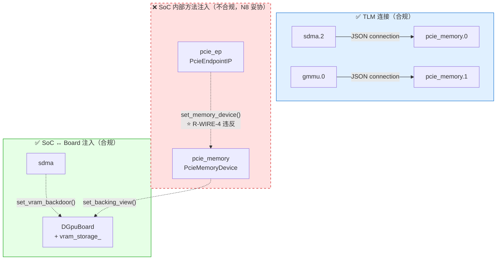
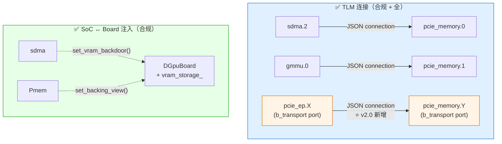

# SoC 内部 TLM 化设计目标 (D-AXI v2.0 Design Target)

> **版本**: v0.1 DRAFT — 2026-09-30
> **状态**: 🟡 **设计目标声明**（非当前实现）
> **承接**: 季度复审（2026-09-30）SoC 内部 wiring 治理讨论
> **Owner**: CppTLM Team
> **配套文档**:
> - [D-AXI v1.4 §7 D3 演进 seam](../pcie/driver-visible-minimal-soc.md#7-d3-演进-seamv14-已就位) — 当前 injection 设计的事实依据
> - [ADR-DGPU-06 AxiMemBundle 边界](../../adr/ADR-DGPU-06-axi-mem-bundle-boundary.md) — wire-format 级别边界（已签发）
> - [ADR-DGPU-07 演进 seam](../../adr/ADR-DGPU-07-minimal-soc-evolution-seam.md) — `handle_slave_port ↔ backing_ptr_` 注入点（D3-D5 演进依赖）
> - [ADR-DGPU-10 backing 字段命名](../../adr/ADR-DGPU-10-backing-naming-convention.md) — owner/injected 两级
> - [D3 evolution roadmap](d3-evolution-roadmap.md) — D3a-2 capacity 同步 + D3b VramController 入口
> - [data-flow-and-topology-comparison.md](data-flow-and-topology-comparison.md) — 当前拓扑 + 数据流对照

---

## 0. 摘要（TL;DR）

**项目愿景**: CppTLM = 建模框架 + 基本 SoC 验证；SoC 架构设计放在 `docs/designs/`。

**本设计目标声明**:
> **SoC 内部模块之间 SHALL 使用 TLM 连接（数据平面事务流）；SoC ↔ Board 边界 MUST 使用方法注入（因为 board-level `vram_storage_` 不是 TLM 模块）。**

**当前状态**: D-AXI v1.4 + v1.5 **未完全达到此目标**。SoC 内部有 1 处方法注入 (`ep->set_memory_device(pcie_mem)`)，是 **Oracle N8 决策的妥协结果**——避免双 tick（cycle_counter 2N 错误）。

**演进路径**:
- **D3a (1-2d)**: Display FB 同构（仅 board-level injection，**符合目标**）
- **D3b (5-7d)**: VramControllerTLM 插入（**符合目标**，seam `handle_slave_port ↔ backing_ptr_` 保留）
- **D-AXI v2.0 (远期)**: SoC 内部全 TLM 化（用 `b_transport` 或 `transport_dbg` 接口，避免双 tick）

---

## 1. 设计目标（Declarative Statement）

### 1.1 原则分层（principle pyramid）

```
┌─────────────────────────────────────────────────────────────┐
│ 第 0 层  项目愿景 (Project Vision)                            │
│   CppTLM = 建模框架 + 基本 SoC 验证                             │
│   SoC 架构设计 → docs/designs/dgpu-soc/                      │
│   SoC 真实架构建模 → ArchForge 仓                              │
└─────────────────────────────────────────────────────────────┘
                          │
                          ▼
┌─────────────────────────────────────────────────────────────┐
│ 第 1 层  wiring 原则 (本设计目标)                              │
│   SoC 内部: TLM 连接 (事务流)                                │
│   SoC ↔ Board: 方法注入 (boring 引用)                       │
└─────────────────────────────────────────────────────────────┘
                          │
                          ▼
┌─────────────────────────────────────────────────────────────┐
│ 第 2 层  wire-format 原则 (per ADR-DGPU-06)                   │
│   chip-internal: AxiMemBundle (4KB inline)                   │
│   board-level: PcieTlpBundle (TLP 级别)                      │
└─────────────────────────────────────────────────────────────┘
                          │
                          ▼
┌─────────────────────────────────────────────────────────────┐
│ 第 3 层  ownership 原则 (per ADR-DGPU-05 + ADR-DGPU-10)      │
│   单一 VRAM 真源: DGpuBoard::vram_storage_                   │
│   5 消费者: backdoor / BAR1 / BAR2 / MemoryTLM / SDMA       │
│   owner/injected 两级命名约定                                 │
└─────────────────────────────────────────────────────────────┘
```

### 1.2 形式化规则（formal rules）

| Rule ID | 触发 | SHALL/MUST 行为 |
|---------|------|----------------|
| **R-WIRE-1** | SoC 内部模块 A → SoC 内部模块 B 数据流 | **SHALL** 用 TLM StreamAdapter 连接（JSON `connections` 表达） |
| **R-WIRE-2** | SoC 内部模块 ↔ board-level backing（`vram_storage_`） | **MUST** 用方法注入（`setXxx()`），因 board-level 不是 TLM 模块 |
| **R-WIRE-3** | SoC 内部模块 ↔ board-level callback（如 translate_cb） | **MAY** 用方法注入（lambda capture），性能优于 TLM port |
| **R-WIRE-4** | SoC 内部方法注入（如 `ep->set_memory_device(pcie_mem)`） | **DEPRECATED** in v2.0，应替换为 TLM `b_transport` port |
| **R-WIRE-5** | tick() 链路（含 ChStreamModuleBase） | **SHALL NOT** 形成环（避免 `cycle_counter_` 2N 错误） |

---

## 2. 当前状态对照（As-Is）

### 2.1 As-Is wiring 全景



### 2.2 当前不合规点（per R-WIRE-4）

| # | 位置 | 类型 | 注入内容 | 违反规则 | 当前理由 |
|---|------|------|----------|---------|----------|
| 1 | `pcie_endpoint_ip.hh:190` | `set_memory_device()` | EP ↔ pcie_memory raw pointer | **R-WIRE-4** | N8 避免双 tick |

### 2.3 N8 决策的事实记录

`src/tlm/pcie/pcie_endpoint_ip.cc:357-360`：
```cpp
// Phase 3 T1.6 (N8): 不再转发 memory_device_->tick()
// PcieMemoryDevice 已 ChStreamModuleBase 化, 由 ModuleFactory 统一 tick 调度
// (SimModule::tick 递归 → internal_factory 内 ChStream 模块各自 tick)。
// 若此处仍调 memory_device_->tick() 将双 tick (cycle_counter_ 2N 错误)。
```

`openspec/specs/driver-visible-minimal-soc/spec.md:126`：
> ### Requirement: PcieEndpointIP 持有 PcieMemoryDevice raw pointer (N8 修订: 不再双 tick)
> **N8 修订**: `tick()` 不再调 `memory_device_->tick()` (避免与 soc::tick 递归双 tick)

**这是 Oracle + Metis 多轮评审的明确决策，不是 ad-hoc。**

---

## 3. 目标状态（To-Be, v2.0）

### 3.1 To-Be wiring 全景



### 3.2 v2.0 设计要点

1. **新增 TLM 端口类型**: PcieEndpointIP 增加 `b_transport` 或 `transport_dbg` initiator socket（**不传播 tick**）
2. **JSON 配置新增 connection**: `{ "src": "pcie_ep.<port>", "dst": "pcie_memory.<port>", "use_b_transport": true }`
3. **删除 `set_memory_device()` 方法**: 替换为 TLM port 的 `memory_read / write` 实现
4. **保留 `memory_routing_enabled` flag**: 治理层显式 gate 仍是必要的（per D2 v1.1 修复 root cause 4）
5. **保留 backing 注入方法**: PcieMemoryDevice 仍持 `vram_storage_` 指针（per ADR-DGPU-05 B7）

### 3.3 v2.0 工程挑战

| 挑战 | 影响 | 解决方案 |
|------|------|---------|
| **C1. 双 tick 复用**: `b_transport` 不传播 tick，但仍需避免环 | 中 | 用 TLM 2.0 `tlm_initiator_socket` + `tlm_target_socket` 配对，**禁用 forward path 自动 tick** |
| **C2. 性能**: TLM 包装 vs 直接指针 | 中 | Benchmark：fast-path 在 BAR2 热路径，必须 < 50ns 损失 |
| **C3. 冻结面**: `pcie_endpoint_ip.h` 是冻结面（per ADR-DGPU-08） | 高 | 加新 socket = 新增 ABI？需 Oracle 评审 |
| **C4. tests 级联**: 14 + 37 cases 依赖 injection | 中 | TDD 5 步：先 failing test → 改 wiring → verify pass → 不回归 |
| **C5. SDMA-GMMU lambda**: 当前 lambda capture 也算"广义 injection" | 低 | 可保留 lambda（per R-WIRE-3 MAY）或改 TLM port |

---

## 4. 演进路径（Roadmap）

### 4.1 阶段化策略

| 阶段 | 工期 | 范围 | 状态 |
|------|------|------|------|
| **D3a-1** (D-AXI v1.6) | 1-2d | Display FB 同构（仅 board-level injection，符合目标） | ⏸ 待 D3 启动 |
| **D3a-2** (D-AXI v1.6) | 1d | MemoryTLM capacity 同步（选项 1/2/3 评估） | ⏸ 待 D3a-1 完成 |
| **D3b-1** (D-AXI v1.6) | 2-3d | VramControllerTLM（seam 保留，符合目标） | ⏸ 待 D3a 完成 + G3 |
| **D-AXI v1.7+** | TBD | 小幅优化（如 SDMA-GMMU lambda → TLM port） | ❄️ 未规划 |
| **D-AXI v2.0** | TBD | **SoC 内部全 TLM 化**（R-WIRE-1 完全达成） | 📋 远期目标 |

### 4.2 v2.0 触发条件

**AND 条件**:
- D-AXI v1.6 (D3) 实施完成 + Oracle 评审通过
- v1.7+ 累积 ≥ 3 处 wiring 改进（说明 wiring 设计活跃）
- 性能 benchmark 显示 TLM 化后 fast-path 损耗 < 5%
- 冻结面审计（per ADR-DGPU-08）通过：加新 socket 不算新增 ABI
- Oracle 评审同意双 tick 解决方案

### 4.3 风险与缓解

| 风险 | 概率 | 影响 | 缓解 |
|------|------|------|------|
| TLM 化导致 BAR2 fast-path 性能不达标 | 中 | 高（破坏 driver 集成验证时效） | 必须先 benchmark 再 commit；预留 revert 路径 |
| 冻结面审计失败 | 低 | 极高（违反 ADR-DGPU-08） | 提前 Oracle 评审 + 增 ADR-DGPU-12 解释"加 socket ≠ 新增 ABI" |
| 现有 51 cases 全部需要回归 | 高 | 中 | TDD 5 步分批实施，每批 verify pass 才进下一批 |
| D-AXI v2.0 与 P2 (CP attach) 时序冲突 | 中 | 高 | P2 (cpptlm-p2-integration-unblock) 优先；v2.0 推到 P2 后 |

---

## 5. 与现有 ADR / Spec 的关系

### 5.1 引用矩阵

| 文档 | 引用关系 | 内容 |
|------|---------|------|
| [ADR-DGPU-05](../../adr/ADR-DGPU-05-vram-storage-ownership.md) | 引用 | 单一 VRAM 真源原则（owner = DGpuBoard） |
| [ADR-DGPU-06](../../adr/ADR-DGPU-06-axi-mem-bundle-boundary.md) | 引用 | wire-format 边界（chip-internal vs board-level） |
| [ADR-DGPU-07](../../adr/ADR-DGPU-07-minimal-soc-evolution-seam.md) | **依赖** | `handle_slave_port ↔ backing_ptr_` seam 必须保留（D3-D5 演进依赖） |
| [ADR-DGPU-10](../../adr/ADR-DGPU-10-backing-naming-convention.md) | 引用 | owner/injected 两级命名 |
| [ADR-DGPU-11](../../adr/ADR-DGPU-11-timing-mode-soc-scope.md) | 引用 | timing-mode 范围 |
| `openspec/specs/driver-visible-minimal-soc/spec.md:126` | **依赖** | N8 raw pointer 决策（v1.4 baseline） |
| [D-AXI v1.4 §7](../pcie/driver-visible-minimal-soc.md#7-d3-演进-seamv14-已就位) | **依赖** | D3 演进 seam 列表 |

### 5.2 与 AGENTS.md §STRUCTURE 一致性

per AGENTS.md "项目愿景分层（季度复审产物）":
- **CppTLM = 建模框架 + 基本 SoC 验证** ← 本项目
- **ArchForge = SoC 架构建模** ← 跨仓镜像

本设计目标是 **CppTLM 范围内的 SoC 业务设计意图声明**，归档于 `docs/designs/dgpu-soc/`（第 1 层架构文档）。具体架构实施细节（GMMU 7 能力、VramController HBM 模型等）属于 **ArchForge 范围**，应在 ArchForge openspec/changes/ 跟踪。

### 5.3 适用范围（in-scope vs out-of-scope）

| Config / 文档 | 是否在本设计目标范围 | 原因 |
|-------------|------------------|------|
| [`dgpu_soc_minimal_v1.json`](../../../configs/dgpu_soc_minimal_v1.json) | ✅ **in-scope** | 当前 D-AXI v1.4 functional-mode SoC，本设计目标的核心适用对象 |
| [`dgpu_soc_timing_v1.json`](../../../configs/dgpu_soc_timing_v1.json) | ✅ **in-scope** | 当前 D-AXI v1.4 + ADR-DGPU-11 timing-mode SoC，本设计目标的核心适用对象 |
| `dgpu_soc_<future>.json` (D-AXI v2.0+) | ✅ **in-scope** | v2.0 全 TLM 化目标将作为 OpenSpec change 跟踪 |
| [`dgpu_board_v1.json`](../../../configs/dgpu_board_v1.json) | ❌ **out-of-scope** | **早期代次** (Stage 1.4-2.1, 2026-09-15) 的 Board 视角 config：完整 GPGPU compute path (cp/tmu/sq/GpuCluster)。它**不**是 SoC 业务架构视角的当前代次 config，由 [../dgpu-board/architecture.md](../dgpu-board/architecture.md) 跟踪 |
| `cpptlm-driver-visible-minimal-soc` OpenSpec | ✅ **in-scope** | v1.8 当前 SSOT，本设计目标对其演进有约束 |
| `cpptlm-dgpu-soc-timing-mvp` OpenSpec | ✅ **in-scope** | timing-mode 实施指导 |
| `2026-08-26-cpptlm-dgpu-board-soc-split` OpenSpec | ❌ **out-of-scope** | 早期 Board-level change（ADR-SOC-07 时代），不在 D-AXI 当前代次 |

**为什么 `dgpu_board_v1.json` 不在本目标范围**:
1. 它是 **Board 视角入口**（per `dgpu-board/architecture.md:34,493`），不是 SoC 业务视角
2. 它的**设计哲学不同**——把 GPU 计算路径（cp/tmu/sq/GpuCluster）**放进 SoC 内部**，而 minimal_v1/timing_v1 **不放在 SoC 内部**（D3+ 演进）
3. 它的**VRAM 归属不同**——board_v1 用 SoC 内部 MemoryTLM，minimal_v1/timing_v1 用 Board-owned `vram_storage_`（per ADR-DGPU-05）
4. 它的 **TLM connections 是 9 条**（cp→vram/sdma/tmu, tmu→sq, sq→gpu, gpu→cq/sq, sdma→cq, cq→tmu），不是 2 条，所以本设计目标的 R-WIRE-1/2 规则**需扩展适用**才能讨论它

> **board_v1 → minimal_v1/timing_v1 的设计目标演变**:
> - board_v1 时期（2026-09-15）：**完整 GPGPU SoC**（cp/tmu/sq/GpuCluster 都在 SoC 内部）
> - minimal_v1 时期（2027-02-09）：**driver-visible minimal**（driver 集成验证为优先目标，GPU 计算路径不在 SoC）
> - timing_v1 时期（2027-02-11）：**performance modeling**（在 minimal_v1 基础上加 cycle-approximate）
>
> 三个 config 不在同一时间线，是**设计目标逐步收敛**的过程——不是错配，不是回退，是**演进**。

---

## 6. 实施下一步（Action Items）

### 6.1 短期（本季度内）

- [x] 起草本设计目标文档（v0.1 DRAFT, 2026-09-30）
- [ ] 在 D3 evolution roadmap §6 开放问题添加"v2.0 全 TLM 化"路线项
- [ ] 在 data-flow-and-topology-comparison.md §9 添加"wiring 原则"小节
- [ ] commit 本设计目标到 docs/designs/dgpu-soc/

### 6.2 中期（v1.6 D3 阶段）

- [ ] D3a-1 实施时显式标注"本变更符合 wiring 设计目标 R-WIRE-2/3"
- [ ] D3b-1 VramControllerTLM 实施时显式标注"seam 保留，符合 R-WIRE-2"
- [ ] 如有 SDMA-GMMU wiring 优化机会，记录"是否违反 R-WIRE-3 MAY"评估

### 6.3 远期（v2.0 启动时）

- [ ] 起草 `D-AXI v2.0-soc-internal-tlm` OpenSpec change
- [ ] Oracle 评审 v2.0 双 tick 解决方案（TLM `b_transport` 接口设计）
- [ ] ADR-DGPU-12 评估"加 TLM socket 是否算新增 ABI"
- [ ] rdd-arch → rdd-planner → rdd-builder → rdd-verifier 全流程
- [ ] 51 cases 回归 + TDD 5 步分批实施

---

## 7. 总结（Conclusion）

### 7.1 一句话原则

> **SoC 内部 = TLM（数据平面），SoC ↔ Board = 方法注入（控制平面 + 非 TLM 共享区）。**

### 7.2 当前偏离

- **1 处偏离**: `pcie_ep ↔ pcie_memory` 方法注入（per N8 spec 修订，避免双 tick）
- **N 处合规**: sdma→pcie_memory、gmmu→pcie_memory（TLM 连接）+ sdma→vram、pcie_memory→vram（方法注入）+ SDMA-GMMU（lambda 捕获）

### 7.3 治理杠杆（governance levers）

| 杠杆 | 当前作用 | 未来作用 |
|------|---------|----------|
| **JSON `connections`** | 数据平面声明 | 全 TLM 化后 = SoC 完整 wiring SSOT |
| **setXxx() 方法** | backing 注入 + callback 注入 | 仅保留 backing 注入 |
| **`memory_routing_enabled`** flag | 治理层显式 gate（per D2 v1.1） | 保留（D2 v1.1 root cause 4 修复不可妥协） |
| **`b_transport` socket** (v2.0) | N/A | 替代 `set_memory_device()` 注入 |

### 7.4 不动摇的原则

- **23 ABI 冻结 + 0 新增**（per ADR-DGPU-08 + Oracle v2.0.2 P0-3e）
- **单一 VRAM 真源归 DGpuBoard**（per ADR-DGPU-05）
- **chip-internal vs board-level wire-format 严格分离**（per ADR-DGPU-06）
- **D3 演进 seam `handle_slave_port ↔ backing_ptr_` 保留**（per ADR-DGPU-07）

---

**维护**: CppTLM Team · **版本**: v0.1 DRAFT (2026-09-30) · **状态**: 🟡 待评审 + commit
**评审入口**: §6 实施下一步（短期）+ §4 v2.0 触发条件（远期）
**关联 PR 流程**: D3a-1 启动时同步引用本设计目标 R-WIRE-* 规则