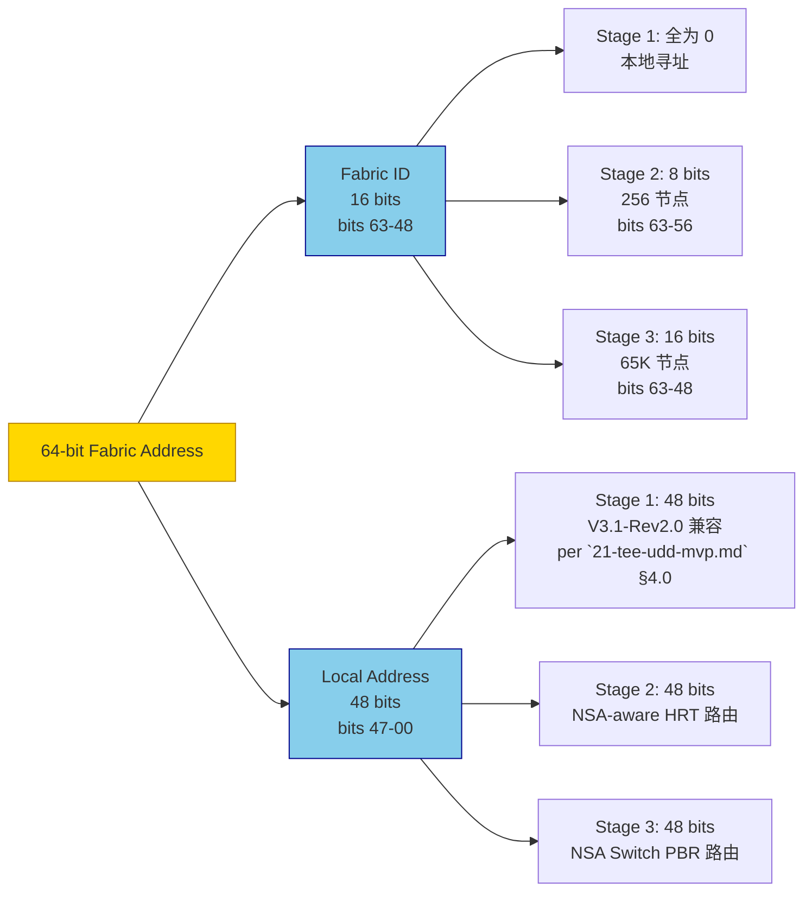

# NSA-MAS: 全局 Fabric Address 规范 v0.1 (草案 1)

> **目的**: 定义 CppTLM dGPU SoC **MAS-3.1 v3.1-Rev2.0** 的 **64-bit Fabric Address 全局地址空间规范**, 替代我之前在讨论中提出的非标准 "NSA (Network-System Address)" 术语, **对齐 CXL 3.0 Fabric Address 业界标准**。
>
> **状态**: Draft v0.1 (2026-09-19)
> **审计**: 待 Oracle 评审 (预期 ≥9.0/10 PASS)
> **归属 OpenSpec**: 待 `openspec/changes/2026-09-19-cpptlm-mas-nsa-fabric-address/` 提案
> **关联文档**:
> - [`21-tee-udd-mvp.md`](21-tee-udd-mvp.md) §4.0 GUPA 空间划分（V3.1-Rev2.0 基础, NSA-aware 升级路径）
> - [`21-soc-topology-mvp.md`](21-soc-topology-mvp.md) SoC 顶层物理布局（NSA-aware SoC 升级）
> - [`21-microarch-ifc-mvp.md`](21-microarch-ifc-mvp.md) §4.2 Host-to-GPU PCIe 互联延时（NSA-aware 扩展）
> - [`20-gmmu-mvp.md`](../soc_arch/architecture/20-gmmu-mvp.md) GMMU v1.0 MVP（GMMU 输出仍为 Local GUPA, NSA 由 CIU 注入）
> - [`23-dist-scale-up-topology.md`](23-dist-scale-up-topology.md) 分布式 Scale-Up 拓扑规范（NSA-aware SoC）
> - [`28-cxl-3-fabric.md`](28-cxl-3-fabric.md) CXL 3.0 Fabric 兼容

> **NSA 命名含义澄清** (适用于所有 NSA 草案, 2026-09-19 决策):
>
> 本草案中 **NSA** 含义为 **"Network-System Architecture"** (多 Linux 节点 + 跨 Fabric 寻址架构), 与美国 **National Security Agency (国家安全局)** **无关**, 仅 CppTLM 内部使用。
>
> NSA 衍生术语对应关系:
>
> | NSA 衍生术语 | 含义 | 与 CXL 3.0 / NVLink / Infinity Fabric 对应 |
> |---|---|---|
> | NSA Switch | NSA Switch (跨 Fabric 路由器) | ≈ CXL Fabric Switch Tier 1 |
> | NSA Fabric Address | 64-bit NSA-aware 地址 (16+48 bits) | ≈ CXL Fabric Address |
> | NSA-aware MMU | 含 Fabric ID + Capability 的 MMU | ≈ CXL-aware IOMMU |
> | NSA Stage 1/2/3 | 5 阶段演进阶段 | ≈ CXL 3.0 Fabric 量产节奏 |
> | NSA-aware SoC | NSA-aware 分布式 SoC 终态 | ≈ CXL 3.0 Fabric-aware SoC |
>
> **替代命名参考** (若未来需替换): GFS (Global Fabric System) / FAS (Fabric Address Space) / UFA (Unified Fabric Address), **当前决策保持 NSA + 备注澄清**。
>

> **关联 ADR**: ADR-SOC-21 (V3.1-Rev2.0 拓扑修正, 待起草 NSA-aware MMU ADR)

---

## §0 阅读引导

- 想理解 NSA / Fabric Address 概念 → 读 §1 (概述) + §2 (术语修正)
- 想看 **Normative Glossary 术语治理** (Oracle P1 修正) → 读 §0.5 (新增)
- 想看 64-bit 地址格式 → 读 §2 (Fabric Address 格式)
- 想看地址空间划分 → 读 §3 (Fabric ID 分配)
- 想理解 V3.1-Rev2.0 兼容路径 → 读 §4 (NSA-aware 升级)
- 想看 v1.0 MVP 范围 → 读 §5 (v1.0 MVP 范围)
- 想看开放问题 → 读 §7 (开放问题)

---

## §0.5 Normative Glossary 术语治理 (Oracle P1 修正)

> **本节为 Oracle P1 修正**: 9 份 NSA 草案中**术语漂移风险**——Fabric ID / HRT / RCT / Capability 在多份草案各自定义, 无单一权威来源。本节定义 NSA-aware 草案体系的 **Normative Glossary**, 其他草案**只引用不重复定义**。

### §0.5.1 Glossary 总览 (15 个核心术语)

```
┌─────────────────────────────────────────────────────────────────────────────┐
│  NSA-aware 草案体系 Normative Glossary (15 核心术语)                     │
│  ────────────────────────────────────────────────────────────              │
│                                                                            │
│  【Fabric Address 体系】 (per §2)                                       │
│  1. Fabric Address: 64-bit 全局地址 = Fabric ID (16b) + Local Addr (48b) │
│  2. Fabric ID: 16-bit 节点标识 (Stage 1 仅 8b 启用)                    │
│  3. Local Address: 48-bit 本地物理地址 (V3.1-Rev2.0 GUPA 兼容)         │
│                                                                            │
│  【路由体系】 (per `21-tee-udd-mvp.md` §4 + §7)                          │
│  4. HRT (Hardware Routing Table): 4096 entries × 32 bits 双 Bank     │
│  5. HRT Entry: [Route_Tag(4)][VC_ID(4)][QoS(8)][NSA-aware Fields(16)] │
│  6. RCT (Routing Context Table): 256 Context × [Base/Limit/Enable]     │
│  7. Route_Tag: 4-bit 后端选择 (0=HBM, 1~E=UALink, F=PCIe)            │
│                                                                            │
│  【MMU / TLB 体系】 (per `25-nsa-hardware.md` §2)                       │
│  8. NSA-aware TLB: [Tag(29)][Fabric ID(16)][Local Addr(16)] + Capability │
│  9. GMMU: GPU MMU (per `20-gmmu-mvp.md`), 输出 Local GUPA            │
│  10. Capability Token: 128 bits (per `27-nsa-capability.md` §2)        │
│  11. Capability Handle: 8-bit TLB Entry 摘要 (per `27-nsa-capability.md` §4.3) │
│                                                                            │
│  【控制面体系】 (per `26-gsp-rm-firmware.md` §0.5 + §4)               │
│  12. GSP (GPU System Processor): RISC-V 微控制器 + 微内核             │
│  13. GSP-RM: 4 大服务 (Memory/Fault/Fabric/Tenant)                       │
│  14. FM (Fabric Manager): Host/Switch Linux 协调层 (决策层)             │
│  15. NSA Switch: 双角色 Switch (UALink Fabric + CXL Fabric)            │
│                                                                            │
│  【过时术语】 (⚠️ 严禁使用)                                              │
│  - NSA (Network-System Address): 非标准, 已用 Fabric Address 替代     │
│  - Remote Switch: 应改为 NSA Switch                                    │
│  - Fabric Node: 应改为 Compute Tray                                    │
└─────────────────────────────────────────────────────────────────────────────┘
```

### §0.5.2 Glossary 使用规则 (其他草案必读)

```
任何 NSA-aware 草案 (21-29 号) 引用上述术语时:

✅ 允许: 直接引用本 §0.5 Glossary
   例: "HRT Entry 字段定义见 `22-nsa-fabric-address-spec.md` §0.5"

⚠️ 允许: 引用本草案其他章节 (如 §2 HRT Entry 格式)
   例: "HRT Entry 详细位分配见 §2.3"

❌ 禁止: 重新定义术语 (避免漂移)
   反例: "Capability Token 是 128 bits, 含 Fabric Addr Base(32 bits)..."
   (这是 `27-nsa-capability.md` §2 的内容, 应**引用**而非**重复定义**)

❌ 禁止: 使用过时术语
   反例: 草案中出现 "NSA" (非标准) 或 "NSA-aware Remote Switch" (应改为 "NSA Switch")
```

### §0.5.3 术语漂移检测机制

```
草案更新时的术语漂移检查 (CI/CD 流程):

1. PR 提交时自动检查:
   - grep -E "NSA[^a-zA-Z-]" docs/soc_arch/architecture/21-29-*.md
     → 应为 0 (除引用 22 号 §0.5.2 反例外)
   - grep -E "Remote Switch" docs/soc_arch/architecture/21-29-*.md
     → 应为 0 (应用 NSA Switch 替代)
   - grep -E "Capability Token" docs/soc_arch/architecture/21-29-*.md
     → 应仅出现引用, 不出现重新定义

2. 季度术语审计:
   - 对照本 §0.5 Glossary 全文检查
   - 发现漂移立即修正

3. 草案间一致性检查:
   - 草案 A 定义了术语 X, 草案 B 引用但重新定义了 X → 报错
   - CI 检查: 草案 B 中术语 X 的定义字符串 vs 草案 A 中的定义字符串
```

---

## §1 概述

### §1.1 问题陈述

V3.1-Rev2.0 (`21-soc-topology-mvp.md` v3.1) 的 **GUPA (Global Unified Physical Address)** 是 **64-bit 全局物理地址**, 仅覆盖**单一 PCIe Hierarchy** (1 个 Host Tray + 8 GPU + 1 Compute Tray + 1 Switch Tray + 1 CXL Pool, 全部在同一 PCIe Hierarchy 内)。

但用户提出的"分布式 Scale-Up" (`21-dist-scale-up-topology.md`) 需要:
- 多 Compute Tray (每 Compute Tray 独立 CPU + Linux OS)
- 跨 Compute Tray 通过 PCIe over UALink 通信
- GPU 0 (Compute Tray 1) 访问 GPU 4 (Compute Tray 2) 内存需要 **跨 Fabric 寻址**

V3.1-Rev2.0 GUPA **不支持跨 Fabric**, 必须升级为 **NSA-aware 全局地址空间**。

### §1.2 术语修正 (重要)

| 术语 | 出处 | 是否业界标准 | 本规范采用 |
|------|------|--------------|-----------|
| **NSA (Network-System Address)** | ⚠️ 我之前在讨论中提出的非标准术语 | ❌ 非标准 | ❌ 弃用 |
| **Fabric Address** | **CXL 3.0 规范** (Port-based Routing) | ✅ CXL 标准 | ✅ 采用 |
| **Fabric ID** | CXL 3.0 规范 (Port-based Routing 字段) | ✅ CXL 标准 | ✅ 采用 |
| **GUPA (Global Unified Physical Address)** | MAS-3.1 V3.0 自创术语 | ⚠️ 部分使用 | ⚠️ 兼容保留 |
| **NVLink Fabric Address** | NVIDIA 私有 (Blackwell GPU) | ⚠️ 私有 | 兼容 |
| **Infinity Fabric ID** | AMD 私有 (MI300X) | ⚠️ 私有 | 兼容 |

**关键决策**: 本规范统一用 **Fabric Address** (CXL 3.0 标准), 不再用 NSA。

### §1.3 设计目标

- ✅ **CXL 3.0 兼容**: 64-bit Fabric Address 与 CXL 3.0 Port-based Routing 字段对齐
- ✅ **NVLink / Infinity Fabric 兼容**: 16-bit Fabric ID 与 NVIDIA NVLink Fabric / AMD Infinity Fabric 概念兼容
- ✅ **V3.1-Rev2.0 兼容**: 单 PCIe Hierarchy 内 GUPA 64-bit 路由域划分**完全保留**
- ✅ **跨 Fabric 扩展**: Phase 2+ 启用 Fabric ID, 支持跨 Compute Tray 寻址
- ✅ **硬件可实现**: Remote Atomic Unit (Phase 2) + Hardware Directory (Phase 2) + Fabric-Aware MMU (Phase 1.5)

---

## §2 64-bit Fabric Address 格式

### §2.1 完整格式

```
┌────────────────────────────────────────────────────────────────────────┐
│  64-bit Fabric Address                                                  │
│                                                                        │
│  [63:48] Fabric ID (16 bits)  ───  65,536 节点上限                     │
│  [47:00] Local Address (48 bits) ─── 256 TB 设备空间                   │
│                                                                        │
│  阶段 1 (V3.1-Rev2.0 MVP):  Fabric ID [63:48] 全部为 0 (本地)         │
│  阶段 2 (NSA Phase 1):    Fabric ID [63:56] 启用 (8 bits, 256 节点)  │
│  阶段 3 (NSA Phase 3):    Fabric ID [63:48] 启用 (16 bits, 65K 节点) │
└────────────────────────────────────────────────────────────────────────┘
```

#### §2.1.1 64-bit Fabric Address 字段分配 (mermaid)



### §2.2 与 V3.1-Rev2.0 GUPA 64-bit 划分的关系

```
V3.1-Rev2.0 GUPA 划分 (per `21-tee-udd-mvp.md` §4.0):

| GUPA 高位 [63:48] | 路由域 | Local Address 含义 |
|------------------|--------|-------------------|
| 0x0000 ~ 0x0FFF | Local HBM | Local HBM 地址 (HBM3e) |
| 0x1000 ~ 0x7FFF | Scale-Up (UALink) | UALink Port 地址 |
| 0x8000 ~ 0x8FFF | PCIe IO / Host | PCIe TLP 地址 |
| 0x9000 ~ 0x9FFF | MMIO / CSR | PCIe MMIO 地址 |
| 0xA000 ~ 0xFFFF | Reserved / Invalid | 触发 AWT Trap |

V3.1-Rev2.0 = 阶段 1 (Fabric ID = 0, 仅本地寻址)

NSA-aware 升级 (Phase 2/3):

| Fabric ID [63:48] | 路由域 | 物理位置 |
|------------------|--------|----------|
| 0x0000 | Local (Compute Tray 本地) | 本 PCIe Hierarchy |
| 0x0001 | Compute Tray 1 (跨 Fabric) | Compute Tray 1 UALink |
| 0x0002 | Compute Tray 2 (跨 Fabric) | Compute Tray 2 UALink |
| 0x0003 ~ 0x00FF | Compute Tray N | 跨 Fabric (Phase 3) |
| 0x0100 ~ 0x01FF | CXL Memory Pool (外部) | 外部 CXL 设备 |
| 0x0200 ~ 0xFFFF | Reserved (Phase 3+ 扩展) | 预留 |

Local Address [47:0] 在每个 Fabric ID 域内**完全沿用 V3.1-Rev2.0 划分**。
```

### §2.3 NSA-aware HRT Entry 扩展 (per `21-microarch-ifc-mvp.md` §3.4)

```cpp
struct HrtEntry {
    // V3.1-Rev2.0 字段 (32 bits, 不变)
    uint8_t  route_tag : 4;    // [31:28] 0:HBM, 1~E:UALink, F:PCIe
    uint8_t  vc_id     : 4;    // [27:24] Virtual Channel
    uint8_t  qos       : 8;    // [23:16] QoS / Throttle_Group

    // NSA 扩展字段 (新增, Phase 2 启用)
    uint8_t  fabric_id_lo : 4; // [15:12] Fabric ID 低 4 bits (Phase 2)
    uint8_t  fabric_id_hi : 4; // [11:8]  Fabric ID 高 4 bits (Phase 3 启用 8 bits)
    uint8_t  addr_offset  : 8; // [7:0]   细粒度地址偏移/Mask (从原 [15:0] 拆分)
};

// 总 HRT Entry 仍 32 bits, 沿用 SRAM 双 Bank 设计
// Phase 2 启用 8-bit Fabric ID, Phase 3 启用 16-bit Fabric ID
```

### §2.4 NSA-aware MMU / TLB Entry 扩展

```cpp
// NSA-aware TLB Entry (64 bits)
struct TlbEntry {
    uint64_t va : 29;           // [63:35] Tag (VA 高 29 bits, ASID + VPN)
    uint64_t fabric_id : 16;    // [34:19] Fabric ID (V3.1-Rev2.0 全为 0)
    uint64_t local_addr : 16;   // [18:3]  Fabric Addr 低 16 bits (Local Addr 高位)
    uint64_t permissions : 3;   // [2:0]   R/W/X
    // Total: 29+16+16+3 = 64 bits, 紧凑对齐
};

// V3.1-Rev2.0 TLB Entry: [VA(48)] → [Local PA(48)]
// NSA-aware TLB Entry:  [VA(48)] → [Fabric Addr(16+48=64)] 包含跨 Fabric 寻址
```

**关键不变量**: TLB Entry 总位宽仍 64 bits (Compact), **不增加 SRAM 容量**。

---

## §3 Fabric ID 分配

### §3.1 阶段 1 (V3.1-Rev2.0 MVP): Fabric ID = 0

```
v1.0 MVP 默认配置:
  - 所有 GPU / Switch / CXL Pool 共享 Fabric ID = 0x0000
  - Local Address 64-bit 完整沿用 V3.1-Rev2.0 GUPA 划分
  - HRT Route_Tag / RCT 多租户隔离 / Credit 流控 全量沿用

V3.1-Rev2.0 9 份架构文档已 ship, 无需修改 (Fabric ID = 0 是 v1.0 MVP 默认状态)。
```

### §3.2 阶段 2 (NSA Phase 1): Fabric ID = 8-bit (256 节点)

```
v1.x 启用 8-bit Fabric ID:
  - Fabric ID [63:56] 启用 (8 bits, 256 节点)
  - Fabric ID [55:48] 保留 (Phase 3 扩展)
  - 阶段 1 的 Fabric ID = 0 仍保留向后兼容

Fabric ID 分配方案 (8 bits):
  ┌─────────────────────────────────────┐
  │  Fabric ID  │ 含义                  │
  ├─────────────────────────────────────┤
  │  0x00      │ Local (本 Compute Tray) │
  │  0x01      │ Compute Tray 1       │
  │  0x02      │ Compute Tray 2       │
  │  ...                              │
  │  0xFF      │ Compute Tray 255     │
  │  0x80~0xFF │ CXL Memory Pool (Phase 2 扩展) │
  └─────────────────────────────────────┘

单超节点 (典型 1 Compute Tray + 8 GPU + 1 CXL Pool) 仅用 2 个 Fabric ID (0x00 本地 + 0x80 CXL)。
```

### §3.3 阶段 3 (NSA Phase 3): Fabric ID = 16-bit (65K 节点)

```
v3.x 启用 16-bit Fabric ID:
  - Fabric ID [63:48] 完整 16 bits (65K 节点)
  - 支持超大规模 Scale-Out (跨数据中心)
  - 与 CXL 3.0 Fabric Address 完全兼容

阶段 3 的 NSA ↔ CXL 3.0 映射:
  ┌──────────────────────────────────────┐
  │  NSA Fabric ID  │ CXL 3.0 Fabric ID │
  ├──────────────────────────────────────┤
  │  [63:60] (4 b) │ [63:60] Fabric ID 高 │
  │  [59:48] (12 b)│ [59:48] Fabric ID 低 │
  │  = 16 bits     │ = 16 bits          │
  │  完全对齐 ✅                       │
  └──────────────────────────────────────┘

阶段 3 同时启用 Remote Atomic Unit + Hardware Directory + CXL 3.0 Fabric Switch。
```

---

## §4 NSA-aware 升级路径 (与 V3.1-Rev2.0 协同)

### §4.1 NSA-aware MMU / TLB 升级

```
V3.1-Rev2.0 (阶段 1):
  GMMU 输出: VA → Local GUPA (64-bit)
  TLB: [VA → Local GUPA]
  CIU: 不参与地址翻译

NSA Phase 1 (阶段 2):
  GMMU 输出: VA → Local GUPA (64-bit, 不变)
  CIU 注入: Fabric ID (8-bit, 经 RCT 配置)
  TLB: [VA → Fabric Addr (64-bit = 8-bit Fabric ID + 56-bit Local)]
  硬件协同: Fabric-Aware MMU + TLB Entry 扩展 (per §2.3 / §2.4)

NSA Phase 3 (阶段 3):
  GMMU 输出: VA → Local GUPA (64-bit, 不变)
  CIU 注入: Fabric ID (16-bit)
  TLB: [VA → Fabric Addr (64-bit = 16-bit Fabric ID + 48-bit Local)]
  硬件协同: NSA-aware MMU + Remote Atomic Unit + Hardware Directory
```

### §4.2 GMMU → CIU → NSA-aware TLB 注入路径

```
Stage 1 (V3.1-Rev2.0):
  GMMU.translate(VA) → Local GUPA
  → TLB (单级, 仅本地)

Stage 2 (NSA Phase 1):
  GMMU.translate(VA) → Local GUPA (不变)
  → CIU 注入 Fabric ID (经 RCT 配置)
  → NSA-aware TLB (双级: Fabric ID + Local Addr)
  → GPU MMU 校验: Fabric ID 匹配 + Local TLB 命中
  → 若跨 Fabric: Remote-Fault 标志位 → HW Fault Request Packet

Stage 3 (NSA Phase 3):
  GMMU.translate(VA) → Local GUPA (不变)
  → CIU 注入 Fabric ID 16-bit
  → NSA-aware TLB (含 Remote-Fault 标志位)
  → Hardware Directory 跨 Fabric 查询 (<50 ns)
  → Remote Atomic Unit 跨 Fabric 操作 (~300 ns)
  → CXL 3.0 Fabric Switch 跨域透明
```

### §4.3 NSA-aware UDD Agent (per-GPC HRT 升级)

```
V3.1-Rev2.0 HRT (阶段 1):
  32-bit HRT Entry: [Route_Tag(4)][VC_ID(4)][QoS(8)][addr_offset(16)]
  → 4096 entries 双 Bank
  → 仅本地路由

NSA-aware HRT (阶段 2):
  32-bit HRT Entry: [Route_Tag(4)][VC_ID(4)][QoS(8)][Fabric_ID_lo(4)][Fabric_ID_hi(4)][addr_offset(8)]
  → 4096 entries 双 Bank (不变)
  → 跨 Fabric 路由 (Phase 2)

NSA-aware HRT (阶段 3):
  32-bit HRT Entry: [Route_Tag(4)][VC_ID(4)][QoS(8)][Fabric_ID(8)][addr_offset(8)]
  → 4096 entries 双 Bank (不变)
  → 完整 16-bit Fabric ID (经多级查表或扩展 LUT)
```

---

## §5 v1.0 MVP 范围 (阶段 1)

### §5.1 v1.0 MVP 实施范围

- [x] **Fabric Address 64-bit 格式定义** (per §2.1)
- [x] **Fabric ID 8-bit 字段保留位** (per §2.2, Phase 1 全为 0)
- [x] **NSA-aware HRT Entry 字段位分配** (per §2.3)
- [x] **NSA-aware TLB Entry 格式** (per §2.4)
- [x] **V3.1-Rev2.0 兼容路径** (per §4, Fabric ID = 0 是默认状态)
- [x] **阶段 2 / 阶段 3 升级路径** (per §3.2 / §3.3)

### §5.2 v1.0 MVP 不实施范围

- ❌ **阶段 2 启用 8-bit Fabric ID**: 推迟到 v1.x (Phase 2)
- ❌ **阶段 3 启用 16-bit Fabric ID**: 推迟到 v3.x (Phase 3)
- ❌ **Remote Atomic Unit 硬件**: 推迟到 Phase 2 实施 (`25-nsa-hardware.md`)
- ❌ **Hardware Directory 硬件**: 推迟到 Phase 2 实施
- ❌ **CXL 3.0 Fabric Switch**: 推迟到 Phase 3 实施 (`28-cxl-3-fabric.md`)
- ❌ **NSA Switch (独立硬件模块)**: 推迟到 Phase 3 实施

### §5.3 v1.0 MVP 验证标准 (10 项 Acceptance Gate)

- [ ] **AG1**: Fabric Address 64-bit 格式定义完成 (§2.1)
- [ ] **AG2**: Fabric ID 8-bit / 16-bit 字段保留位对齐 (per §2.2 / §3.2 / §3.3)
- [ ] **AG3**: NSA-aware HRT Entry 32-bit 字段位分配完成 (§2.3)
- [ ] **AG4**: NSA-aware TLB Entry 64-bit 格式完成 (§2.4)
- [ ] **AG5**: V3.1-Rev2.0 兼容路径明确 (Fabric ID = 0 默认) (§4.1)
- [ ] **AG6**: GMMU → CIU → TLB 注入路径明确 (§4.2)
- [ ] **AG7**: UDD Agent HRT 升级路径明确 (§4.3)
- [ ] **AG8**: 阶段 2 / 阶段 3 升级路径明确 (§3.2 / §3.3)
- [ ] **AG9**: 跨子系统 Cross-Reference 完整 (关联 `21-tee-udd-mvp.md` / `21-microarch-ifc-mvp.md` / `23-dist-scale-up-topology.md` 等)
- [ ] **AG10**: 0 个新 ABI 函数 (per ADR-088 §D5 严格遵守, NSA-aware 是 RTL/硬件层, 不改 ABI)

---

## §6 跨子系统 Cross-Reference

### §6.1 上游依赖 (本规范依赖哪些文档)

| 依赖文档 | 依赖内容 | 依赖强度 |
|---------|---------|----------|
| [`21-soc-topology-mvp.md`](21-soc-topology-mvp.md) | V3.1-Rev2.0 SoC 顶层拓扑 (NSA-aware 升级基础) | 强 |
| [`21-tee-udd-mvp.md`](21-tee-udd-mvp.md) §4.0 | V3.1-Rev2.0 GUPA 64-bit 划分 (NSA-aware 升级路径) | 强 |
| [`21-microarch-ifc-mvp.md`](21-microarch-ifc-mvp.md) §4.2 | Host-to-GPU PCIe 互联 (NSA-aware 扩展) | 强 |
| [`20-gmmu-mvp.md`](../soc_arch/architecture/20-gmmu-mvp.md) | GMMU 翻译层 (NSA-aware 协同) | 强 |
| [`ADR-SOC-21-v31-rev2-topology-correction.md`](../soc_arch/adr/ADR-SOC-21-v31-rev2-topology-correction.md) | V3.1-Rev2.0 拓扑修正决策 | 中 |

### §6.2 下游依赖 (哪些文档依赖本规范)

| 下游文档 | 依赖本规范内容 |
|---------|---------------|
| [`23-dist-scale-up-topology.md`](23-dist-scale-up-topology.md) | NSA-aware SoC 拓扑升级 (Phase 2/3) |
| [`25-nsa-hardware.md`](25-nsa-hardware.md) | NSA-aware MMU + Remote Atomic + Directory 硬件 |
| [`27-nsa-capability.md`](27-nsa-capability.md) | Capability 含 Fabric ID 字段 |
| [`28-cxl-3-fabric.md`](28-cxl-3-fabric.md) | CXL 3.0 Fabric ID ↔ NSA Fabric ID 映射 |
| [`29-nsa-evolution-roadmap.md`](29-nsa-evolution-roadmap.md) | 5 阶段演进时间线 (V3.1-Rev2.0 → Phase 1 → 2 → 3 → 5) |
| [`26-gsp-rm-firmware.md`](26-gsp-rm-firmware.md) | GSP-RM Memory Service 含 Fabric ID 管理 |

---

## §7 开放问题 (待新 session 讨论)

| # | 开放问题 | 优先级 | 关联草案 |
|---|---------|--------|---------|
| 1 | **Fabric ID 分配粒度**: per-Compute-Tray vs per-GPU vs per-Switch？ | P1 | 草案 2 |
| 2 | **NSA-aware MMU 与 GMMU 协同**: GMMU 输出 Local GUPA + CIU 注入 Fabric ID vs GMMU 直接输出 NSA？ | P1 | 草案 2, 4 |
| 3 | **HRT Entry 32-bit Fabric ID 拆分**: 如何划分 8-bit Fabric ID + 8-bit addr_offset？ | P2 | 草案 4 |
| 4 | **跨数据中心 Fabric ID 分配**: Multi-Fabric 16-bit Fabric ID 全局分配策略？ | P2 | 草案 7 |
| 5 | **NSA-aware TLB 与传统 TLB 兼容性**: 是否需支持 GUPA-only 模式 (Fabric ID = 0 始终)？ | P2 | 草案 4 |
| 6 | **TLB Entry Remote-Fault 标志位**: 是否需要 Tenant ID 字段 (hardware-enforced 隔离)？ | P3 | 草案 4, 6 |
| 7 | **Fabric ID 与 RCT 关系**: RCT 是否需 per-Fabric-ID Override (与 8.2 对应)？ | P3 | 草案 2 |
| 8 | **CXL 3.0 Fabric ID 与 NSA Fabric ID 字段对齐**: 详细位字段对应关系？ | P3 | 草案 7 |
| 9 | **NSA Hardware Directory 跨 Fabric 一致性**: MESIF vs MOESI vs MESI？ | P3 | 草案 4 |
| 10 | **Capability Token 与 Fabric Address**: Capability Base 是否含 Fabric ID？ | P3 | 草案 6 |

---

## §8 维护记录

| 日期 | 版本 | 作者 | 修订 |
|------|------|------|------|
| 2026-09-19 | v0.1-draft | Sisyphus | 首版: NSA / Fabric Address 规范 v0.1 (草案 1, 64-bit 格式 + NSA-aware MMU/TLB 扩展 + V3.1-Rev2.0 兼容路径 + 10 项 Acceptance Gate + 10 个开放问题) |

---

**关联 OpenSpec change**: 待 `openspec/changes/2026-09-19-cpptlm-mas-nsa-fabric-address/` 提案创建
**下次更新**: Oracle 评审反馈后 v0.2