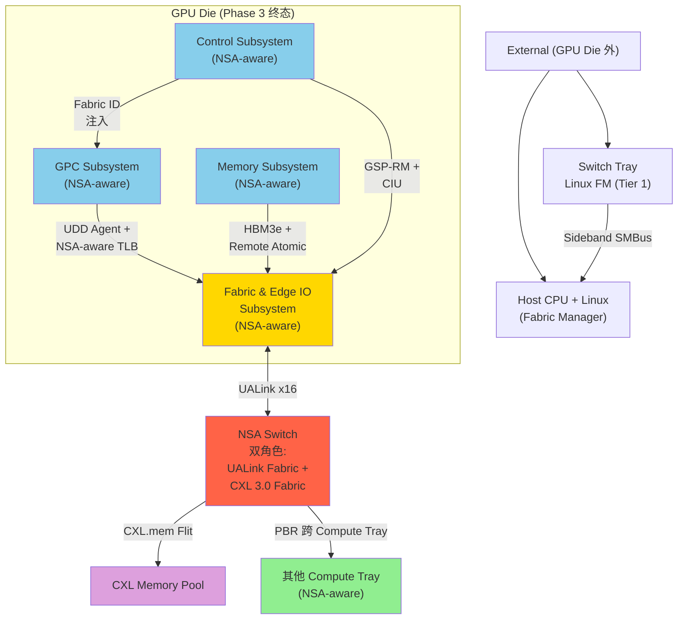

# Dist-Topology: 分布式 Scale-Up 拓扑规范 v0.1 (草案 2 - NSA-aware SoC)

> **目的**: 定义 CppTLM dGPU SoC **MAS-3.1 v3.1-Rev2.0 → NSA-aware 分布式 Scale-Up** 的 **完整 SoC 物理拓扑升级**。这是 [`21-soc-topology-mvp.md`](21-soc-topology-mvp.md) V3.1-Rev2.0 的 **NSA-aware 终态扩展**, 含 5 大子系统 NSA 感知升级 + Remote Atomic Unit + Hardware Directory + Capability + GSP-RM。
>
> **状态**: Draft v0.1 (2026-09-19)
> **审计**: 待 Oracle 评审 (预期 ≥9.0/10 PASS)
> **归属 OpenSpec**: 待 `openspec/changes/2026-09-19-cpptlm-mas-dist-scale-up-topology/` 提案
> **关联文档**:
> - [`21-soc-topology-mvp.md`](21-soc-topology-mvp.md) V3.1-Rev2.0 SoC 拓扑基础 (本规范扩展)
> - [`22-nsa-fabric-address-spec.md`](22-nsa-fabric-address-spec.md) NSA-aware MMU/TLB 地址格式
> - [`21-tee-udd-mvp.md`](21-tee-udd-mvp.md) TEE-UDD 数据面 (NSA-aware HRT 扩展)
> - [`25-nsa-hardware.md`](25-nsa-hardware.md) NSA-aware MMU + Remote Atomic + Directory 硬件
> - [`21-dist-scale-up-topology-b.md`](21-dist-scale-up-topology-b.md) **方案 B (传统分布式, 非 NSA-aware)** 降级替代
> - [`26-gsp-rm-firmware.md`](26-gsp-rm-firmware.md) GSP-RM 固件架构
> - [`27-nsa-capability.md`](27-nsa-capability.md) Capability 多租户隔离
> - [`28-cxl-3-fabric.md`](28-cxl-3-fabric.md) CXL 3.0 Fabric 兼容
> - [`29-nsa-evolution-roadmap.md`](29-nsa-evolution-roadmap.md) 5 阶段演进时间线

> **NSA 命名含义澄清** (适用于所有 NSA 草案, 2026-09-19 决策):
>
> 本草案中 **NSA** 含义为 **"Network-System Architecture"** (多 Linux 节点 + 跨 Fabric 寻址架构), 与美国 **National Security Agency (国家安全局)** **无关**, 仅 CppTLM 内部使用。
>
> NSA 衍生术语对应关系:
>
> | NSA 衍生术语 | 含义 | 与 CXL 3.0 / NVLink / Infinity Fabric 对应 |
> |---|---|---|
> | NSA Switch | NSA Switch (跨 Fabric 路由器) | ≈ CXL Fabric Switch Tier 1 |
> | NSA Fabric Address | 64-bit NSA-aware 地址 (16+48 bits) | ≈ CXL Fabric Address |
> | NSA-aware MMU | 含 Fabric ID + Capability 的 MMU | ≈ CXL-aware IOMMU |
> | NSA Stage 1/2/3 | 5 阶段演进阶段 | ≈ CXL 3.0 Fabric 量产节奏 |
> | NSA-aware SoC | NSA-aware 分布式 SoC 终态 | ≈ CXL 3.0 Fabric-aware SoC |
>
> **替代命名参考** (若未来需替换): GFS (Global Fabric System) / FAS (Fabric Address Space) / UFA (Unified Fabric Address), **当前决策保持 NSA + 备注澄清**。
>

> **关联 ADR**: ADR-SOC-21 (V3.1-Rev2.0 拓扑修正), 待起草 NSA-aware SoC ADR

---

## §0 阅读引导

- 想理解 NSA-aware SoC 总体 → 读 §1
- 想看 5 大子系统 NSA-aware 升级 → 读 §2
- 想看 NSA-aware HRT Entry 扩展 → 读 §3
- 想看 NSA-aware MMU / TLB → 读 §4
- 想看 5 阶段 NSA 演进 → 读 §5
- 想看 v1.0 MVP 范围 → 读 §6
- 想看开放问题 → 读 §7

---

## §1 概述

### §1.1 问题陈述

V3.1-Rev2.0 (`21-soc-topology-mvp.md`) 是 **1 个 Linux 节点 + 1 个 PCIe Hierarchy** 架构:
- Host Tray (双 CPU + 8 GPU 通过 PCIe Switch 桥接)
- Compute Tray (无 CPU, 8 GPU + 4 Switches)
- Switch Tray (ARM Cortex-M 固件)
- 单一 Linux OS 管理所有 8 GPU

但 NSA-aware 分布式 Scale-Up (方案 C) 需要:
- **多 Compute Tray 独立 CPU + Linux OS** (N 个 Linux 节点)
- **跨 Compute Tray 通过 NSA Switch + PCIe over UALink** 通信
- **NSA-aware MMU / TLB** (含 64-bit Fabric Address)
- **Remote Atomic Unit + Hardware Directory** (跨 Fabric 一致性)
- **Capability-Based 多租户隔离** (per `27-nsa-capability.md`)
- **GSP-RM 控制面下沉** (per `26-gsp-rm-firmware.md`)
- **NSA Switch** (含 CXL 3.0 Fabric Switch + UALink Fabric Switch 双角色)
- **CXL 3.0 Fabric 兼容** (per `28-cxl-3-fabric.md`)

本规范定义这一**完整 NSA-aware SoC 终态拓扑**, 是 V3.1-Rev2.0 的**NSA-aware 升级版本**。

### §1.2 与 V3.1-Rev2.0 / 方案 B / 方案 C 对比

| 维度 | V3.1-Rev2.0 (方案 A) | **方案 B** (本草案前) | **方案 C (本草案)** |
|------|---------------------|---------------------|---------------------|
| **Linux 节点** | 1 | N+1 | N+1 |
| **NSA-aware MMU** | ❌ | ❌ | ✅ |
| **Remote Atomic Unit** | ❌ | ❌ | ✅ |
| **Hardware Directory** | ❌ | ❌ | ✅ |
| **Capability-Based 隔离** | ❌ (MIG 软件) | ⚠️ (SR-IOV 跨节点不成熟) | ✅ (HW 强制) |
| **GSP-RM 控制面下沉** | ❌ (Host KMD 5x 厚) | ⚠️ (Switch Linux) | ✅ (GSP 微控制器) |
| **NSA Switch** | ❌ | ⚠️ (Switch Linux 协调) | ✅ (CXL 3.0 Fabric Switch) |
| **Fabric Address** | GUPA (本地) | GUPA + PCIe over UALink | NSA-aware (16-bit Fabric ID) |
| **跨 tray GPU↔GPU** | N/A | 1.8 μs | 500 ns (目标, NSA 硬件加速) |
| **量产时间窗** | 现在 ✅ | 2026-2027 ⚠️ | 2027+ ⚠️ |

### §1.3 设计目标

- ✅ **V3.1-Rev2.0 完全兼容**: Fabric ID = 0 是默认状态 (Phase 1 = V3.1-Rev2.0)
- ✅ **NSA-aware 升级路径**: 阶段 1→2→3 渐进升级 (per `22-nsa-fabric-address-spec.md` §3)
- ✅ **方案 B 降级路径**: 硬件 NSA 不就绪时, 可降级到方案 B (`21-dist-scale-up-topology-b.md`)
- ✅ **CXL 3.0 Fabric 兼容**: Phase 3 启用 16-bit Fabric ID, 完全对齐 CXL 3.0
- ✅ **5 大子系统 NSA 感知**: GPC / Memory / Fabric-IO / Control / External 全量 NSA 升级

---

## §2 5 大子系统 NSA-aware 升级

### §2.1 NSA-aware SoC 物理布局 (方案 C 终态)

```
┌─────────────────────────────────────────────────────────────────────────────────┐
│                      MAS-3.1 NSA-aware GPU Die (Phase 3 终态)                │
│                                                                                 │
│  ╔══════════════════ GPC Subsystem (NSA-aware) ══════════════════════════╗ │
│  ║  [GPC × N]                                                                ║ │
│  ║  ┌─────────────────────────────────────────────────────────────────┐  ║ │
│  ║  │ SM × 16-32                                                       │  ║ │
│  ║  ├─────────────────────────────────────────────────────────────────┤  ║ │
│  ║  │ TC-DMA × 2-8 (TMA, GPC 紧耦合, per V3.1-Rev2.0 不变)         │  ║ │
│  ║  ├─────────────────────────────────────────────────────────────────┤  ║ │
│  ║  │ L2 Cache Slice                                                     │  ║ │
│  ║  ├─────────────────────────────────────────────────────────────────┤  ║ │
│  ║  │ UDD Agent (NSA-aware)                                            │  ║ │
│  ║  │  - HRT Entry 含 Fabric ID (per §3)                              │  ║ │
│  ║  │  - WRR 仲裁 (TC:SM = 4:1)                                      │  ║ │
│  ║  │  - HRT Atomic Swap ≤8 cycles                                    │  ║ │
│  ║  ├─────────────────────────────────────────────────────────────────┤  ║ │
│  ║  │ NSA-aware MMU / TLB (per `25-nsa-hardware.md` §2)              │  ║ │
│  ║  │  - TLB: [VA → Fabric Addr (16+48 bits)]                         │  ║ │
│  ║  │  - Remote-Fault 标志位 (HW 发起 Fault Request Packet)         │  ║ │
│  ║  │  - Capability 校验 (per `27-nsa-capability.md`)                │  ║ │
│  ║  ├─────────────────────────────────────────────────────────────────┤  ║ │
│  ║  │ L1 Hardware Directory (per-GPC, 64 KB)                        │  ║ │
│  ║  │  - MESIF 变体状态                                                │  ║ │
│  ║  │  - < 50 ns 查询                                                  │  ║ │
│  ║  └─────────────────────────────────────────────────────────────────┘  ║ │
│  ╚═════════════════════════════════════════════════════════════════════════╝ │
│                                                                                 │
│  ╔══════════════════ Memory Subsystem (NSA-aware) ════════════════════════╗ │
│  ║  [HBM-DMA × N + NSA-aware Controller]                                 ║ │
│  ║  - GUPA → PC/BG/Bank/Row/Col 解码                                    ║ │
│  ║  - FR-FCFS 调度 (First-Ready)                                       ║ │
│  ║  - SECDED ECC + Page Retirement                                     ║ │
│  ║  - L2 Hardware Directory (per-GPU, 1 MB)                          ║ │
│  ║  - Remote Atomic Unit 硬件 (per `25-nsa-hardware.md` §3)            ║ │
│  ╚═════════════════════════════════════════════════════════════════════════╝ │
│                                                                                 │
│  ╔══════════ Fabric & Edge IO Subsystem (NSA-aware) ═══════════════════════╗ │
│  ║  - Global UDD Hub (NSA-aware, 含 Fabric ID 路由)                    ║ │
│  ║  - Memory & IO NoC                                                  ║ │
│  ║  - NIC-DMA × 4 (UALink Flit + 跨 Fabric 路由)                       ║ │
│  ║  - IO-DMA × 1 (PCIe Gen6 + ATS/PRI, v1.1+)                       ║ │
│  ║  - NSA Switch (含 CXL 3.0 Fabric Switch + UALink Fabric 双角色)    ║ │
│  ╚═════════════════════════════════════════════════════════════════════════╝ │
│                                                                                 │
│  ╔══════════════════ Control Subsystem (NSA-aware) ═══════════════════════╗ │
│  ║  - GSP-RM 微控制器 + 微内核 (NV-RTOS, per `26-gsp-rm-firmware.md`)  ║ │
│  ║    ├─ Memory Service (Hardware Directory Owner)                   ║ │
│  ║    ├─ Fault Service (HW Fault 处理)                                ║ │
│  ║    ├─ Fabric Service (NSA Switch 控制平面)                        ║ │
│  ║    └─ Tenant Manager (Capability 签发, per `27-nsa-capability.md`) ║ │
│  ║  - CIU (per V3.1-Rev2.0, NSA-aware 扩展)                          ║ │
│  ║  - GMMU Hub (per V3.1-Rev2.0, NSA-aware 输出)                     ║ │
│  ╚═════════════════════════════════════════════════════════════════════════╝ │
│                                                                                 │
│  ╔══════════════════ External (GPU Die 之外) ═════════════════════════════╗ │
│  ║  - Compute Tray 独立 CPU + Linux OS (N 个)                         ║ │
│  ║  - Switch Tray Linux FM (CXL 3.0 Fabric Switch Tier 1)           ║ │
│  ║  - CXL Memory Pool (CXL 3.0 HDM Device)                           ║ │
│  ║  - Host CPU + NVMe (PCIe Gen6 端点)                                ║ │
│  ╚═════════════════════════════════════════════════════════════════════════╝ │
└─────────────────────────────────────────────────────────────────────────────────┘
```

#### §2.1.1 NSA-aware SoC 拓扑图 (mermaid)



### §2.2 GPC Subsystem NSA-aware 升级

```
V3.1-Rev2.0 GPC:
  - SM × 16-32
  - TC-DMA × 2-8 (GPC 紧耦合, 不变)
  - L2 Cache Slice
  - UDD Agent (per-GPC HRT 查表 + WRR 仲裁)
  - GMMU (per `20-gmmu-mvp.md`, VA → Local PA)

NSA-aware GPC (Phase 2):
  - + NSA-aware MMU / TLB (per `25-nsa-hardware.md` §2)
  - + L1 Hardware Directory (per-GPC, 64 KB)
  - + Capability 校验 (per `27-nsa-capability.md` §4)
  - UDD Agent HRT Entry 扩展 (含 Fabric ID, per §3)
  - GMMU 输出 Fabric Addr (per `22-nsa-fabric-address-spec.md` §4)

NSA-aware GPC (Phase 3):
  - + 16-bit Fabric ID 完整启用
  - + L1 Directory 跨 Compute Tray 查询
  - + Remote-Fault 标志位
```

### §2.3 Memory Subsystem NSA-aware 升级

```
V3.1-Rev2.0 Memory:
  - HBM-DMA × N (HBM3e Controller)
  - Page Retirement, ECC, Refresh Manager
  - L1 Directory 不存在 (纯软件管理)

NSA-aware Memory (Phase 2):
  - + L2 Hardware Directory (per-GPU, 1 MB)
  - + Remote Atomic Unit (HW Atomic Op, per `25-nsa-hardware.md` §3)
  - + Fabric ID 感知 (Owner 跨 Compute Tray)

NSA-aware Memory (Phase 3):
  - + L3 Hardware Directory (per-Compute-Tray, 4 MB)
  - + CXL 3.0 Fabric 内存池接入 (per `28-cxl-3-fabric.md`)
```

### §2.4 Fabric & Edge IO Subsystem NSA-aware 升级

**⚠️ NSA Switch 物理位置 (Oracle B1+C4 修正)**: 本节统一选**默认假设**为 **"NSA Switch 在 Switch Tray 内置"** (与 V3.1-Rev2.0 ARM Cortex-M 固件共存, NSA Stage 2/3 升级为 NSA-aware)。其他 2 种备选方案(独立 NSA Switch 机箱 / NSA Switch 与 Switch Tray 整合为 ARM Cortex-A + Linux) 显式标注为 "假设, 待硬件选型确认"。

```
NSA Switch 物理位置 3 种方案 (Oracle B1+C4 修正):

方案 A (默认, 推荐): NSA Switch 在 Switch Tray 内置
  - 与 V3.1-Rev2.0 ARM Cortex-M 固件共存
  - NSA Stage 1: ARM Cortex-M 固件 (协调 + PTE 查表)
  - NSA Stage 2/3: NSA-aware 升级 (ARM Cortex-A + Linux + NSA Switch)
  - 优势: 与 V3.1-Rev2.0 物理兼容, 渐进升级, 物料复用
  - 劣势: Switch Tray 内空间受限 (1U 设备)

方案 B: NSA Switch 是独立物理设备 (独立机箱)
  - 单独的 NSA Switch Tray 1U/2U
  - NSA Stage 2/3 启用
  - 优势: 独立扩展, 散热更好, 服务性优
  - 劣势: 额外物料成本 + 物理空间, 跨机柜延迟增加

方案 C: NSA Switch 与 Switch Tray 整合为 ARM Cortex-A + Linux
  - 完全替代 V3.1-Rev2.0 ARM Cortex-M 固件
  - NSA Stage 1 直接升级
  - 优势: NSA-aware 一步到位
  - 劣势: ARM Cortex-A 比 Cortex-M 贵 5-10×, 与 V3.1-Rev2.0 兼容性差
```

**NSA Switch 与 Switch Tray Linux FM 关系 (Oracle C4 修正)**:

- NSA Stage 1 (V3.1-Rev2.0): Switch Tray Linux FM = ARM Cortex-M 固件 (per `21-dist-scale-up-topology-b.md` §4)
- NSA Stage 2 (v3.x): Switch Tray Linux FM = ARM Cortex-A + Linux + NSA Switch 集成 (per 方案 A 默认假设)
- NSA Stage 3 (v3.x 远期): NSA Switch 与 Switch Tray Linux FM 完全合并, NSA-aware Fabric Service 接管

**NSA Switch 与 FM (Fabric Manager) 关系**:
- NSA Switch 作为 Tier 1 FM (本地 Compute Tray 协调, per `28-cxl-3-fabric.md` §1.2)
- Host FM 作为 Tier 2 FM (全局协调, 经 Sideband SMBus)
- NSA Switch 内部 PTE 路由 + CXL 3.0 PBR (Port-based Routing) 协同

V3.1-Rev2.0 Fabric & Edge IO:
  - Global UDD Hub (RCT + Credit + Dispatch)
  - Memory & IO NoC (clk_fab)
  - NIC-DMA × 4 (UALink Flit)
  - IO-DMA × 1 (PCIe Gen6, v1.1+)

NSA-aware Fabric & Edge IO (Phase 2):
  - + Global UDD Hub 含 Fabric ID 路由 (per §3)
  - + NSA-aware HRT Entry 扩展
  - + NSA-aware RCT (per-Context Fabric ID Override)
  - NIC-DMA 跨 Fabric 路由 (经 NSA Switch)

NSA-aware Fabric & Edge IO (Phase 3):
  - + NSA Switch (CXL 3.0 Fabric Switch + UALink Fabric 双角色)
  - + PCIe over UALink 硬件加速 (跨 Compute Tray)
  - + 跨 Fabric Remote Atomic
```

### §2.5 Control Subsystem NSA-aware 升级

```
V3.1-Rev2.0 Control:
  - CIU (Configuration & Isolation Unit)
  - AWT Controller (per `21-microarch-ifc-mvp.md` §7.6)
  - GMMU Hub (per-GPC GMMU 协同)

NSA-aware Control (Phase 2):
  - + GSP-RM 微控制器 + NV-RTOS (per `26-gsp-rm-firmware.md`)
    - Memory Service: Hardware Directory Owner 管理
    - Fault Service: HW Fault Interrupt 处理
    - Fabric Service: NSA Switch 控制平面
    - Tenant Manager: Capability 签发/撤销
  - + CIU 扩展: 注入 Fabric ID + Capability 注入
  - + GMMU Hub 输出 Fabric Addr (per `22-nsa-fabric-address-spec.md` §4)

NSA-aware Control (Phase 3):
  - + GSP-RM 完整 4 大服务
  - + 跨 Compute Tray Capability 共享
  - + CXL 3.0 Fabric Manager 协同
```

### §2.6 External NSA-aware 升级

```
V3.1-Rev2.0 External:
  - Scale-Up Switch (UALink Flit, ARM Cortex-M 固件)
  - CXL Memory Pool (外部)
  - Host CPU + NVMe (单一 PCIe Hierarchy)

NSA-aware External (Phase 2):
  - + Switch Tray 独立 Linux FM (per `21-dist-scale-up-topology-b.md` §4)
  - + PCIe over UALink 协议栈 (跨 Compute Tray)
  - + Compute Tray 独立 CPU + Linux OS

NSA-aware External (Phase 3):
  - + NSA Switch (CXL 3.0 Fabric Switch Tier 1)
  - + 跨数据中心 (Multi-Fabric, 16-bit Fabric ID)
  - + 多租户 GPU 云 (Capability + CXL Fabric)
```

---

## §3 NSA-aware HRT Entry 扩展

### §3.1 HRT Entry 32-bit 字段位分配 (NSA-aware)

```cpp
// NSA-aware HRT Entry (32 bits, 与 V3.1-Rev2.0 兼容)
struct NsaHrtEntry {
    // V3.1-Rev2.0 字段 (16 bits, 不变)
    uint8_t  route_tag : 4;       // [31:28] 0:HBM, 1~E:UALink, F:PCIe
    uint8_t  vc_id     : 4;       // [27:24] Virtual Channel
    uint8_t  qos       : 8;       // [23:16] QoS / Throttle_Group

    // NSA-aware 扩展字段 (16 bits, 新增)
    uint8_t  fabric_id_lo : 4;   // [15:12] Fabric ID 低 4 bits (Phase 2 启用)
    uint8_t  fabric_id_hi : 4;   // [11:8]  Fabric ID 高 4 bits (Phase 3 启用 8 bits)
    uint8_t  remote_fabric : 1;  // [7]     Remote Fabric 标志位 (Phase 2)
    uint8_t  capability_id : 3;   // [6:4]   Capability Handle (per `27-nsa-capability.md` §4.3)
    uint8_t  tenant_id    : 4;   // [3:0]   Tenant ID (per `27-nsa-capability.md` §2.1)
};
// 总: 32 bits, 与 V3.1-Rev2.0 兼容
```

### §3.2 HRT 双 Bank 设计不变 (per `21-tee-udd-mvp.md` §7.1)

```
V3.1-Rev2.0 HRT 双 Bank:
  - Active Bank: 服务在途请求
  - Shadow Bank: FM 经 CIU 写入新表
  - Atomic Swap: ≤8 cycles @ clk_core (per V3.1-Rev2.0 不变量)

NSA-aware HRT (Phase 2):
  - 双 Bank 设计不变 (Active + Shadow)
  - 新增 Fabric ID 字段 (per §3.1)
  - Atomic Swap 协议不变
  - 仅 Shadow Bank 写入时需注入 Fabric ID
```

### §3.3 HRT 多级查表 (Phase 3 扩展)

```
NSA Phase 1 (Phase 2, v1.x):
  - 32-bit HRT (per §3.1) + 4096 entries 双 Bank
  - 单级查表
  - 仅本地路由 (Fabric ID = 0)

NSA Phase 3 (Phase 3, v3.x):
  - 32-bit HRT (per §3.1) + 4096 entries 双 Bank
  - 多级查表:
    - L1 HRT (per-GPC): 热数据缓存 (~256 entries)
    - L2 HRT (per-GPU): 完整 4096 entries
    - L3 HRT (per-Compute-Tray, Phase 3): 完整 Fabric ID 范围
  - 跨 Compute Tray 路由经 NSA Switch
```

---

## §4 NSA-aware MMU / TLB

### §4.1 NSA-aware MMU / TLB 升级 (per `25-nsa-hardware.md` §2)

```
V3.1-Rev2.0 MMU/TLB:
  - GMMU 输出: VA → Local PA (48 bits)
  - TLB: [Tag(29)] [Local PA(16)] [Permissions(3)] = 64 bits
  - HW PTW Walker: 4-level 页表 walk
  - Page Table: Host DRAM

NSA-aware MMU/TLB (Phase 2):
  - GMMU 输出: VA → Fabric Addr (8-bit Fabric ID + 48-bit Local Addr)
  - TLB: [Tag(29)] [Fabric ID(16)] [Local Addr(16)] [Tenant ID(16)] [Cap_Handle(8)] [Permissions(8)] [Flags(8)] [Version(8)] = 128 bits
  - HW PTW Walker: 4-level 页表 → 输出含 Fabric ID
  - Page Table: 本 Compute Tray DRAM

NSA-aware MMU/TLB (Phase 3):
  - GMMU 输出: VA → Fabric Addr (16-bit Fabric ID + 48-bit Local Addr)
  - TLB Entry 扩展 (16-bit Fabric ID)
  - 跨 Compute Tray Page Table 查询 (经 PCIe over UALink)
```

### §4.2 NSA-aware GMMU 与 V3.1-Rev2.0 GMMU 兼容

```
兼容路径 (Phase 1 → Phase 2):

Phase 1 (V3.1-Rev2.0):
  GMMU → Local PA → CIU 不参与 → TLB [VA → Local PA]

Phase 2 (NSA-aware):
  GMMU → Local Addr (不变, 48 bits)
  → CIU 注入 Fabric ID (8 bits, 经 RCT 配置)
  → TLB [VA → Fabric Addr (8+48)]
  
  关键: GMMU 输出**不变**, 仅 CIU 注入 Fabric ID
  关键: 兼容 Phase 1 (Fabric ID = 0 默认)

Phase 3:
  GMMU → Local Addr (不变)
  → CIU 注入 Fabric ID (16 bits)
  → TLB [VA → Fabric Addr (16+48)]
  → 跨 Compute Tray 查询 (经 PCIe over UALink)
```

---

## §5 5 阶段 NSA 演进 (per `29-nsa-evolution-roadmap.md`)

### §5.1 阶段 0 (V3.1-Rev2.0, 已 ship)

```
阶段 0: V3.1-Rev2.0 (传统 Scale-Up, 单一 Linux 节点)
  - 9 份架构文档已 ship
  - 5 大子系统基础功能
  - GUPA 64-bit 路由域划分 (per `21-tee-udd-mvp.md` §4.0)
  - Fabric ID = 0 (本地寻址)

对应 NSA 演进: NSA Phase 0 (本地寻址)
```

### §5.2 阶段 1 (NSA Phase 1, Phase 2, v1.x)

```
阶段 1: NSA-aware MMU + GSP-RM 控制面下沉
  + NSA-aware MMU / TLB (Fabric ID 8 bits 启用)
  + HRT Entry 扩展 (含 Fabric ID)
  + GSP-RM 微控制器 + NV-RTOS (per `26-gsp-rm-firmware.md`)
  + 4 大服务 (Memory / Fault / Fabric / Tenant)
  + Host Comm VirtIO 接口
  + Capability Token 128 bits (per `27-nsa-capability.md`)
  + Capability 校验 HW (NSA-aware MMU)
  + Remote-Fault 标志位

⚠️ 关键: 阶段 1 = V3.1-Rev2.0 + NSA-aware 升级 (软件层为主)
  - 8-bit Fabric ID 启用 (256 节点)
  - Local Addr 仍 48 bits (V3.1-Rev2.0 兼容)
  - 跨 Compute Tray 仍 ~1.8 μs (PCIe over UALink)
  - NSA-aware 硬件 (Remote Atomic / Hardware Directory) 推迟 Phase 3

对应 NSA 演进: NSA Phase 1 (本地 + 8-bit Fabric ID)
```

### §5.3 阶段 2 (NSA Phase 3, Phase 3, v3.x)

```
阶段 2: NSA-aware 硬件加速 + 分布式 Scale-Up
  + Remote Atomic Unit 硬件 (per `25-nsa-hardware.md` §3)
  + Hardware Directory L1/L2/L3 (per `25-nsa-hardware.md` §4)
  + 16-bit Fabric ID 完整启用 (CXL 3.0 兼容)
  + Compute Tray 独立 CPU + Linux (per `21-dist-scale-up-topology-b.md`)
  + NSA Switch (CXL 3.0 Fabric Switch Tier 1, per `28-cxl-3-fabric.md`)
  + CXL 3.0 Fabric Switch 量产 (预计 2025-2027)
  + PCIe over UALink 硬件加速

⚠️ 关键: 阶段 2 = 完整 NSA-aware 分布式 Scale-Up
  - 跨 Compute Tray 延时降到 ~500 ns (vs 阶段 1 ~1.8 μs)
  - 跨 Fabric Remote Atomic 硬件
  - 跨 Fabric Hardware Directory

对应 NSA 演进: NSA Phase 3 (完整 NSA-aware)
```

### §5.4 阶段 3-4 (远期, 2027+)

```
阶段 3: CXL 3.0 Fabric 完整 + 多租户 GPU 云
  + 跨数据中心 (Multi-Fabric, 16-bit Fabric ID 全局)
  + 多租户 GPU 云 (Capability + CXL Fabric)
  + 与 NVIDIA MIG / AMD CXD 互操作

阶段 4: 商业化
  + 与 NVIDIA NVL72 / AMD MI300X 对标
  + 商业化模型 (License / Open-source)
```

### §5.5 阶段 1 → 阶段 2 演进路径 (重点)

```
阶段 1 (NSA Phase 1):
  - 软件层 NSA-aware (CIU 注入 Fabric ID, MMU 升级)
  - 硬件层不变 (沿用 V3.1-Rev2.0)
  - 跨 Compute Tray 仍 1.8 μs (PCIe over UALink 协议栈)
  - 适合: 多租户 + 故障域隔离

阶段 2 (NSA Phase 3):
  - 硬件层 NSA-aware (Remote Atomic Unit + Hardware Directory)
  - 跨 Compute Tray 500 ns (NSA 硬件加速)
  - 适合: 密集跨 Fabric 计算 (大模型训练)

降级路径:
  - 阶段 2 硬件 NSA 不就绪 → 降级到方案 B (`21-dist-scale-up-topology-b.md`)
  - 跨 Compute Tray 1.8 μs (软件 PCIe over UALink)
  - 仍支持多租户 + 故障域隔离
```

---

## §6 v1.0 MVP 范围

### §6.1 v1.0 MVP 实施范围 (NONE)

本规范 **v1.0 MVP 不实施任何 NSA-aware 升级**, 仅作为**演进蓝图**和**接口预留**。

V3.1-Rev2.0 9 份架构文档保持不变 (NSA-aware 是 v1.x / v3.x 演进)。

### §6.2 v1.0 MVP 不实施范围

- ❌ **NSA-aware MMU / TLB**: 推迟到 v1.x (Phase 2)
- ❌ **NSA-aware HRT Entry 扩展**: 推迟到 v1.x
- ❌ **Remote Atomic Unit 硬件**: 推迟到 v3.x (Phase 3)
- ❌ **Hardware Directory L1/L2/L3**: 推迟到 v1.x / v3.x
- ❌ **GSP-RM 微控制器硬件**: 推迟到 v1.x
- ❌ **GSP-RM 4 大服务实现**: 推迟到 v1.x
- ❌ **Capability 多租户隔离**: 推迟到 v1.x
- ❌ **NSA Switch**: 推迟到 v3.x
- ❌ **CXL 3.0 Fabric Switch**: 推迟到 v3.x
- ❌ **跨 Compute Tray PCIe over UALink 量产**: 推迟到 v3.x

### §6.3 v1.0 MVP 验证标准 (草案, 非实施)

- [ ] **AG1**: NSA-aware SoC 5 大子系统升级路径定义 (§2)
- [ ] **AG2**: NSA-aware HRT Entry 32-bit 字段位分配 (§3.1)
- [ ] **AG3**: NSA-aware MMU / TLB 升级路径定义 (§4.1)
- [ ] **AG4**: NSA-aware GMMU 与 V3.1-Rev2.0 兼容路径 (§4.2)
- [ ] **AG5**: 5 阶段 NSA 演进时间线 (§5)
- [ ] **AG6**: 与 V3.1-Rev2.0 9 份架构文档完全兼容 (Fabric ID = 0 默认)
- [ ] **AG7**: 0 个新 ABI 函数 (per ADR-088 §D5)

---

## §7 开放问题 (待新 session 讨论)

| # | 开放问题 | 优先级 | 关联草案 |
|---|---------|--------|---------|
| 1 | **Fabric ID 分配粒度**: per-Compute-Tray vs per-GPU vs per-Switch? | P1 | 草案 1 |
| 2 | **NSA-aware MMU 与 V3.1-Rev2.0 GMMU 协同**: GMMU 输出 Local PA + CIU 注入 Fabric ID vs GMMU 直接输出 NSA? | P1 | 草案 1, 2, 4 |
| 3 | **HRT Entry 32-bit Fabric ID 拆分**: 如何划分 8-bit Fabric ID + 8-bit addr_offset? | P2 | 草案 2, 4 |
| 4 | **跨数据中心 Fabric ID 分配**: Multi-Fabric 16-bit Fabric ID 全局分配策略? | P2 | 草案 1, 7 |
| 5 | **NSA-aware TLB 与传统 TLB 兼容性**: 是否需支持 GUPA-only 模式? | P2 | 草案 4 |
| 6 | **TLB Entry Remote-Fault 标志位**: 是否需要 Tenant ID 字段 (硬件强隔离)? | P3 | 草案 4, 6 |
| 7 | **Fabric ID 与 RCT 关系**: RCT 是否需 per-Fabric-ID Override? | P3 | 草案 2 |
| 8 | **NSA Hardware Directory 跨 Fabric 一致性**: MESIF vs MOESI vs MESI? | P3 | 草案 4 |
| 9 | **Capability Token 与 Fabric Address**: Capability Base 是否含 Fabric ID? | P3 | 草案 6 |
| 10 | **阶段 2 硬件 NSA 不就绪时的降级路径**: 是否直接跳到方案 B? | P3 | 草案 8 |

---

## §8 维护记录

| 日期 | 版本 | 作者 | 修订 |
|------|------|------|------|
| 2026-09-19 | v0.1-draft | Sisyphus | 首版: 分布式 Scale-Up NSA-aware SoC 拓扑规范 v0.1 (草案 2, 8 章节 + 7 项 Acceptance Gate + 10 个开放问题) |

---

**关联 OpenSpec change**: 待 `openspec/changes/2026-09-19-cpptlm-mas-dist-scale-up-topology/` 提案创建
**下次更新**: Oracle 评审反馈后 v0.2

**关键定位**: 本规范是 V3.1-Rev2.0 的 **NSA-aware 升级终态蓝图**, 含 5 大子系统 NSA-aware 升级 + 5 阶段演进时间线。地址格式见 [`22-nsa-fabric-address-spec.md`](22-nsa-fabric-address-spec.md) 草案 1, 硬件见 [`25-nsa-hardware.md`](25-nsa-hardware.md) 草案 4, 固件见 [`26-gsp-rm-firmware.md`](26-gsp-rm-firmware.md) 草案 5, 多租户见 [`27-nsa-capability.md`](27-nsa-capability.md) 草案 6, 5 阶段演进见 [`29-nsa-evolution-roadmap.md`](29-nsa-evolution-roadmap.md) 草案 8。降级替代见 [`21-dist-scale-up-topology-b.md`](21-dist-scale-up-topology-b.md) 方案 B。