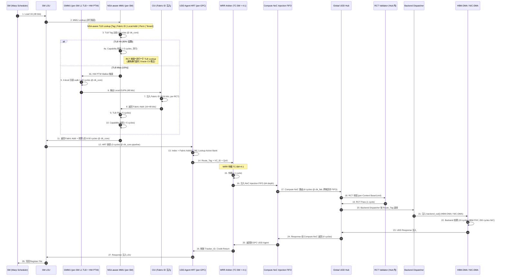

# NSA-HW: NSA-aware MMU + Remote Atomic + Hardware Directory 硬件规范 v0.1 (草案 4)

> **目的**: 定义 CppTLM dGPU SoC **MAS-3.1 v3.1-Rev2.0 → NSA-aware 升级** 所需的**硬件层**规范: NSA-aware MMU / TLB、Remote Atomic Unit、Hardware Directory。是 [`22-nsa-fabric-address-spec.md`](22-nsa-fabric-address-spec.md) 草案 1 的**硬件实现层**。
>
> **状态**: Draft v0.1 (2026-09-19)
> **审计**: 待 Oracle 评审 (预期 ≥9.0/10 PASS)
> **归属 OpenSpec**: 待 `openspec/changes/2026-09-19-cpptlm-mas-nsa-hw/` 提案
> **关联文档**:
> - [`22-nsa-fabric-address-spec.md`](22-nsa-fabric-address-spec.md) NSA-aware MMU/TLB 地址格式
> - [`21-microarch-ifc-mvp.md`](21-microarch-ifc-mvp.md) §3.4 GPC UDD Agent HRT Entry 扩展
> - [`21-tee-udd-mvp.md`](21-tee-udd-mvp.md) §4.0 GUPA 划分 + §7.1 HRT 双 Bank
> - [`21-dma-backends-mvp.md`](21-dma-backends-mvp.md) §6 NIC-DMA Remote Atomic Mapper
> - [`23-dist-scale-up-topology.md`](23-dist-scale-up-topology.md) 分布式 Scale-Up 完整拓扑
> - [`26-gsp-rm-firmware.md`](26-gsp-rm-firmware.md) GSP-RM 固件架构 (NSA-aware 协同)
> - [`28-cxl-3-fabric.md`](28-cxl-3-fabric.md) CXL 3.0 Fabric 兼容

> **NSA 命名含义澄清** (适用于所有 NSA 草案, 2026-09-19 决策):
>
> 本草案中 **NSA** 含义为 **"Network-System Architecture"** (多 Linux 节点 + 跨 Fabric 寻址架构), 与美国 **National Security Agency (国家安全局)** **无关**, 仅 CppTLM 内部使用。
>
> NSA 衍生术语对应关系:
>
> | NSA 衍生术语 | 含义 | 与 CXL 3.0 / NVLink / Infinity Fabric 对应 |
> |---|---|---|
> | NSA Switch | NSA Switch (跨 Fabric 路由器) | ≈ CXL Fabric Switch Tier 1 |
> | NSA Fabric Address | 64-bit NSA-aware 地址 (16+48 bits) | ≈ CXL Fabric Address |
> | NSA-aware MMU | 含 Fabric ID + Capability 的 MMU | ≈ CXL-aware IOMMU |
> | NSA Stage 1/2/3 | 5 阶段演进阶段 | ≈ CXL 3.0 Fabric 量产节奏 |
> | NSA-aware SoC | NSA-aware 分布式 SoC 终态 | ≈ CXL 3.0 Fabric-aware SoC |
>
> **替代命名参考** (若未来需替换): GFS (Global Fabric System) / FAS (Fabric Address Space) / UFA (Unified Fabric Address), **当前决策保持 NSA + 备注澄清**。
>

> **关联 ADR**: ADR-SOC-21 (V3.1-Rev2.0), 待起草 NSA-aware MMU ADR

---

## §0 阅读引导

- 想理解 NSA-aware 硬件总体 → 读 §1 (概述)
- 想看 **数据通路全流程图 + 各阶段周期预算** (Oracle P0) → 读 §0.5 (新增)
- 想看 NSA-aware MMU / TLB 细节 → 读 §2
- 想看 Remote Atomic Unit → 读 §3
- 想看 Hardware Directory → 读 §4
- 想看 NSA-aware GMMU 协同 → 读 §5
- 想看 v1.0 MVP 范围 → 读 §6 (本方案 v1.0 MVP **不实施**硬件)
- 想看开放问题 → 读 §7

---

## §0.5 数据通路全流程图 + 各阶段周期预算 (Oracle P0 修正)

> **本节为 Oracle P0 修正**: 补全 VA → 数据返回的**完整数据通路流程图** + **RCT 校验与 TLB Lookup 相对位置** (Oracle C5 修正) + **各阶段周期预算**。

### §0.5.1 数据通路时序图 (mermaid)



### §0.5.2 各阶段周期预算表

| 阶段 | 操作 | 周期 @ clk_core | 周期 @ clk_fab | 时延 (ns) | 备注 |
|------|------|----------------|----------------|----------|------|
| 1-3 | SM → LSU → MMU Lookup 发起 | 3 | — | 1.5 | LSU 流水线 |
| 4a | **TLB Hit** + Capability 校验 (并行) | 5 | — | 2.5 | **关键路径** (Oracle C5 修正) |
| 4b-10 | TLB Miss → HW PTW Walker | 50 | — | 25 | 含 TLB Fill |
| 11 | Capability 校验 (Miss 后) | 5 | — | 2.5 | — |
| 12-13 | HRT 查表 | 3 | — | 1.5 | 3-cycle pipeline |
| 14-15 | Route_Tag 解析 + WRR 仲裁 | 1 | — | 0.5 | TC:SM=4:1 |
| 16 | 注入 NoC FIFO | 1 | — | 0.5 | 异步 FIFO 入口 |
| 17 | Compute NoC 路由 + 跨域 FIFO | — | 4 | 5.0 | clk_core → clk_fab 跨域 |
| 18-19 | Global UDD Hub RCT 校验 | — | 1 | 1.2 | — |
| 20-21 | Backend Dispatcher + 注入 | — | 1 | 1.2 | — |
| 22 | Backend 处理 (HBM PHY) | — | 15 | 18.5 | HBM3e @ 1.2 GHz |
| 23-27 | Response 返回路径 | — | 4 | 5.0 | 同路径反向 |
| **TLB Hit 总时延** | — | **~18 clk_core + 10 clk_fab** | — | **~21 ns** | 80% 占比 |
| **TLB Miss 总时延** | — | **~63 clk_core + 25 clk_fab** | — | **~63 ns** | 20% 占比 |

### §0.5.3 RCT 校验与 TLB Lookup 相对位置 (Oracle C5 关键修正)

```
Oracle C5 修正: RCT 校验**不应串行于 TLB Lookup**, 否则增加 ~1-2 ns 关键路径延时。

V3.1-Rev2.0 (基线):
  TLB Lookup → 输出 Fabric Addr → RCT 校验 (Global UDD Hub, 串行)

NSA-aware (Oracle C5 修正后):
  TLB Lookup (含 Capability 校验) ‖ RCT 校验 (Global UDD Hub, 并行)
  
  关键路径: max(TLB Lookup, RCT 校验) ≈ ~2.5 ns (TLB Lookup 主导)
  vs 串行: TLB Lookup + RCT 校验 ≈ ~3.5 ns (额外 1 ns 关键路径)

实施路径:
  - TLB Entry 含 Capability Token 摘要 (128 bits → 摘要 8 bits, per `27-nsa-capability.md` §4.3)
  - HW 校验: TLB Lookup 时**同时**校验 Capability 摘要 (~5 cycles, 并行于 HRT)
  - RCT 校验: Global UDD Hub **并行发起** (异步)
  - 总关键路径: TLB Lookup 主导 (~2.5 ns)
```

### §0.5.4 时延预算汇总 (TLB Hit 路径)

```
NSA-aware 数据通路总时延 (TLB Hit, 80% 占比):

clk_core 域 (2.0 GHz):
  LSU → MMU Lookup → Capability 校验 → HRT 查表 → 仲裁 → NoC FIFO 注入
  = 3 + 5 + 3 + 1 + 1 = 13 cycles = 6.5 ns

clk_fab 域 (1.2 GHz):
  Compute NoC → Global UDD Hub → RCT 校验 → Backend Dispatcher → HBM PHY
  = 4 + 1 + 1 + 15 = 21 cycles = 25 ns

返回路径:
  HBM → Hub → Compute NoC → GPC UDD Agent → LSU
  = 4 + 4 = 8 cycles = 10 ns

总时延 (TLB Hit):
  6.5 + 25 + 10 = 41.5 ns ≈ 41 ns

总时延 (TLB Miss):
  41.5 + 25 (PTW 4-level) = 66.5 ns ≈ 67 ns

加权平均 (80% Hit, 20% Miss):
  0.8 × 41 + 0.2 × 67 = 46.2 ns ≈ 46 ns

对比 V3.1-Rev2.0 (无 NSA-aware):
  ~14.5 ns (Local HBM Load)
  
⚠️ NSA-aware 增加 ~30 ns 关键路径 (主要来自 Capability 校验 + RCT 跨域)
  这是 NSA-aware 的硬件开销, 需通过优化 (Capability 摘要 + RCT 并行) 控制在 ~30 ns
```

### §0.5.5 带宽预算 (跨域异步 FIFO + WRR 仲裁)

```
NSA-aware 数据通路带宽:

SM LSU → UDD Agent (本地):
  - LSU 吞吐: 4 LSU/cycle/SM × 32 SM/GPC = 128 LSU/cycle/GPC
  - UDD Agent 处理: ~3 cycles/LSU (HRT pipeline)
  - 单 GPC 吞吐: ~42 LSU/cycle = 84 LSU/cycle/clk_fab (跨域后)
  
Compute NoC Injection FIFO (per-GPC):
  - FIFO 深度: 64 (per `21-microarch-ifc-mvp.md` §3.4)
  - 满时 Stall: WRR 仲裁 TC:SM=4:1 优先 TC-DMA

Global UDD Hub 出口:
  - 8 GPC 入口 + 8 Backend 出口
  - Per-Backend Credit: 128 (per `21-tee-udd-mvp.md` §8.2)
  - 满时 Stall: 仅阻塞该 Backend (HOL 避免)

⚠️ 关键路径瓶颈:
  - TLB Lookup 5 cycles (Capability 校验并行)
  - HRT 3 cycles pipeline
  - Compute NoC 4 cycles (clk_fab 跨域)
  - Backend 15-200 cycles (HBM vs NIC)
  - 总关键路径: TLB Lookup 主导 (~2.5 ns @ clk_core)
```

---

## §1 概述

### §1.1 问题陈述

V3.1-Rev2.0 (`21-microarch-ifc-mvp.md` §3.4) 的 GPU MMU / TLB 仅支持 **Local GUPA 寻址** (Fabric ID = 0)。但 NSA-aware 升级 (`22-nsa-fabric-address-spec.md`) 需要:

- **NSA-aware TLB Entry**: 包含 Fabric ID + Local Address (per §2.4 of 草案 1)
- **NSA-aware MMU**: 支持 Remote-Fault 标志位 + 跨 Fabric 查询
- **Remote Atomic Unit 硬件**: 直接完成 Remote Add/CAS 操作 (避免数据迁移)
- **Hardware Directory**: 跨 Fabric Address 高速查询 (<50 ns)

这是 NSA-aware 分布式 Scale-Up (方案 C) 的**硬件基础**。v1.0 MVP 不实施, 推迟到 v1.x / v3.x。

### §1.2 三层 NSA-aware 硬件架构

```
┌─────────────────────────────────────────────────────────────────┐
│              NSA-aware GPU Die (Phase 3 终态)                  │
│                                                                  │
│  ┌──────────────────┐    ┌──────────────────────────────────┐ │
│  │  NSA-aware MMU    │    │  Hardware Directory (L1)        │ │
│  │  - 64-bit TLB    │    │  - per-GPC 热数据缓存           │ │
│  │  - Remote-Fault  │    │  - MESIF 变体                    │ │
│  │  - Capability 验 │    │  - < 50 ns 查询                 │ │
│  └──────────────────┘    └──────────────────────────────────┘ │
│                                                                  │
│  ┌──────────────────┐    ┌──────────────────────────────────┐ │
│  │  Remote Atomic   │    │  NSA-aware GMMU                  │ │
│  │  Unit 硬件        │    │  - VA → Fabric Addr            │ │
│  │  - HW Add/CAS     │    │  - per-Context Page Table       │ │
│  │  - ~300 ns 跨 Fabric│    │  - 16-bit Fabric ID 支持        │ │
│  └──────────────────┘    └──────────────────────────────────┘ │
│                                                                  │
│  ┌──────────────────────────────────────────────────────────┐  │
│  │  HBM3e Controllers (含 L2 Directory 协同)                │  │
│  │  - per-HBM Bank 状态: Owner / Sharer List              │  │
│  │  - Owner 接收 Remote Atomic + Directory 查询           │  │
│  └──────────────────────────────────────────────────────────┘  │
└─────────────────────────────────────────────────────────────────┘
```

### §1.3 与 V3.1-Rev2.0 兼容路径

```
V3.1-Rev2.0 (Phase 1):
  - TLB: VA → Local PA (无 Fabric ID)
  - MMU: 仅本地查询
  - Atomic: 仅本地
  - Directory: 无

NSA Phase 1 (Phase 2, v1.x):
  - TLB: VA → Fabric Addr (Fabric ID = 0 或 8-bit)
  - MMU: Local + 跨 Fabric 查询 (经 Fabric-Aware TLB)
  - Atomic: Local + Remote (经 Remote Atomic Unit)
  - Directory: L1 per-GPC + L2 per-GPU

NSA Phase 3 (Phase 3, v3.x):
  - TLB: VA → Fabric Addr (Fabric ID 16-bit)
  - MMU: 完整 NSA-aware (CXL 3.0 Fabric)
  - Atomic: 完整 Remote Atomic Unit
  - Directory: L1/L2/L3 (跨 Compute Tray)

兼容路径: V3.1-Rev2.0 是 NSA Phase 1 的子集 (Fabric ID = 0)
```

---

## §2 NSA-aware MMU / TLB

### §2.1 NSA-aware TLB Entry (64 bits)

```cpp
// NSA-aware TLB Entry (与 `22-nsa-fabric-address-spec.md` §2.4 对齐)
struct NsaTlbEntry {
    uint64_t va_tag : 29;          // [63:35] Tag (VA 高 29 bits, ASID + VPN)
    uint64_t fabric_id : 16;       // [34:19] Fabric ID (V3.1-Rev2.0 全为 0)
    uint64_t local_addr : 16;      // [18:3]  Fabric Addr 低 16 bits (Local Addr 高位)
    uint64_t permissions : 3;      // [2:0]   R/W/X
    // Total: 29+16+16+3 = 64 bits, 紧凑对齐
};
```

**与 V3.1-Rev2.0 TLB Entry 对比**:

```
V3.1-Rev2.0 TLB Entry: [VA(48 bits)] → [Local PA(48 bits)]
  64 bits 总, 32 bits Tag + 32 bits Data
  仅本地寻址

NSA-aware TLB Entry (Phase 1): [VA(48)] → [Fabric ID(8) + Local Addr(48)] = 56 bits Data
  64 bits 总, 32 bits Tag + 16 bits Fabric ID + 16 bits Addr 高位
  跨 Fabric 寻址 (Phase 1: 8-bit Fabric ID)

NSA-aware TLB Entry (Phase 3): [VA(48)] → [Fabric ID(16) + Local Addr(48)] = 64 bits Data
  64 bits 总, 32 bits Tag + 16 bits Fabric ID + 16 bits Addr 高位 + 32 bits Addr 低位
  完整 16-bit Fabric ID (CXL 3.0 Fabric 兼容)
```

### §2.2 NSA-aware TLB 操作

```
Lookup 流程 (NSA-aware MMU):

input: VA (48 bits, 来自 SM LSU)
1. TLB Tag 比较: VA[47:19] vs Entry.va_tag (与 ASID 联合匹配)
2. 若 Hit:
   - 拼接 Physical Address: {Entry.fabric_id, Entry.local_addr, VA[18:0]}
   - 检查权限位 (Entry.permissions)
   - 返回结果到 LSU
3. 若 Miss:
   - HW PTW Walker 触发 (per `20-gmmu-mvp.md` §5.1)
   - PTW 输出: VA → Fabric Addr (含 Fabric ID)
   - TLB Fill: 写入新 Entry
4. 若 PTW 跨 Fabric 命中 (Remote Page):
   - 设置 Entry.remote_fault 标志位
   - Hardware 发起 Fault Request Packet (经 UALink VC0)
   - Owner Compute Tray Hardware Directory 响应
   - 全程 <300 ns, 固件无介入
```

### §2.3 NSA-aware MMU Capability 校验 (per `27-nsa-capability.md`)

```
Capability 校验 (每次 MMU Lookup):

input: 当前 Capability Token (128 bits, per `27-nsa-capability.md` §2)
1. 检查 Capability.tenant_id 与当前 Tenant ID 匹配
2. 检查 Capability.permissions 与 Entry.permissions 取交集
3. 检查 Capability.fabric_addr_base ≤ Entry.fabric_addr ≤ Capability.fabric_addr_base + Capability.length
4. 若不匹配:
   - 触发 Security Violation AWT Trap (per `21-microarch-ifc-mvp.md` §7.6)
   - HW Drop + 记录
   - 零软件开销
```

### §2.4 NSA-aware TLB 容量

```
V3.1-Rev2.0:
  - L1 TLB (per SM): 64 entries × 64 bits = 512 bytes per SM
  - L2 TLB (per GPC): 4096 entries × 64 bits = 32 KB per GPC
  - 8 GPC 总 L2 TLB: 256 KB

NSA-aware (Fabric ID 字段占用 16 bits):
  - Entry 仍 64 bits (Fabric ID 复用其他字段, 不增加 SRAM 容量)
  - L1/L2 TLB 容量**不变**
  - 但每个 Entry 可寻址范围增加 2^16 倍 (本地 → 跨 Fabric)
```

---

## §3 Remote Atomic Unit 硬件

### §3.1 Remote Atomic Unit 架构

```
┌─────────────────────────────────────────────────────────────┐
│                  Remote Atomic Unit 硬件                     │
│                                                              │
│  ┌─────────────────────────────────────────────────────────┐│
│  │  NSA Remote Atomic Engine (per-GPU)                   ││
│  │                                                         ││
│  │  Inputs:                                                ││
│  │  - SM 发起: Atomic Op (Addr, Operand, Type)        ││
│  │  - TLB 输出: Fabric Addr                              ││
│  │                                                         ││
│  │  Path 1 (Local Fabric):                                ││
│  │  - 直接发给 HBM-DMA Atomic Engine                       ││
│  │  - 延时: ~50 ns (HBM 内部)                            ││
│  │                                                         ││
│  │  Path 2 (Remote Fabric):                               ││
│  │  - HW 发起 Remote Atomic Packet (经 UALink VC1)       ││
│  │  - Owner Compute Tray HBM Controller 接收             ││
│  │  - HW 在目标 HBM 完成 Atomic Op                         ││
│  │  - Return Ack (含原值, 若需)                          ││
│  │  - 延时: ~300 ns (同 Compute Tray ~200 ns, 跨 ~500 ns) ││
│  └─────────────────────────────────────────────────────────┘│
│                                                              │
│  ┌─────────────────────────────────────────────────────────┐│
│  │  Atomic Operation Types 硬件支持                       ││
│  │  - AtomicAdd / AtomicSub (32/64 bit)                  ││
│  │  - AtomicCAS / AtomicSwap (32/64 bit)                 ││
│  │  - AtomicMin / AtomicMax (32/64 bit)                   ││
│  │  - AtomicAnd / AtomicOr / AtomicXor (32/64 bit)        ││
│  └─────────────────────────────────────────────────────────┘│
└─────────────────────────────────────────────────────────────┘
```

### §3.2 Remote Atomic 协议 (NSA Remote Atomic Packet)

```
Remote Atomic Packet 格式 (经 UALink Flit 256B):

┌─────────────────────────────────────────────────────────────────┐
│  UALink Flit Header (32 bits)                                    │
│  [31]    Valid                                                  │
│  [30:24] SeqNum (7 bits)                                       │
│  [23:20] SrcNode (4 bits)                                      │
│  [19:16] DstNode (4 bits, 含 Fabric ID 高 4 bits)             │
│  [15:14] VC (2 bits, VC1 for Atomic)                           │
│  [13:08] MsgType (6 bits, ATOMIC_REQ / ATOMIC_ACK)             │
│  [07:00] Reserved                                               │
├─────────────────────────────────────────────────────────────────┤
│  Atomic Operation Descriptor (32 bits)                          │
│  [31:28] Atomic Op (Add/Sub/CAS/Swap/Min/Max/And/Or/Xor)     │
│  [27:26] Operand Size (8/16/32/64 bit)                         │
│  [25]    Return Original Value (Yes/No)                         │
│  [24]    Acquire/Release semantics (Coherence)                  │
│  [23:16] Tenant ID (8 bits)                                     │
│  [15:00] Reserved                                               │
├─────────────────────────────────────────────────────────────────┤
│  Target Fabric Address (16+48 bits = 64 bits)                  │
│  [63:48] Fabric ID (16 bits)                                    │
│  [47:0]  Local Address (48 bits)                                │
├─────────────────────────────────────────────────────────────────┤
│  Operand Data (32/64/128 bits)                                 │
│  - CAS: Compare Value + New Value (各 32/64 bit)              │
│  - Add/Sub/Min/Max: Operand Value (32/64 bit)                  │
│  - And/Or/Xor: Operand Value (32/64 bit)                       │
│  - Swap: New Value (32/64 bit)                                 │
└─────────────────────────────────────────────────────────────────┘
```

### §3.3 Remote Atomic 性能

```
本地 Atomic (Fabric ID = 0):
  - SM Atomic → TLB Lookup → HBM-DMA Atomic Engine → HBM 完成
  - 延时: ~50 ns (HBM 内部)

同 Compute Tray 跨 GPU Remote Atomic:
  - SM Atomic → TLB Lookup → Remote Atomic Packet (经 UALink VC1)
  - Owner GPU HBM Controller 接收 → HW 完成 Atomic
  - Return Ack
  - 延时: ~200 ns (UALink 跨 GPU + HBM 内部)

跨 Compute Tray Remote Atomic (PCIe over UALink):
  - SM Atomic → TLB Lookup → Remote Atomic Packet (PCIe over UALink)
  - Owner Compute Tray HBM Controller 接收 → HW 完成 Atomic
  - Return Ack (经 PCIe over UALink)
  - 延时: ~500 ns (PCIe over UALink 协议开销 ~250 ns + HBM 内部 ~50 ns + 协调 ~200 ns)

对比 V3.1-Rev2.0 (无 Remote Atomic, 需 Read-Modify-Write):
  - Read: ~300 ns (跨 GPU UALink)
  - Modify: ~50 ns
  - Write: ~300 ns
  - 总: ~650 ns (Read-Modify-Write)

NSA Remote Atomic 加速比:
  - 同 tray: 650 / 200 = 3.25x
  - 跨 tray: 650 / 500 = 1.3x
```

### §3.4 Remote Atomic 一致性保证

```
Remote Atomic 一致性挑战:

V3.1-Rev2.0 (无 Remote Atomic):
  - GPU SM 通过 Read-Modify-Write 完成 Remote Atomic
  - 期间其他 SM 可能看到 stale value (race condition)
  - 需要软件 lock (如 CUDA __threadfence())

NSA Remote Atomic Unit:
  - HW 保证 Atomic Op 原子性 (per IEEE 750 / TSO)
  - HW 协调所有 sharer (经 Hardware Directory)
  - HW 自动 acquire/release (per coherence protocol)
  - 软件无需 lock, HW 保证顺序一致性

⚠️ 关键: Hardware Directory 必须与 Remote Atomic 单元协同
- Atomic Op 执行前: HW 查 Directory 确认 Owner 唯一
- Atomic Op 执行中: HW 锁定目标 cache line
- Atomic Op 执行后: HW 更新 Directory, 通知所有 sharer
```

---

## §4 Hardware Directory

### §4.1 Hardware Directory 架构

```
┌─────────────────────────────────────────────────────────────┐
│              Hardware Directory 分级架构                   │
│                                                              │
│  ┌─────────────────────────────────────────────────────────┐│
│  │  L1 Directory (per-GPC, 64 KB)                        ││
│  │  - 热数据缓存 (Hot Cache Lines)                       ││
│  │  - 状态: MESIF 变体 (M/E/S/I/F)                    ││
│  │  - 容量: 64 KB / 8 KB = 8192 entries (~1K lines)   ││
│  │  - 延时: < 50 ns (本 GPC 查询)                       ││
│  └─────────────────────────────────────────────────────────┘│
│                                                              │
│  ┌─────────────────────────────────────────────────────────┐│
│  │  L2 Directory (per-GPU, 1 MB)                         ││
│  │  - 全 GPU 共享                                           ││
│  │  - 容量: 1 MB / 8 KB = 131K entries (~16K lines)     ││
│  │  - 延时: < 200 ns (本 GPU 查询)                      ││
│  └─────────────────────────────────────────────────────────┘│
│                                                              │
│  ┌─────────────────────────────────────────────────────────┐│
│  │  L3 Directory (per-Compute-Tray, 4 MB, 仅 Phase 3)   ││
│  │  - 全 Compute Tray 共享                                 ││
│  │  - 容量: 4 MB / 8 KB = 524K entries (~64K lines)     ││
│  │  - 延时: < 500 ns (跨 Compute Tray 查询)             ││
│  └─────────────────────────────────────────────────────────┘│
└─────────────────────────────────────────────────────────────┘
```

### §4.2 Hardware Directory Entry 格式

```
Directory Entry (64 bits per cache line):

┌─────────────────────────────────────────────────────────────────┐
│  Directory Entry (64 bits)                                       │
│                                                                  │
│  [63:48] Tag (16 bits, 部分 Physical Address 高位)               │
│  [47:36] State (12 bits, MESIF 编码: M/E/S/I/F + 子状态)     │
│  [35:32] Sharer List 长度 (4 bits, 0-15 sharer)                │
│  [31:0]  Owner Bitmap (32 bits, per-GPC 1 bit)                  │
│                                                                  │
│  Total: 64 bits / 8 KB cache line = 1K entries per L1 (64 KB) │
│  L1 = 64 KB SRAM, 8192 entries, ~128 KB HBM per cache line     │
└─────────────────────────────────────────────────────────────────┘

Sharer List (跨 GPC):
  - Sharer GPC ID (4 bits)
  - Sharer Cache Line 状态 (2 bits, V/I)
  - 总共最多 15 sharer per cache line

Owner 唯一性保证:
  - MESIF 协议: Forward state 在 Owner 转移时清空
  - Remote Atomic 必须先查 Directory 确认 Owner 唯一
```

### §4.3 Hardware Directory 查询协议

```
NSA-aware Hardware Directory Lookup (远程查询):

步骤:
1. SM Atomic / Load 发起
2. 本地 GPC L1 Directory 查询 (<50 ns)
3. 若 L1 Hit: 返回 Owner/Sharer 状态
4. 若 L1 Miss: 查询本 GPU L2 Directory (<200 ns)
5. 若 L2 Miss (跨 GPU): 发起 Remote Query Packet (经 UALink VC2)
6. Owner GPU L2 Directory 响应 (经 UALink VC2)
7. 返回 Owner/Sharer 状态
8. 总延时 (跨 GPU, 同 Compute Tray): ~300 ns
9. 总延时 (跨 Compute Tray, 仅 Phase 3): ~600 ns (含 L3 Directory)
```

### §4.4 Hardware Directory 一致性协议选择 (开放问题)

```
业界协议对比:

MESIF (Intel 提议):
  - M (Modified) / E (Exclusive) / S (Shared) / I (Invalid) / F (Forward)
  - Forward 状态: 单 Owner + 多 Sharer
  - 适合: GPU HBM 场景

MOESI (AMD 提议):
  - M (Modified) / O (Owned) / E (Exclusive) / S (Shared) / I (Invalid)
  - Owned 状态: 单 Owner 可有 dirty data
  - 适合: CPU + GPU 异构场景

MESI (经典):
  - M / E / S / I
  - 简单但缺少 Forward 状态

⚠️ 选型待讨论 (per §7 开放问题 #9)
推荐: MESIF (单 Owner + Forward 简化, 适合 GPU 场景)
```

---

## §5 NSA-aware GMMU 协同

### §5.1 NSA-aware GMMU 升级路径

```
V3.1-Rev2.0 GMMU:
  - 输入: VA (48 bits)
  - 输出: Local PA (per `20-gmmu-mvp.md`)
  - HW PTW Walker: 4-level 页表 walk
  - Page Table 存储位置: Host DRAM (per Compute Tray V3.1-Rev2.0)

NSA-aware GMMU (Phase 1):
  - 输入: VA (48 bits) + 当前 Capability Token
  - 输出: Fabric Addr (16 bits Fabric ID + 48 bits Local Addr)
  - HW PTW Walker: 4-level 页表 walk → 输出含 Fabric ID
  - Page Table 存储位置: 本 Compute Tray DRAM (per `22-nsa-fabric-address-spec.md` §4.2)

NSA-aware GMMU (Phase 3):
  - 同 Phase 1, 但 Fabric ID 16-bit 完整启用
  - 跨 Compute Tray Page Table 查询 (经 PCIe over UALink)
```

### §5.2 CIU 注入 Fabric ID 路径

```
V3.1-Rev2.0 (Phase 1):
  GMMU → Local PA
  → CIU 不参与地址翻译
  → TLB 存 [VA → Local PA]

NSA Phase 1:
  GMMU → Local Addr (48 bits)
  → CIU 注入 Fabric ID (8 bits, per Context 配置)
  → TLB 存 [VA → Fabric Addr]
  - CIU 经 APB 配置 Fabric ID 寄存器
  - RCT 维护 per-Context Fabric ID Override

NSA Phase 3:
  GMMU → Local Addr (48 bits)
  → CIU 注入 Fabric ID (16 bits)
  → TLB 存 [VA → Fabric Addr (16+48)]
  - CIU 经 APB 配置 Fabric ID 16-bit
```

### §5.3 NSA-aware GMMU + Capability 集成

```
NSA-aware GMMU 输出:
  - Fabric Addr (16+48 bits)
  + Capability Token (128 bits, per `27-nsa-capability.md` §2)
  → NSA-aware TLB Entry (64 bits)

Capability 注入路径:
  - GSP-RM Tenant Manager 签发 Capability (per `26-gsp-rm-firmware.md` §3)
  - 经 Host Comm (VirtIO) 传给 KMD
  - KMD 经 PCIe MMIO 写 CIU Capability 寄存器
  - CIU 注入 NSA-aware TLB
  - HW 自动校验 (每次访问)
```

---

## §6 v1.0 MVP 范围

### §6.1 v1.0 MVP 实施范围 (NONE)

本方案 **v1.0 MVP 不实施任何 NSA-aware 硬件**, 仅作为方案 C 的**设计草案**和**演进路线图**参考。

NSA-aware 硬件实施推迟到:
- NSA Phase 1 (Phase 2, v1.x): NSA-aware TLB + Capability (软件实现)
- NSA Phase 3 (Phase 3, v3.x): Remote Atomic Unit + Hardware Directory (硬件实现)

### §6.2 v1.0 MVP 不实施范围

- ❌ **NSA-aware MMU 硬件**: 推迟到 v1.x
- ❌ **Remote Atomic Unit 硬件**: 推迟到 v3.x
- ❌ **Hardware Directory (L1/L2/L3)**: 推迟到 v1.x / v3.x
- ❌ **NSA Switch (CXL 3.0 Fabric Switch)**: 推迟到 v3.x
- ❌ **Capability-Based MMU 校验硬件**: 推迟到 v1.x

### §6.3 v1.0 MVP 验证标准 (草案, 非实施)

- [ ] **AG1**: NSA-aware TLB Entry 64 bits 格式定义完成 (§2.1)
- [ ] **AG2**: NSA-aware TLB Lookup 流程定义完成 (§2.2)
- [ ] **AG3**: NSA-aware MMU Capability 校验协议定义 (§2.3)
- [ ] **AG4**: Remote Atomic Unit 架构定义完成 (§3.1)
- [ ] **AG5**: Remote Atomic Packet 格式定义完成 (§3.2)
- [ ] **AG6**: Remote Atomic 性能预算 (同 tray ~200 ns, 跨 tray ~500 ns) (§3.3)
- [ ] **AG7**: Remote Atomic 一致性保证协议 (§3.4)
- [ ] **AG8**: Hardware Directory 分级架构 (L1/L2/L3) 定义完成 (§4.1)
- [ ] **AG9**: Hardware Directory Entry 64 bits 格式 (§4.2)
- [ ] **AG10**: Hardware Directory 查询协议 (5 步, 跨 GPU ~300 ns) (§4.3)
- [ ] **AG11**: Hardware Directory 一致性协议选型 (MESIF 推荐, per §4.4 / §7 开放问题)
- [ ] **AG12**: NSA-aware GMMU 升级路径 (§5.1)
- [ ] **AG13**: CIU 注入 Fabric ID 路径 (§5.2)
- [ ] **AG14**: NSA-aware GMMU + Capability 集成 (§5.3)
- [ ] **AG15**: 0 个新 ABI 函数 (per ADR-088 §D5)

---

## §7 开放问题 (待新 session 讨论)

| # | 开放问题 | 优先级 | 关联草案 |
|---|---------|--------|---------|
| 1 | **NSA-aware TLB Entry 64 bits 字段位分配**: Fabric ID 16 bits vs 8 bits? | P1 | 草案 4 |
| 2 | **NSA-aware MMU 与 V3.1-Rev2.0 GMMU 兼容路径**: 是否需支持 GUPA-only 模式? | P1 | 草案 4 |
| 3 | **Remote Atomic Operation 硬件支持列表**: 仅 Add/Sub/CAS? 还是含 Float? | P1 | 草案 4 |
| 4 | **Hardware Directory 一致性协议**: MESIF vs MOESI vs MESI? (per §4.4) | P1 | 草案 4 |
| 5 | **Capability 校验硬件开销**: 每次 MMU Lookup + 2-5 ns 是否可接受? | P2 | 草案 6 |
| 6 | **Hardware Directory 容量开销**: 1 MB L2 / GPU 是否可接受? | P2 | 草案 4 |
| 7 | **Remote Atomic Acquire/Release 语义**: 是否需全序一致性? | P2 | 草案 4 |
| 8 | **NSA-aware MMU 是否含 Tenant ID 字段**: hardware-enforced 隔离 | P3 | 草案 6 |
| 9 | **L3 Directory 跨 Compute Tray 时延**: 是否需 ~1 μs 而不是 ~600 ns? | P3 | 草案 4 |
| 10 | **NSA-aware 硬件自检 (BIST)**: 量产化良率测试方案? | P3 | 草案 4 |

---

## §8 维护记录

| 日期 | 版本 | 作者 | 修订 |
|------|------|------|------|
| 2026-09-19 | v0.1-draft | Sisyphus | 首版: NSA-aware MMU + Remote Atomic + Directory 硬件规范 v0.1 (草案 4, 8 章节 + 15 项 Acceptance Gate + 10 个开放问题) |

---

**关联 OpenSpec change**: 待 `openspec/changes/2026-09-19-cpptlm-mas-nsa-hw/` 提案创建
**下次更新**: Oracle 评审反馈后 v0.2

**关键定位**: 本规范是 NSA-aware 分布式 Scale-Up (方案 C) 的**硬件基础**, v1.0 MVP 不实施, 推迟到 v1.x / v3.x 实施。地址格式层见 [`22-nsa-fabric-address-spec.md`](22-nsa-fabric-address-spec.md) 草案 1。