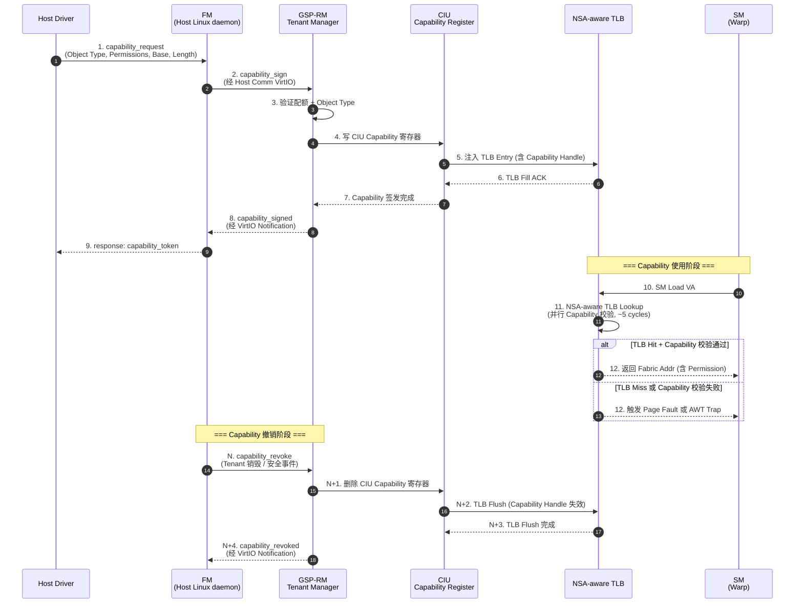

# NSA-Cap: Capability-Based 内存保护 + 多租户隔离 v0.1 (草案 6)

> **目的**: 定义 CppTLM dGPU SoC **MAS-3.1 v3.1-Rev2.0 → NSA-aware 升级** 所需的 **Capability-Based 内存保护机制**, 借鉴 CHERI (Cambridge) + seL4 Capability 思想, 实现 **GPU 多租户硬件强隔离**。对应你提出的"Tenant ID Tagging + Capability-Based Memory Protection"设想 (per 第 14 轮讨论)。
>
> **状态**: Draft v0.1 (2026-09-19)
> **审计**: 待 Oracle 评审 (预期 ≥9.0/10 PASS)
> **归属 OpenSpec**: 待 `openspec/changes/2026-09-19-cpptlm-mas-nsa-capability/` 提案
> **关联文档**:
> - [`21-tee-udd-mvp.md`](21-tee-udd-mvp.md) §3.4 RCT (V3.1-Rev2.0 Base/Limit 软件维护)
> - [`21-microarch-ifc-mvp.md`](21-microarch-ifc-mvp.md) §7.6 AWT Trap Type
> - [`22-nsa-fabric-address-spec.md`](22-nsa-fabric-address-spec.md) Fabric Address 格式
> - [`25-nsa-hardware.md`](25-nsa-hardware.md) §2.3 NSA-aware MMU Capability 校验
> - [`26-gsp-rm-firmware.md`](26-gsp-rm-firmware.md) §4.5 Tenant Manager Capability 签发
> - [`23-dist-scale-up-topology.md`](23-dist-scale-up-topology.md) 分布式 Scale-Up 拓扑

> **NSA 命名含义澄清** (适用于所有 NSA 草案, 2026-09-19 决策):
>
> 本草案中 **NSA** 含义为 **"Network-System Architecture"** (多 Linux 节点 + 跨 Fabric 寻址架构), 与美国 **National Security Agency (国家安全局)** **无关**, 仅 CppTLM 内部使用。
>
> NSA 衍生术语对应关系:
>
> | NSA 衍生术语 | 含义 | 与 CXL 3.0 / NVLink / Infinity Fabric 对应 |
> |---|---|---|
> | NSA Switch | NSA Switch (跨 Fabric 路由器) | ≈ CXL Fabric Switch Tier 1 |
> | NSA Fabric Address | 64-bit NSA-aware 地址 (16+48 bits) | ≈ CXL Fabric Address |
> | NSA-aware MMU | 含 Fabric ID + Capability 的 MMU | ≈ CXL-aware IOMMU |
> | NSA Stage 1/2/3 | 5 阶段演进阶段 | ≈ CXL 3.0 Fabric 量产节奏 |
> | NSA-aware SoC | NSA-aware 分布式 SoC 终态 | ≈ CXL 3.0 Fabric-aware SoC |
>
> **替代命名参考** (若未来需替换): GFS (Global Fabric System) / FAS (Fabric Address Space) / UFA (Unified Fabric Address), **当前决策保持 NSA + 备注澄清**。
>

> **关联 ADR**: 待起草 Capability 多租户 ADR

---

## §0 阅读引导

- 想理解 Capability 总体 → 读 §1 (概述 + 与业界对比)
- 想看 Capability Token 格式 → 读 §2
- 想看 Capability 生命周期 → 读 §3
- 想看 HW 校验路径 → 读 §4
- 想看多租户场景 → 读 §5
- 想看与 V3.1-Rev2.0 RCT 兼容路径 → 读 §6
- 想看开放问题 → 读 §7

---

## §1 概述

### §1.1 问题陈述

V3.1-Rev2.0 (`21-tee-udd-mvp.md` §3.4) 的 **RCT (Routing Context Table)** 是 **软件维护的 Base/Limit 校验**:
- KMD 维护 RCT (Base/Limit/Enable)
- 每次 NSA-aware MMU 翻译时, RCT 软硬件协同校验
- 多租户隔离**依赖软件信任链**, 不是硬件强制

这导致:
- ❌ **多租户隔离薄弱**: 恶意 Host OS 可绕过 RCT 限制
- ❌ **RCT 软件维护开销**: KMD 需同步所有 GPC 的 RCT
- ❌ **Capability 不可传递**: RCT 不能跨 Compute Tray 共享

业界解决方案对比:
- **NVIDIA MIG**: 硬件切片, 严格隔离, 但限本地 PCIe Hierarchy
- **AMD CXD**: 类似 MIG
- **Intel SGX**: 基于飞地 (Enclave), 但 CPU 中心
- **ARM CCA**: 基于 Realm Management Monitor (RMM), 但 CPU 中心
- **CHERI**: Capability-Based, 内存安全, 适合任何处理器
- **seL4**: Capability-Based, 微内核, 形式化验证

本规范定义 CppTLM dGPU 的 **NSA-Cap (NSA Capability-Based 内存保护)**, 借鉴 CHERI + seL4 思想。

### §1.2 Capability 总体设计目标

```
设计目标:
  ✅ Capability 由 HW 强制校验 (零软件开销)
  ✅ Capability 跨 Compute Tray 可传递 (Phase 3+)
  ✅ Capability 包含 Fabric Address (per `22-nsa-fabric-address-spec.md`)
  ✅ Capability 包含 Tenant ID (硬件强隔离)
  ✅ Capability 可签发/撤销 (per Tenant Manager, `26-gsp-rm-firmware.md` §4.5)
  ✅ 与 V3.1-Rev2.0 RCT 兼容 (软件 → 硬件迁移路径)
```

---

## §2 Capability Token 格式

### §2.1 128-bit Capability Token

```
┌─────────────────────────────────────────────────────────────────┐
│  128-bit Capability Token                                         │
│                                                                  │
│  [127:96] Fabric Addr Base (32 bits)                            │
│           - NSA-aware Fabric ID (8 bits) + Local Addr (24 bits)│
│           - 对齐 `22-nsa-fabric-address-spec.md` §2.2          │
│                                                                  │
│  [95:64]  Length (32 bits)                                       │
│           - Capability 覆盖范围 (字节数)                       │
│           - 0 表示单地址 (非范围 Capability)                    │
│                                                                  │
│  [63:48]  Tenant ID (16 bits, 256 租户)                       │
│           - Hardware-enforced 多租户隔离                        │
│                                                                  │
│  [47:32]  Permissions (16 bits):                                │
│           [15]   Reserved                                         │
│           [14]   Fabric-DMA (允许跨 Fabric DMA)               │
│           [13]   Remote-Atomic (允许 Remote Atomic)            │
│           [12]   Cross-Tenant-Share (允许跨租户共享)            │
│           [11]   Reserved                                         │
│           [10]   Execute (X)                                     │
│           [9]    Write (W)                                       │
│           [8]    Read (R)                                        │
│           [7]    User-Accessible (U)                           │
│           [6]    Supervisor-Accessible (S)                      │
│           [5]    DMA-Accessible (Host DMA)                      │
│           [4]    Peer-Accessible (GPU P2P)                     │
│           [3]    Atomic-Accessible                              │
│           [2-0]  Reserved                                         │
│                                                                  │
│  [31:16]  Object Type (16 bits):                                │
│           0x0001: Memory (HBM / DRAM)                          │
│           0x0002: Queue (Command Queue / Completion Queue)     │
│           0x0003: Interrupt (MSI-X Vector)                     │
│           0x0004: DMA Buffer (Host-side)                       │
│           0x0005: Mailbox (GSP ↔ GPU Compute)                  │
│           ...                                                     │
│                                                                  │
│  [15:8]   Flags (8 bits):                                       │
│           [7]    Read-Only                                       │
│           [6]    Execute-Only                                    │
│           [5]    No-Fabric-DMA                                  │
│           [4]    No-Remote-Atomic                                │
│           [3]    Cacheable                                       │
│           [2]    Non-Cacheable                                   │
│           [1]    Device-Memory (HBM)                            │
│           [0]    Host-Memory (DRAM)                              │
│                                                                  │
│  [7:0]    Version + Checksum (8 bits):                         │
│           [7:4]  Version (4 bits, Capability 撤销/迁移递增)    │
│           [3:0]  Checksum (4 bits, 防止篡改)                   │
└─────────────────────────────────────────────────────────────────┘

总: 32 + 32 + 16 + 16 + 16 + 8 + 8 = 128 bits
```

### §2.2 Capability Token 字段位分配表

| 字段 | 位数 | 含义 | 默认值 |
|------|------|------|--------|
| Fabric Addr Base | 32 | Fabric Addr 高 32 bits (含 Fabric ID) | 0 |
| Length | 32 | Capability 范围 (字节) | 0 (单地址) |
| Tenant ID | 16 | 租户标识 (256 租户) | 0 (无租户) |
| Permissions | 16 | R/W/X/U/S/DMA/Peer/Atomic 等 | 0 (无权限) |
| Object Type | 16 | Memory / Queue / Interrupt / DMA / Mailbox | 0x0000 (invalid) |
| Flags | 8 | Read-Only / Execute-Only / Cacheable / etc. | 0 |
| Version + Checksum | 8 | 撤销/迁移版本号 + 校验和 | 0 |

### §2.3 Capability Token 与业界对比

| 维度 | CHERI | seL4 Capability | NSA-Cap (本规范) |
|------|-------|-----------------|-------------------|
| **Token 大小** | 128 bits | 8-16 bytes (CSpace) | 128 bits |
| **Base 字段** | Virtual Address (39/64 bits) | CSpace 句柄 | Fabric Addr (32 bits) |
| **Length** | Length (in bytes) | 无 (句柄式) | Length (32 bits) |
| **Permissions** | R/W/X + Load/Store/Cap | Read / Write / Grant | R/W/X/U/S/DMA/Peer/Atomic |
| **Object Type** | 隐式 (能力类型推断) | 显式 (endpoint, notification, etc.) | 显式 (Memory / Queue / Interrupt) |
| **Tenant ID** | 无 (per-process domain) | 无 (per-process domain) | ✅ 16 bits (硬件强隔离) |
| **跨节点** | 本地 | 本地 | ✅ Fabric ID 16 bits (跨 Fabric) |
| **HW 校验** | ✅ CHERI 硬件 | ⚠️ 软件 (seL4 内核) | ✅ 硬件 |

### §2.4 Acquire/Release 精确语义 (Oracle P1-2 修正)

> **本节为 Oracle P1-2 修正**: 补充 Capability Acquire/Release 与 ARM DMB/DSB / x86 MFENCE 对齐, 提供精确的内存序语义, 是 NSA-aware 分布式 Scale-Up 内存一致性的关键。

#### §2.4.1 Acquire 语义 (读屏障)

```
Capability Acquire 语义:

Capability Acquire(Read):
  - 确保: 此 Acquire 之后的所有读操作, 都能看到 Acquire 之前的所有写操作
  - 对应: ARM DMB LD (Data Memory Barrier, Load-Load + Load-Store 屏障)
  - 对应: x86 MFENCE (Memory Fence, 全屏障)
  - 对应: RISC-V FENCE r,rw (Read-Read + Read-Write 屏障)

NSA-aware 语义:
  Acquire(Token):
    HW: 等待所有 outstanding Capability 写入完成
    HW: 在 NSA-aware MMU 完成 Capability Token 更新
    HW: 刷新 Capability Handle 缓存 (TLB / Directory)
    HW: 返回 OK 后, 后续 SM 读操作可看到 Acquire 前的写
```

#### §2.4.2 Release 语义 (写屏障)

```
Capability Release 语义:

Capability Release(Write):
  - 确保: 此 Release 之前的所有写操作, 在 Release 之后对其他 GPU/Compute Tray 可见
  - 对应: ARM DMB ST (Data Memory Barrier, Store-Store + Store-Load 屏障)
  - 对应: x86 SFENCE (Store Fence)
  - 对应: RISC-V FENCE w,w (Write-Write 屏障)

NSA-aware 语义:
  Release(Token):
    HW: 等待所有 outstanding Capability 写入完成
    HW: 同步到 NSA Hardware Directory (L1/L2/L3)
    HW: 同步到其他 GPU / Compute Tray (经 NSA Switch PBR)
    HW: 返回 OK 后, 其他 GPU/Compute Tray 可见 Release 前的写
```

#### §2.4.3 Full Fence (读+写屏障)

```
Capability Full Fence (Acquire + Release):

Capability FullFence:
  - 确保: 此 Fence 之前的所有读写操作, 在 Fence 之后对所有 GPU/Compute Tray 可见
  - 对应: ARM DMB SY (Data Memory Barrier, Full System)
  - 对应: x86 MFENCE (全屏障)
  - 对应: RISC-V FENCE rw,rw (Read-Write + Read-Write 屏障)

NSA-aware 语义:
  FullFence():
    HW: 等待所有 outstanding Capability 读 + 写完成
    HW: 全屏障 (Acquire + Release)
    HW: 用于强一致性场景 (如 Remote Atomic 跨节点)
```

#### §2.4.4 Capability Acquire/Release 与 Memory Ordering 对应表

| NSA-Cap | ARM | x86 | RISC-V | 适用场景 |
|---------|-----|-----|--------|---------|
| **Acquire** | `DMB LD` | `MFENCE` | `FENCE r,rw` | 读屏障 (确保读到新值) |
| **Release** | `DMB ST` | `SFENCE` | `FENCE w,w` | 写屏障 (确保写对其他可见) |
| **FullFence** | `DMB SY` | `MFENCE` | `FENCE rw,rw` | 全屏障 (读+写, 强一致) |

#### §2.4.5 NSA-aware 跨 Compute Tray 屏障示例

```
跨 Compute Tray Capability Release 屏障:

1. SM 0 (Compute Tray 1) 执行 Capability Release(Write)
2. HW: 写入 Hardware Directory L1 (per-GPC)
3. HW: 经 UALink VC2 发送 Directory Sync 消息到 Compute Tray 2
4. Compute Tray 2 HW Directory L1 接收, 写 L2 (per-GPU)
5. Compute Tray 2 HW Directory L2 写 L3 (per-Compute-Tray)
6. L3 返回 ACK 给 Compute Tray 1
7. SM 0 HW: Release 完成 (后续写对所有 GPU 可见)

总时延: ~500 ns (NSA Stage 2 目标, 经 NSA Switch 加速)
vs V3.1-Rev2.0: ~10-50 μs (单 Linux 节点, 软件屏障)
```

#### §2.4.6 Capability 屏障 vs Capability 撤销区别

| 维度 | Acquire/Release (屏障) | Revoke (撤销) |
|------|-----------------------|---------------|
| 目的 | 内存序 (保证读写顺序) | 权限回收 (撤销访问权) |
| 时延 | < 1 μs (HW 屏障) | < 1 ms (Capability Token 失效 + TLB Flush) |
| 范围 | 当前 SM 事务 | 全 GPU/Compute Tray (经 Capability Database) |
| 影响 | 仅内存序 | 后续访问触发 Security Violation AWT Trap |
| NSA Stage 1 启用 | ✅ (HW Capability Token 校验) | ✅ |
| NSA Stage 2 跨节点 | ✅ (经 NSA Switch) | ✅ |

---

## §3 Capability 生命周期

### §3.1 5 阶段生命周期

```
┌─────────────────────────────────────────────────────────────────┐
│  Capability 生命周期 (5 阶段)                                │
│                                                                  │
│  阶段 1: 请求 (Host Driver → GSP-RM)                          │
│  ────────────────────────────────────                          │
│  - Host Driver 经 VirtIO 通知 GSP-RM                          │
│    (request: capability_request)                                │
│  - Payload: Object Type, Permissions, Base, Length            │
│                                                                  │
│  阶段 2: 验证 (GSP-RM Tenant Manager)                          │
│  ────────────────────────────────────                          │
│  - Tenant Manager 验证 Tenant 配额 (per `26-gsp-rm-firmware.md` §4.5) │
│  - 验证 Object Type 合法性 (Memory / Queue / Interrupt / ...) │
│  - 验证 Base + Length 不越界 (HBM 容量, Queue ID 等)        │
│  - 验证 Permissions 与 Tenant 默认权限一致                     │
│  - 验证请求 Tenant 拥有该 Base 地址的 Capability 分配权限     │
│  - 若不通过: 返回 -EPERM                                       │
│                                                                  │
│  阶段 3: 签发 (GSP-RM Tenant Manager → CIU)                   │
│  ────────────────────────────────────                          │
│  - 生成 Capability Token (128 bits, per §2)                    │
│  - Tenant Manager 签发 (经 GSP-RM 微内核)                    │
│  - 写入 CIU Capability 寄存器 (经 CIU APB)                    │
│  - 同时写入 NSA-aware TLB (per `25-nsa-hardware.md` §2.1)    │
│  - 记录到 Capability Database (per Tenant)                      │
│  - 返回 Capability Token + Capability Handle                  │
│                                                                  │
│  阶段 4: 使用 (SM Load/Store → NSA-aware MMU 校验)            │
│  ────────────────────────────────────                          │
│  - SM 发起 Load/Store VA                                       │
│  - NSA-aware MMU 翻译: VA → Fabric Addr (per `22-nsa-..md` §2.2) │
│  - HW 校验当前 Capability Token:                              │
│    a. Tenant ID 匹配 (否则 Security Violation AWT Trap)       │
│    b. Permissions 满足 (否则 Security Violation AWT Trap)       │
│    c. Fabric Addr 在 Capability Base ~ Base+Length 范围       │
│    d. Object Type 匹配 (Memory / Queue / Interrupt)          │
│  - HW 校验通过: 正常访问                                       │
│  - HW 校验失败: 触发 Security Violation AWT Trap (per `21-microarch-ifc-mvp.md` §7.6) │
│                                                                  │
│  阶段 5: 撤销 (Tenant Manager 主动 / 自动失效)                │
│  ────────────────────────────────────                          │
│  - 主动撤销: Tenant Manager 经 VirtIO 接 Tenant 销毁请求     │
│  - 自动失效: Capability Version 过时 (per §2.1 Version 字段)│
│  - 自动失效: Capability TTL 过期 (待 §7 开放问题决定)        │
│  - 撤销动作:                                                  │
│    a. 更新 Capability Version (递增)                          │
│    b. 从 CIU Capability 寄存器删除                            │
│    c. 从 NSA-aware TLB 删除 (TLB Flush)                       │
│    d. 从 Capability Database 删除                              │
│  - 后续访问: HW 校验失败 → Security Violation AWT Trap         │
└─────────────────────────────────────────────────────────────────┘
```

#### §3.1.1 Capability 5 阶段生命周期 mermaid 时序图



### §3.2 Capability Database

```
Capability Database (per Tenant):

┌─────────────────────────────────────────────────────────────────┐
│  GSP-RM Memory (per Tenant)                                    │
│                                                                  │
│  struct TenantCapabilityDb {                                   │
│    uint16_t tenant_id;                // 16 bits, 256 租户      │
│    uint64_t capability_handle_base;   // 句柄空间基址           │
│    uint64_t capability_handle_limit;  // 句柄空间上限           │
│    uint32_t num_active_capabilities;  // 当前活跃 Capability 数 │
│    CapabilityToken capabilities[];   // 变长数组             │
│  };                                                                │
│                                                                  │
│  - 存储位置: GSP-RM Code SRAM + Data SRAM                     │
│  - 容量: ~1 MB (per Tenant)                                    │
│  - 持久化: 不需要 (Tenant 销毁时全清)                        │
└─────────────────────────────────────────────────────────────────┘
```

---

## §4 HW 校验路径 (per NSA-aware MMU)

### §4.1 Capability 注入 NSA-aware TLB

```
Capability 注入 NSA-aware TLB (per `25-nsa-hardware.md` §2.1):

V3.1-Rev2.0 (无 Capability):
  NSA-aware TLB Entry: [Tag(29)] [Fabric ID(16)] [Local Addr(16)] [Permissions(3)]
  仅 3 bits Permissions (R/W/X)

NSA-Cap (本规范):
  NSA-aware TLB Entry 扩展 (per `25-nsa-hardware.md` §2.1):
  [Tag(29)] [Fabric ID(16)] [Local Addr(16)] [Tenant ID(16)] [Cap_Permissions(16)] [Object Type(16)] [Flags(8)] [Version(8)]
  
  关键: Tenant ID + Cap_Permissions + Object Type + Flags 全部在 TLB Entry 内
  - HW 每次 Lookup 校验: Tenant ID 匹配 + Cap_Permissions 满足 + Object Type 匹配
  - 零软件开销 (HW 自动校验)

NSA-aware TLB Entry 容量扩展:
  - V3.1-Rev2.0: 64 bits / Entry
  - NSA-Cap: 64 + 48 = 112 bits / Entry (含 Tenant ID + Cap_Permissions + Object Type)
  - 容量增加: 64 / 48 = 1.75x (从 64 KB → 112 KB per GPC L2 TLB)
  - 或保持 64 bits, 仅存 Cap_Handle (8 bits, per §4.3)
```

### §4.2 Capability 校验流程 (HW)

```
Capability 校验流程 (HW, per `25-nsa-hardware.md` §2.3):

input: SM Load/Store VA + 当前 Capability Token (128 bits)
output: 允许访问 / 触发 Security Violation AWT Trap

步骤 (HW, 零软件开销):
1. NSA-aware MMU TLB Lookup (per `25-nsa-hardware.md` §2.2)
   - Tag 匹配 + 命中
2. 提取 TLB Entry 字段: [Tenant ID, Cap_Permissions, Object Type, Flags]
3. 比较当前 Capability Token:
   a. Entry.Tenant ID == Token.Tenant ID?
      - 否: 触发 Security Violation AWT Trap
   b. (Entry.Cap_Permissions & Token.Permissions) == Token.Permissions?
      - 否: 触发 Security Violation AWT Trap
   c. Entry.Object Type == Token.Object Type?
      - 否: 触发 Security Violation AWT Trap
   d. Token.Fabric Addr Base ≤ Entry.Fabric Addr ≤ Token.Fabric Addr Base + Token.Length?
      - 否: 触发 Security Violation AWT Trap
4. 所有校验通过: 允许访问
5. 校验延时: ~2-5 ns (HW combinational logic)

⚠️ 关键: HW 校验在 MMU Lookup 后立即执行
- 不是独立阶段, 嵌入 MMU Lookup pipeline
- 零额外时钟周期
- 仅增加 ~2-5 ns 组合逻辑延时 (per critical path)
```

### §4.3 Capability Handle 优化 (可选)

```
方案 A: 完整 128-bit Capability Token 在 TLB Entry (per §4.1)
  - 优势: 每次访问零查找
  - 劣势: TLB Entry 增大 (64 → 112 bits), L2 TLB 容量减少 1.75x

方案 B: TLB Entry 仅存 8-bit Capability Handle
  - Capability Database (per §3.2) 存 128-bit Token
  - TLB Lookup 命中后, HW 经 Capability Handle 查 Database
  - 优势: TLB Entry 不变 (64 bits), 容量不变
  - 劣势: 每次访问多一次 SRAM 读 (~5 ns), Database 容量需求增加

⚠️ 推荐: 方案 B (TLB Entry 不变)
- 与 V3.1-Rev2.0 TLB 容量兼容
- SRAM 读延迟可接受 (~5 ns)
- Database 容量需求 (1 MB per Tenant) 可接受

实施:
- NSA-aware TLB Entry: [Tag(29)] [Fabric ID(16)] [Local Addr(16)] [Cap_Handle(8)] [Reserved(3)]
- Cap_Handle (8 bits): 256 Capability per Tenant (类似 seL4 CSpace)
- Capability Database (per Tenant): 256 × 128 bits = 4 KB SRAM per Tenant
- HW 校验: TLB Lookup 命中 → 经 Cap_Handle 读 Database → 校验 4 项
```

---

## §5 多租户场景

### §5.1 典型场景示例

```
场景: GPU 云, 4 个租户共享 1 张 GPU (V3.1-Rev2.0 已 ship MIG)
本规范扩展: NSA-Cap 提供更细粒度的硬件隔离

Tenant A: 云游戏 (渲染)
  - Capability 1: HBM[0x0000_0000_0000, 16 GB], R/W, Memory
  - Capability 2: Mailbox[0x1000], R/W, Mailbox
  - Capability 3: Interrupt[0x10], S, Interrupt

Tenant B: 推理 (Inference)
  - Capability 4: HBM[0x4000_0000_0000, 8 GB], R/W, Memory
  - Capability 5: Queue[0x2000], R/W, Queue

Tenant C: 训练 (Training)
  - Capability 6: HBM[0x6000_0000_0000, 32 GB], R/W, Memory
  - Capability 7: Mailbox[0x1001], R/W, Mailbox

Tenant D: 系统 (System)
  - Capability 8: HBM 全部, R/W/X, Memory + DMA
  - Capability 9: PCIe MMIO 全部, R/W, Memory
```

### §5.2 越权访问检测

```
Tenant A 越权访问 Tenant B 的 HBM (HBM[0x4000_0000_0000]):

1. SM 发起 Load VA = 0x4000_0000_0000
2. NSA-aware MMU TLB Lookup: Miss → HW PTW Walker → Page Fault (无 Tenant A 的 PTE)
   OR TLB 命中 (Tenant B 的 Capability) → HW 校验 Tenant ID
3. HW 校验当前 Capability Token (Tenant A 的 Cap_1):
   - Cap_1.Tenant ID = A
   - TLB Entry.Tenant ID = B
   - 不匹配!
4. HW 触发 Security Violation AWT Trap (per `21-microarch-ifc-mvp.md` §7.6)
5. KMD 接收 AWT Trap:
   - 检查 AWT_PAYLOAD_2 = 0x2 (Security Violation)
   - 记录恶意访问日志
   - 选择性: SIGSEGV 给 Tenant A 进程
6. Tenant B 完全不受影响 (HW 隔离)
```

### §5.3 Capability 跨节点共享 (Phase 3+)

```
场景: Compute Tray 1 Tenant A 访问 Compute Tray 2 GPU HBM (跨节点)

Phase 3 (NSA-aware + 跨 Compute Tray):

1. Tenant A 在 Compute Tray 1 发起 VA 访问
2. NSA-aware MMU TLB Miss → HW PTW Walker
3. HW PTW Walker 查 Page Table → 发现远程 (Fabric ID = 0x02, Compute Tray 2)
4. HW 发起 Remote Page Fault (per `25-nsa-hardware.md` §2.2)
5. Compute Tray 2 GSP-RM Memory Service 响应:
   a. 查 Page Table (per §3.1 阶段 3)
   b. 验证 Capability (Phase 3 Capability 含跨节点 Base)
   c. 注入远程 Capability 到 Tenant A 的 NSA-aware TLB
6. Tenant A TLB 命中 → HW 校验 Capability 通过 → 发起 Remote Access
7. Compute Tray 2 HBM 接收 → 完成访问 → 返回数据

⚠️ 跨节点 Capability 共享需 Fabric ID 16 bits 完整启用 (per `22-nsa-fabric-address-spec.md` §3.3)
```

---

## §6 与 V3.1-Rev2.0 RCT 兼容路径

### §6.1 RCT → NSA-Cap 迁移路径

```
V3.1-Rev2.0 (Phase 1):
  - RCT (per `21-tee-udd-mvp.md` §3.4):
    struct RctEntry {
      uint64_t gupa_base;      // 授权 GUPA 区间起点
      uint64_t gupa_limit;     // 授权 GUPA 区间终点
      uint8_t  route_override;  // 强制覆写 Route_Tag
      uint8_t  enable;
    };
  - KMD 软件维护 RCT (per GPC)
  - HW RCT 校验 (Global UDD Hub) (per `21-tee-udd-mvp.md` §8.1)

NSA-Cap (Phase 2):
  - RCT 仍在 KMD 软件维护 (per Tenant Base/Limit)
  - 额外: Capability 由 GSP-RM Tenant Manager 签发
  - HW 校验: Capability (在 MMU Lookup 时) + RCT (在 Global UDD Hub 路由时)
  - 双层校验: 粗粒度 (RCT, 软件) + 细粒度 (Capability, 硬件)

NSA-Cap (Phase 3):
  - RCT 逐渐废弃 (Capability 覆盖 RCT 全部功能)
  - Capability 完全替代 RCT (HW 强校验, 软件零开销)
```

### §6.2 迁移步骤 (3 阶段)

```
阶段 1 (V3.1-Rev2.0 MVP): 仅 RCT
  - RCT 软件维护
  - HW RCT 校验 (Global UDD Hub)
  - 多租户隔离**仅靠 RCT 软件保证**

阶段 2 (NSA Phase 1): RCT + Capability 并行
  - RCT 保留 (向后兼容)
  - Capability 新增 (HW 强校验)
  - 关键路径: Capability (HW, ~2-5 ns) + RCT (HW, ~10 ns)
  - 总开销: ~12-15 ns (可接受)

阶段 3 (NSA Phase 3): 仅 Capability
  - RCT 废弃 (Capability 覆盖全部功能)
  - Capability 完全硬件强制
  - 关键路径: 仅 Capability (HW, ~5 ns)
  - 总开销: ~5 ns (最优)
```

---

## §7 开放问题 (待新 session 讨论)

| # | 开放问题 | 优先级 | 关联草案 |
|---|---------|--------|---------|
| 1 | **Capability Handle vs 完整 Token**: TLB Entry 仅存 Handle (per §4.3 方案 B)? | P1 | 草案 4, 6 |
| 2 | **Capability TTL 自动失效**: 是否需要 (vs 仅主动撤销)? | P1 | 草案 6 |
| 3 | **Capability 跨节点共享**: Phase 3 启用 Fabric ID 16 bits 的迁移路径? | P1 | 草案 6, 7 |
| 4 | **Capability Object Type 编码**: 16 bits 够用? 是否需扩展? | P2 | 草案 6 |
| 5 | **Capability Token 大小**: 128 bits 紧凑 vs 256 bits 扩展? | P2 | 草案 6 |
| 6 | **Capability Database 容量**: per Tenant 1 MB 是否可接受? | P2 | 草案 6 |
| 7 | **Capability 与 MIG 协同**: MIG 硬件切片 + Capability 抽象 (vs 替代)? | P2 | 草案 6 |
| 8 | **Capability 撤销延迟**: 即时 (< 1 μs) vs 批量 (< 1 ms)? | P3 | 草案 6 |
| 9 | **Capability 与 IOMMUv2 协同**: Host IOMMU vs GPU Capability? | P3 | 草案 6 |
| 10 | **Capability Token 加密**: 防止 Host OS 篡改 Capability? | P3 | 草案 6 |

---

## §8 维护记录

| 日期 | 版本 | 作者 | 修订 |
|------|------|------|------|
| 2026-09-19 | v0.1-draft | Sisyphus | 首版: Capability-Based 内存保护 + 多租户隔离 v0.1 (草案 6, 8 章节 + 12 项 Acceptance Gate + 10 个开放问题) |

---

**关联 OpenSpec change**: 待 `openspec/changes/2026-09-19-cpptlm-mas-nsa-capability/` 提案创建
**下次更新**: Oracle 评审反馈后 v0.2

**关键定位**: 本规范是 NSA-aware 分布式 Scale-Up (方案 C) 的**多租户硬件隔离基础**, 借鉴 CHERI + seL4 Capability 思想。v1.0 MVP 仅定义 Capability Token 格式 + 生命周期 + HW 校验路径, 完整硬件实施推迟到 Phase 2/3。地址格式见 [`22-nsa-fabric-address-spec.md`](22-nsa-fabric-address-spec.md) 草案 1, 硬件见 [`25-nsa-hardware.md`](25-nsa-hardware.md) 草案 4, 固件见 [`26-gsp-rm-firmware.md`](26-gsp-rm-firmware.md) 草案 5。