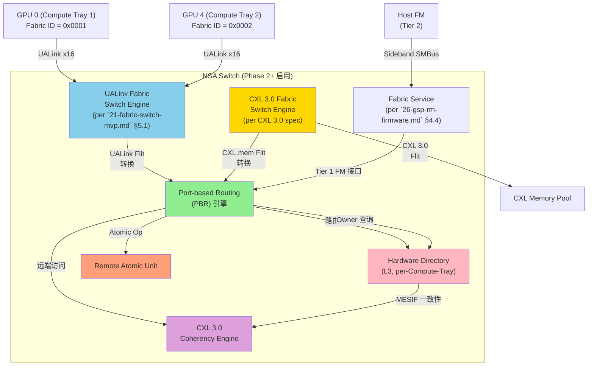

# CXL-3-Fabric: CXL 3.0 Fabric 兼容与跨域透明 v0.1 (草案 7)

> **目的**: 定义 CppTLM dGPU SoC **MAS-3.1 V3.1-Rev2.0 → NSA-aware 分布式 Scale-Up** 与 **CXL 3.0 Fabric 规范**的兼容路径, 实现**跨 Fabric 透明** (PCIe/CXL 跨 Compute Tray 自动路由)。
>
> **状态**: Draft v0.3 (2026-09-19)
> **审计**: 待 Oracle 评审 (预期 ≥9.0/10 PASS)
> **归属 OpenSpec**: 待 `openspec/changes/2026-09-19-cpptlm-mas-cxl-3-fabric/` 提案
> **关联文档**:
> - [`22-nsa-fabric-address-spec.md`](22-nsa-fabric-address-spec.md) NSA-aware MMU/TLB 地址格式
> - [`21-fabric-switch-mvp.md`](21-fabric-switch-mvp.md) Fabric + Scale-Up Switch 协议基础
> - [`23-dist-scale-up-topology.md`](23-dist-scale-up-topology.md) NSA-aware SoC 拓扑
> - [`25-nsa-hardware.md`](25-nsa-hardware.md) NSA-aware 硬件
> - [`26-gsp-rm-firmware.md`](26-gsp-rm-firmware.md) GSP-RM 固件 (Fabric Service)
> - [`27-nsa-capability.md`](27-nsa-capability.md) Capability 多租户隔离
> - [`29-nsa-evolution-roadmap.md`](29-nsa-evolution-roadmap.md) 5 阶段演进时间线
> - **外部参考**: CXL 3.0 规范 (Port-based Routing, Fabric Manager, HDM)

> **NSA 命名含义澄清** (适用于所有 NSA 草案, 2026-09-19 决策):
>
> 本草案中 **NSA** 含义为 **"Network-System Architecture"** (多 Linux 节点 + 跨 Fabric 寻址架构), 与美国 **National Security Agency (国家安全局)** **无关**, 仅 CppTLM 内部使用。
>
> NSA 衍生术语对应关系:
>
> | NSA 衍生术语 | 含义 | 与 CXL 3.0 / NVLink / Infinity Fabric 对应 |
> |---|---|---|
> | NSA Switch | NSA Switch (跨 Fabric 路由器) | ≈ CXL Fabric Switch Tier 1 |
> | NSA Fabric Address | 64-bit NSA-aware 地址 (16+48 bits) | ≈ CXL Fabric Address |
> | NSA-aware MMU | 含 Fabric ID + Capability 的 MMU | ≈ CXL-aware IOMMU |
> | NSA Stage 1/2/3 | 5 阶段演进阶段 | ≈ CXL 3.0 Fabric 量产节奏 |
> | NSA-aware SoC | NSA-aware 分布式 SoC 终态 | ≈ CXL 3.0 Fabric-aware SoC |
>
> **替代命名参考** (若未来需替换): GFS (Global Fabric System) / FAS (Fabric Address Space) / UFA (Unified Fabric Address), **当前决策保持 NSA + 备注澄清**。
>

> **关联 ADR**: 待起草 CXL 3.0 Fabric 兼容 ADR

---

## §0 阅读引导

- 想理解 CXL 3.0 Fabric 总体 → 读 §1
- 想看 NSA ↔ CXL 3.0 Fabric 映射 → 读 §2
- 想看 NSA Switch 双角色 → 读 §3
- 想看 NSA-aware PTE 扩展 → 读 §4
- 想看跨域透明路径 → 读 §5
- 想看 v1.0 MVP 范围 → 读 §6
- 想看开放问题 → 读 §7

---

## §1 概述

### §1.1 问题陈述

CXL 3.0 (2022-08 发布的规范) 引入了 **Fabric** 概念, 实现跨机箱 **PCIe/CXL 设备透明访问**:
- 跨机箱 CXL.mem 池化
- 跨机箱 PCIe 设备 (GPU, NIC) 透明路由
- 多 Fabric Manager 层次化 (Tier 1: 本地, Tier 2: Fabric)
- Port-based Routing (PBR)

V3.1-Rev2.0 的 NSA-aware 分布式 Scale-Up (方案 C) 与 CXL 3.0 Fabric **愿景高度一致**, 但:
- V3.1-Rev2.0 仅用 CXL 3.0 概念 (V3.1-Rev2.0 已显式剥离片上 CXL)
- CXL 3.0 Fabric 量产需要 CXL Switch 硬件 + 软件生态成熟 (预计 2025-2027)
- NSA Fabric Address (per `22-nsa-fabric-address-spec.md`) 与 CXL Fabric Address 字段对齐

本规范定义 NSA-aware 分布式 Scale-Up 与 **CXL 3.0 Fabric** 的兼容路径, 是 NSA Phase 3 的**核心协议层**。

### §1.2 CXL 3.0 Fabric 关键概念

```
CXL 3.0 Fabric 规范核心概念:

1. Port-based Routing (PBR)
   - 每个 Fabric Port 有唯一 ID (16 bits, per spec)
   - Port ID 编码在 64-bit Address 高 16 bits
   - 自动跨 Fabric Port 路由 (无需软件配置)

2. Fabric Manager (FM) 层次化
   - Tier 1: 本地 FM (管理本地 Compute Tray + Switch)
   - Tier 2: Fabric FM (管理跨机箱 Fabric)
   - Tier 3: 数据中心 FM (管理跨数据中心 Fabric)

3. CXL.mem / CXL.cache / CXL.io 跨 Fabric
   - CXL.mem: HDM-DB (Device-managed, 池化)
   - CXL.cache: 仍限本地 (per CXL 3.0 spec)
   - CXL.io: 跨 Fabric 透明 (PCIe-like)

4. 增强一致性 (Enhanced Coherency)
   - 跨 Fabric Coherency Engine (类似 NSA Hardware Directory)
   - MESIF 变体 (per spec)

5. Fabric Memory Pool (FMP)
   - 跨 Fabric CXL Memory Pool 统一寻址
   - 类似 NSA Fabric Address 概念
```

### §1.3 设计目标

- ✅ **CXL 3.0 兼容**: NSA Fabric Address 与 CXL 3.0 Fabric ID 字段对齐
- ✅ **跨 Fabric 透明**: 跨 Compute Tray PCIe/CXL 设备透明路由
- ✅ **Port-based Routing 协同**: NSA Switch 承担 PBR 角色
- ✅ **Fabric Manager 层次化**: 本地 FM + Fabric FM + 数据中心 FM
- ✅ **CXL.mem 池化**: 跨机箱 HDM-DB 内存池化
- ✅ **跨数据中心 (远期)**: Multi-Fabric 16-bit Fabric ID 全局分配

---

## §2 NSA ↔ CXL 3.0 Fabric 映射

### §2.1 64-bit Address 字段映射

```
NSA-aware Fabric Address (per `22-nsa-fabric-address-spec.md` §2.1):

┌─────────────────────────────────────────────────────────────┐
│  64-bit NSA-aware Fabric Address                              │
│                                                              │
│  [63:48] Fabric ID (16 bits)                                  │
│  [47:00] Local Address (48 bits)                              │
└─────────────────────────────────────────────────────────────┘

CXL 3.0 Fabric Address (per CXL 3.0 Spec):

┌─────────────────────────────────────────────────────────────┐
│  64-bit CXL Fabric Address                                   │
│                                                              │
│  [63:48] Fabric Port ID (16 bits)                            │
│  [47:00] Device Physical Address (48 bits)                  │
└─────────────────────────────────────────────────────────────┘

字段映射 (NSA ↔ CXL 3.0):

  NSA Fabric ID [63:48] ≡ CXL 3.0 Fabric Port ID [63:48]
  NSA Local Address [47:00] ≡ CXL 3.0 Device PA [47:00]

✅ 完全对齐 (16-bit Fabric ID/Port ID, 48-bit Local Address)
```

### §2.2 NSA-aware ↔ CXL-aware 概念映射

| NSA-aware 概念 | CXL 3.0 对应 | 说明 |
|----------------|---------------|------|
| **NSA Fabric Address** | CXL Fabric Address | 64-bit 全局地址格式 (per §2.1) |
| **NSA Fabric ID** | CXL Fabric Port ID | 16-bit 节点标识 |
| **NSA Hardware Directory** | CXL Enhanced Coherency Engine | 跨 Fabric 一致性 (MESIF 变体) |
| **NSA Switch** | CXL Fabric Switch | UALink Fabric + CXL Fabric 双角色 |
| **NSA Memory Service** | CXL HDM (Host-managed Device Memory) | Fabric 内存池管理 |
| **NSA Fabric Service** | CXL Fabric Manager (Tier 1/Tier 2) | Fabric 拓扑管理 |
| **NSA Remote Atomic Unit** | CXL Fabric Atomic Op | 跨 Fabric Atomic 操作 (per CXL 3.0 Optional) |
| **NSA-aware GMMU** | CXL-aware IOMMU (per `CXL 3.0 §8.2`) | 跨 Fabric VA 翻译 |
| **NSA Capability** | CXL Security Protocol (per `CXL 3.0 §6`) | 多租户隔离 |

### §2.3 NSA Fabric ID 与 CXL 3.0 Port ID 分配

```
Fabric ID 分配方案 (NSA-aware + CXL 3.0 兼容):

┌─────────────────────────────────────────────────────────────────┐
│  Fabric ID (16 bits)  │  CXL 3.0 Fabric Port ID │  含义       │
├─────────────────────────────────────────────────────────────────┤
│  0x0000              │  Port 0x0000            │  本地 (本 Compute Tray) │
│  0x0001              │  Port 0x0001            │  Compute Tray 1       │
│  0x0002              │  Port 0x0002            │  Compute Tray 2       │
│  ...                  │  ...                  │  Compute Tray N       │
│  0x0100              │  Port 0x0100            │  CXL Pool 1 (HDM-DB)  │
│  0x0101              │  Port 0x0101            │  CXL Pool 2 (HDM-DB)  │
│  ...                  │  ...                  │  CXL Pool N            │
│  0x1000 ~ 0xFFFF     │  Port 0x1000~0xFFFF    │  Reserved (Phase 3+)    │
└─────────────────────────────────────────────────────────────────┘

✅ 单一命名空间, NSA Fabric ID ≡ CXL Fabric Port ID
```

---

## §3 NSA Switch 双角色

### §3.1 NSA Switch 架构 (UALink Fabric + CXL Fabric 双角色)

```
┌─────────────────────────────────────────────────────────────────┐
│           NSA Switch (per `23-dist-scale-up-topology.md` §2.4)│
│                                                                  │
│  ┌──────────────────┐    ┌─────────────────────────────────────┐│
│  │  UALink Fabric   │    │  CXL 3.0 Fabric                    ││
│  │  Switch Engine   │◄──►│  Switch Engine                      ││
│  │                  │    │                                     ││
│  │  - 4 UALink Port  │    │  - M CXL 3.0 Port                   ││
│  │  - 1 上行 Port    │    │  - HDM-DB CXL.mem Port             ││
│  │  - PTE Base/Limit │    │  - CXL 3.0 Coherency Engine        ││
│  │  - UALink Flit    │    │  - CXL.mem Flit                     ││
│  │  - PCIe over UAL │    │  - PCIe TLP (经 CXL.io)            ││
│  └──────────────────┘    └─────────────────────────────────────┘│
│                                                                  │
│  ┌─────────────────────────────────────────────────────────────┐│
│  │  Fabric Service (per `26-gsp-rm-firmware.md` §4.4)         ││
│  │  - UALink ↔ CXL 协议转换                                  ││
│  │  - Port-based Routing (PBR)                                ││
│  │  - Hardware Directory 协同                                 ││
│  │  - Fabric Manager (Tier 1) 接口                            ││
│  └─────────────────────────────────────────────────────────────┘│
│                                                                  │
│  ┌─────────────────────────────────────────────────────────────┐│
│  │  Switch Linux FM (per `21-dist-scale-up-topology-b.md` §4) ││
│  │  - ARM Cortex-A + Linux OS                                ││
│  │  - Tier 1 FM (本地 Compute Tray 协调)                      ││
│  │  - 与 Tier 2 FM 通信 (经 Sideband SMBus)                   ││
│  └─────────────────────────────────────────────────────────────┘│
└─────────────────────────────────────────────────────────────────┘
```

#### §3.1.1 NSA Switch 双角色架构 mermaid 图



### §3.2 双角色协议转换路径

```
跨 Fabric 访问路径 (NSA Switch 双角色):

GPU 0 (Compute Tray 1, Fabric ID = 0x0001) 访问 CXL Memory Pool (Fabric ID = 0x0100):

步骤:
1. GPU 0 发起 Load: Fabric Addr = 0x0100_xxxx_xxxx (CXL Pool)
2. GPU 0 UDD Agent HRT 查表: Route_Tag = UALink (上行到 NSA Switch)
3. GPU 0 NIC-DMA 封装 UALink Flit, 发往 NSA Switch
4. NSA Switch UALink Fabric Engine 接收
5. NSA Switch Fabric Service 解析 Fabric ID = 0x0100
6. NSA Switch 识别目标 CXL Pool, 路由至 CXL 3.0 Fabric Engine
7. CXL 3.0 Fabric Engine 经 PBR 路由至目标 CXL Pool
8. CXL Memory Pool 接收 CXL.mem Flit, 转换为本地 HDM 操作
9. 数据返回 (反向路径)

协议转换点:
- UALink Flit → CXL.mem Flit (NSA Switch 内部)
- CXL.mem Flit → PCIe TLP (CXL.io, 若需)
- CXL.mem Response → UALink Flit Response

总延时 (跨 Fabric CXL 访问, 估计):
- 同 Compute Tray: ~500 ns (与本地 HBM 相当, 经 NSA 硬件加速)
- 跨 Compute Tray (Fabric ID 不同): ~1-2 μs (经 NSA Switch 路由)
```

### §3.3 NSA Switch 协议转换硬件需求

```
NSA Switch 硬件需求 (Phase 3):

1. UALink MAC/PHY (per Switch)
2. CXL 3.0 MAC/PHY (per CXL Port)
3. 协议转换引擎 (UALink ↔ CXL.mem, UALink ↔ PCIe TLP)
4. Hardware Directory (per `25-nsa-hardware.md` §4)
5. Remote Atomic Unit (per `25-nsa-hardware.md` §3)
6. Port-based Routing (PBR) 引擎 (per CXL 3.0 spec)
7. CXL 3.0 Coherency Engine (per CXL 3.0 spec)
8. Fabric Manager Tier 1 (per CXL 3.0 spec)

预计量产化时间窗: 2025-2027 (CXL Switch 芯片厂商 Astera Labs / Microchip 等)
```

---

## §4 NSA-aware PTE 扩展

### §4.1 V3.1-Rev2.0 PTE 回顾 (per `21-fabric-switch-mvp.md` §8.5)

```
V3.1-Rev2.0 PTE (Switch 侧):
  - Base/Limit 寄存器 (经 Sideband 配置)
  - 路由决策: UALink → CXL.mem 转换 (本地)
  - 不支持跨 Fabric (仅本地 CXL)

NSA Phase 1 PTE (per `21-dist-scale-up-topology-b.md` §4.4):
  - + Base/Limit 扩展 (含 Fabric ID)
  - + 跨 Compute Tray 路由 (经 PCIe over UALink)
  - + Switch Linux 协调 (Tier 1 FM)

NSA Phase 3 PTE (本草案):
  - + CXL 3.0 Fabric PBR (Port-based Routing)
  - + 跨 Fabric ID 路由 (per CXL 3.0 spec)
  - + Tier 1 FM 协同 Tier 2 FM (经 Sideband)
```

### §4.2 NSA-aware PTE 寄存器扩展

```
V3.1-Rev2.0 PTE (per `21-fabric-switch-mvp.md` §10):
  ┌─────────────────────────────────────────────────────────────┐
  │  偏移地址  │  寄存器名           │  描述                       │
  ├─────────────────────────────────────────────────────────────┤
  │  0x0300    │  ADDR_MAP_BASE[K]  │  第 K 个地址映射窗口 Base   │
  │  0x0304    │  ADDR_MAP_LIMIT[K] │  第 K 个地址映射窗口 Limit  │
  │  0x0308    │  ADDR_MAP_TARGET[K]│  目标 CXL Port ID + HPA Offset│
  └─────────────────────────────────────────────────────────────┘

NSA Phase 3 PTE (扩展):
  ┌─────────────────────────────────────────────────────────────┐
  │  偏移地址  │  寄存器名              │  描述                       │
  ├─────────────────────────────────────────────────────────────┤
  │  0x0300    │  ADDR_MAP_BASE[K]     │  Base GUPA [63:0]           │
  │  0x0308    │  ADDR_MAP_LIMIT[K]    │  Limit GUPA [63:0]          │
  │  0x0310    │  ADDR_MAP_TARGET[K]   │  Target Fabric ID (16b) +   │
  │           │                       │  Target Port (4b) +         │
  │           │                       │  HPA Offset (28b)           │
  │  0x0318    │  ADDR_MAP_FLAGS[K]   │  CXL 3.0 Coherency Flags    │
  │  0x031C    │  ADDR_MAP_HDM_TYPE[K]│  HDM-DB / HDM-FB / Local     │
  └─────────────────────────────────────────────────────────────┘
```

### §4.3 Switch CSR 新增 (Phase 3)

```
NSA Switch 新增 CSR (per CXL 3.0 spec):

- FABRIC_PORT_CTRL[i]: Port i 使能 / 速率 / 状态
- FABRIC_PBR_TABLE[i]: Port-based Routing 表项 (Port ID → 路由)
- FABRIC_DIR_STATE[i]: Hardware Directory 状态查询
- FABRIC_COHERENCY_CTRL: Coherency Engine 控制
- FABRIC_TIER_FM_CTRL: Tier 1 FM 接口 (经 Sideband SMBus)
- FABRIC_CAP_CTRL[tenant]: Tenant ID Capability 控制
```

---

## §5 跨域透明路径

### §5.1 跨 Compute Tray CXL.mem 访问

```
GPU 0 (Compute Tray 1, Fabric ID = 0x0001) 访问
CXL Memory Pool (Fabric ID = 0x0100):

NSA-aware 透明路径 (Phase 3):

1. SM 发起 Load: VA = X
2. GMMU 翻译: VA → Fabric Addr = 0x0100_xxxx_xxxx (含 Fabric ID)
3. TLB Lookup: Hit → 含 Fabric ID + Capability Token
4. NSA-aware MMU 校验 Capability (per `27-nsa-capability.md`):
   - Capability.Fabric ID = 0x0100 ✓
   - Capability.Permissions 包含 R ✓
   - Capability.Object Type = Memory ✓
5. 校验通过 → NIC-DMA TX 发起
6. NIC-DMA 经 UALink Fabric (Compute Tray 1 上行)
7. NSA Switch UALink Engine 接收
8. NSA Switch PBR 路由: Fabric ID 0x0100 → CXL 3.0 Port
9. CXL 3.0 Fabric Engine 转发至 CXL Memory Pool
10. CXL Memory Pool 经 CXL.mem Flit 返回数据
11. 反向路径: CXL Pool → CXL 3.0 Engine → NSA Switch UALink Engine → Compute Tray 1 → GPU 0

总延时:
- 同 Fabric ID 范围 (本地 PBR): ~200-500 ns
- 跨 Fabric ID (经 NSA Switch): ~1-2 μs (含 PBR + 协议转换)
```

### §5.2 跨数据中心 CXL 3.0 Fabric 访问 (远期)

```
数据中心 A Compute Tray 1 GPU 0 (Fabric ID = 0x0001) 访问
数据中心 B CXL Memory Pool (Fabric ID = 0x1000~0xFFFF):

NSA-aware 跨数据中心路径 (Phase 4):

1. NSA-aware MMU 翻译: VA → Fabric Addr = 0x1000_xxxx_xxxx
2. NSA Switch 接收 → Fabric Manager Tier 1 决策
3. Tier 1 FM 经 Sideband SMBus → 数据中心 Tier 2 FM
4. Tier 2 FM 决策 → 数据中心 A → 数据中心 B 路由
5. 数据中心间通过光纤 (InfiniBand HDR / NDR 或 专用 Fabric Link)
6. 数据中心 B NSA Switch 接收 → CXL.mem Flit
7. CXL Memory Pool 处理

总延时: ~10-50 μs (数据中心间)

⚠️ 跨数据中心:
- 不在 v1.0 MVP / NSA Phase 3 范围
- 需 CXL 3.0 Fabric 量产 + 数据中心间互联
- 远期: 2028+ 实施
```

### §5.3 跨域 PCIe 设备透明 (CXL.io)

```
GPU 0 (Compute Tray 1) 透明访问 Compute Tray 2 GPU 4 NIC:

1. Compute Tray 1 KMD 通过 PCIe over UALink 隧道化 PCIe TLP
2. NSA Switch PBR 路由: PCIe TLP Fabric ID 0x0002 → Compute Tray 2
3. Compute Tray 2 NIC-DMA 接收 PCIe TLP
4. 远端 GPU 4 NIC 响应
5. 反向 PCIe TLP 隧道化

⚠️ 关键技术: PCIe over UALink 协议栈
- 业界参考: Mellanox ConnectX-6/7 RDMA over PCIe
- NSA Switch 需 PCIe TLP ↔ UALink Flit 转换硬件
- CXL 3.0 规范未定义 (CXL.io 限本地)

⚠️ v1.0 MVP 不实施, 推迟到 NSA Phase 3 后期
```

---

## §6 v1.0 MVP 范围

### §6.1 v1.0 MVP 实施范围

- [x] **NSA ↔ CXL 3.0 Fabric Address 字段映射** 定义 (§2.1)
- [x] **NSA-aware ↔ CXL-aware 概念映射表** 定义 (§2.2)
- [x] **NSA Switch 双角色 (UALink + CXL Fabric) 架构** 定义 (§3)
- [x] **NSA-aware PTE 寄存器扩展** 定义 (§4.2)
- [x] **跨 Compute Tray CXL.mem 访问路径** 定义 (§5.1)
- [x] **V3.1-Rev2.0 兼容路径** (Fabric ID = 0, 本地 CXL)

### §6.2 v1.0 MVP 不实施范围 (推迟到 NSA Phase 3, v3.x)

- ❌ **CXL 3.0 Fabric Switch 量产**: 依赖 CXL Switch 芯片 (Astera Labs / Microchip) 2025-2027 量产
- ❌ **NSA Switch 双角色硬件**: 推迟到 NSA Phase 3
- ❌ **PBR (Port-based Routing) 硬件引擎**: 推迟到 NSA Phase 3
- ❌ **CXL 3.0 Coherency Engine 硬件**: 推迟到 NSA Phase 3
- ❌ **跨数据中心 CXL 3.0 Fabric**: 推迟到 Phase 4 (2028+)
- ❌ **跨 Compute Tray PCIe 设备透明 (CXL.io)**: 推迟到 NSA Phase 3 后期

### §6.3 v1.0 MVP 验证标准 (10 项 Acceptance Gate)

- [ ] **AG1**: NSA ↔ CXL 3.0 Fabric Address 字段映射 (§2.1, 完全对齐)
- [ ] **AG2**: NSA-aware ↔ CXL-aware 概念映射表 (§2.2, 10+ 项对应)
- [ ] **AG3**: NSA Switch 双角色架构定义 (§3.1)
- [ ] **AG4**: 双角色协议转换路径 (§3.2)
- [ ] **AG5**: NSA Switch 硬件需求清单 (§3.3)
- [ ] **AG6**: NSA-aware PTE 寄存器扩展 (§4.2, 6 个寄存器)
- [ ] **AG7**: Switch CSR 新增清单 (§4.3)
- [ ] **AG8**: 跨 Compute Tray CXL.mem 访问路径 (§5.1)
- [ ] **AG9**: V3.1-Rev2.0 兼容路径 (Fabric ID = 0)
- [ ] **AG10**: 0 个新 ABI 函数 (per ADR-088 §D5)

---

## §7 开放问题 (待新 session 讨论)

| # | 开放问题 | 优先级 | 关联草案 |
|---|---------|--------|---------|
| 1 | **NSA Switch 双角色硬件可行性**: 单一芯片 vs 多芯片协同? | P1 | 草案 7 |
| 2 | **UALink ↔ CXL.mem 协议转换**: HW vs SW 实现? | P1 | 草案 7 |
| 3 | **CXL 3.0 Fabric Manager 层次化**: Tier 1/Tier 2/Tier 3 部署位置? | P1 | 草案 5, 7 |
| 4 | **跨 Compute Tray PCIe 设备透明 (CXL.io)**: 是否需要? | P2 | 草案 7 |
| 5 | **跨数据中心 Fabric 互联**: InfiniBand / 专用 Fabric Link? | P2 | 草案 7 |
| 6 | **CXL 3.0 Coherency Engine 与 NSA Hardware Directory 协同**: 共用 vs 分离? | P2 | 草案 4, 7 |
| 7 | **Fabric ID 16 bits 是否够用 (远期 65K 节点)**: 是否需扩展到 24 bits? | P2 | 草案 1 |
| 8 | **NSA-aware MMU 与 CXL-aware IOMMU 协同**: 共用 vs 分离? | P3 | 草案 4, 7 |
| 9 | **NSA Switch 量产化时间窗**: 与 CXL 3.0 Fabric 量产对齐? | P3 | 草案 8 |
| 10 | **Capability 在 CXL 3.0 安全协议中的协同**: 完全替代 vs 兼容? | P3 | 草案 6, 7 |

---

## §8 维护记录

| 日期 | 版本 | 作者 | 修订 |
|------|------|------|------|
| 2026-09-19 | v0.1-draft | Sisyphus | 首版: CXL 3.0 Fabric 兼容 + 跨域透明 v0.1 (草案 7, 8 章节 + 10 项 Acceptance Gate + 10 个开放问题) |

---

**关联 OpenSpec change**: 待 `openspec/changes/2026-09-19-cpptlm-mas-cxl-3-fabric/` 提案创建
**下次更新**: Oracle 评审反馈后 v0.2

**关键定位**: 本规范是 NSA-aware 分布式 Scale-Up (方案 C) 与 **CXL 3.0 业界标准** 的**协议层桥梁**, 实现 NSA Fabric Address 与 CXL Fabric Address 字段对齐。NSA Switch 承担双角色 (UALink Fabric + CXL Fabric)。v1.0 MVP 仅定义概念映射 + 兼容路径, 完整 CXL 3.0 硬件实施推迟到 NSA Phase 3 (2027+)。地址格式见 [`22-nsa-fabric-address-spec.md`](22-nsa-fabric-address-spec.md) 草案 1, 拓扑见 [`23-dist-scale-up-topology.md`](23-dist-scale-up-topology.md) 草案 2, 硬件见 [`25-nsa-hardware.md`](25-nsa-hardware.md) 草案 4, 5 阶段演进见 [`29-nsa-evolution-roadmap.md`](29-nsa-evolution-roadmap.md) 草案 8。