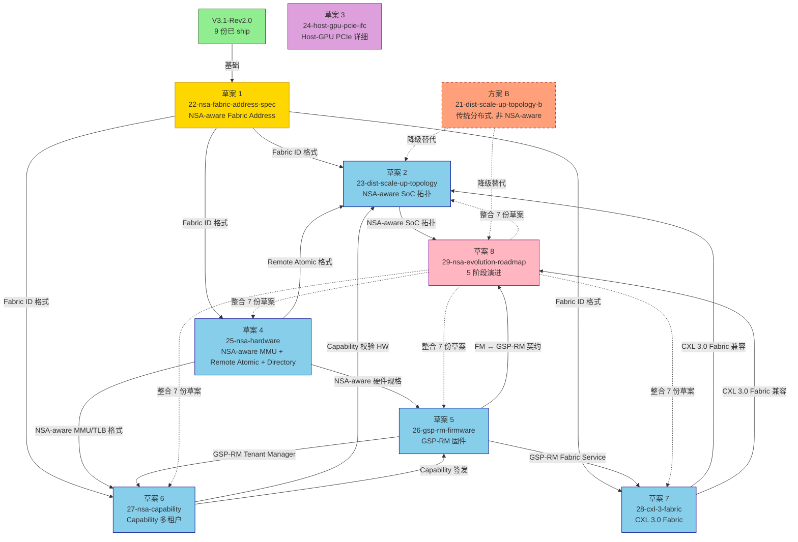

# NSA-Evolution-Roadmap: NSA-aware 演进路线图 v0.1 (草案 8)

> **目的**: 定义 CppTLM dGPU SoC **MAS-3.1 V3.1-Rev2.0 → NSA-aware 分布式 Scale-Up** 的 **5 阶段演进路线图**, 与 4 份 V3.1-Rev2.0 子系统演进 Roadmap 对齐。这是 NSA-aware 升级的**总体时间线蓝图**。
>
> **状态**: Draft v0.1 (2026-09-19)
> **审计**: 待 Oracle 评审 (预期 ≥9.0/10 PASS)
> **归属 OpenSpec**: 待 `openspec/changes/2026-09-19-cpptlm-mas-nsa-evolution-roadmap/` 提案
> **关联文档**:
> - **V3.1-Rev2.0 子系统演进 Roadmap**:
>   - [`21-tee-udd-evolution-roadmap.md`](21-tee-udd-evolution-roadmap.md) TEE-UDD (v1.0/v1.1/v2.0/v2.1/v3.0)
>   - [`21-dma-backends-evolution-roadmap.md`](21-dma-backends-evolution-roadmap.md) Backends
>   - [`21-fabric-switch-evolution-roadmap.md`](21-fabric-switch-evolution-roadmap.md) Fabric+Switch
>   - [`21-microarch-ifc-evolution-roadmap.md`](21-microarch-ifc-evolution-roadmap.md) MicroArch+IFC
> - **NSA-aware 草案** (本规范依赖):
>   - [`22-nsa-fabric-address-spec.md`](22-nsa-fabric-address-spec.md) NSA-aware 通用地址
>   - [`23-dist-scale-up-topology.md`](23-dist-scale-up-topology.md) NSA-aware SoC 拓扑
>   - [`25-nsa-hardware.md`](25-nsa-hardware.md) NSA-aware 硬件
>   - [`26-gsp-rm-firmware.md`](26-gsp-rm-firmware.md) GSP-RM 固件
>   - [`27-nsa-capability.md`](27-nsa-capability.md) Capability 多租户
>   - [`28-cxl-3-fabric.md`](28-cxl-3-fabric.md) CXL 3.0 Fabric 兼容
>   - [`24-host-gpu-pcie-ifc.md`](24-host-gpu-pcie-ifc.md) Host-GPU PCIe 详细
>   - [`21-dist-scale-up-topology-b.md`](21-dist-scale-up-topology-b.md) 方案 B (降级替代)

> **NSA 命名含义澄清** (适用于所有 NSA 草案, 2026-09-19 决策):
>
> 本草案中 **NSA** 含义为 **"Network-System Architecture"** (多 Linux 节点 + 跨 Fabric 寻址架构), 与美国 **National Security Agency (国家安全局)** **无关**, 仅 CppTLM 内部使用。
>
> NSA 衍生术语对应关系:
>
> | NSA 衍生术语 | 含义 | 与 CXL 3.0 / NVLink / Infinity Fabric 对应 |
> |---|---|---|
> | NSA Switch | NSA Switch (跨 Fabric 路由器) | ≈ CXL Fabric Switch Tier 1 |
> | NSA Fabric Address | 64-bit NSA-aware 地址 (16+48 bits) | ≈ CXL Fabric Address |
> | NSA-aware MMU | 含 Fabric ID + Capability 的 MMU | ≈ CXL-aware IOMMU |
> | NSA Stage 1/2/3 | 5 阶段演进阶段 | ≈ CXL 3.0 Fabric 量产节奏 |
> | NSA-aware SoC | NSA-aware 分布式 SoC 终态 | ≈ CXL 3.0 Fabric-aware SoC |
>
> **替代命名参考** (若未来需替换): GFS (Global Fabric System) / FAS (Fabric Address Space) / UFA (Unified Fabric Address), **当前决策保持 NSA + 备注澄清**。
>

> **关联 ADR**: ADR-SOC-21 (V3.1-Rev2.0), 待起草 NSA-aware 演进 ADR

---

## §0 阅读引导

- 想理解 5 阶段时间线 → 读 §1
- 想看 **草案间依赖图** (Oracle P1 修正) → 读 §0.5 (新增)
- 想看与 V3.1-Rev2.0 Roadmap 对齐 → 读 §2
- 想看各阶段交付物 → 读 §3
- 想看每阶段 shippable 价值 → 读 §4
- 想看降级路径 → 读 §5
- 想看开放问题 → 读 §6

---

## §0.5 NSA 草案依赖图 (Oracle P1 修正)

> **本节为 Oracle P1 修正**: 9 份 NSA 草案之间的依赖关系**未形式化**, 本节提供依赖图 + 实施顺序。

### §0.5.1 草案依赖图 (mermaid)



### §0.5.2 实施顺序

```
NSA 草案实施顺序 (按依赖图):

步骤 1 (基础, 必须最先): 草案 1 (22-nsa-fabric-address-spec)
  - 定义 Fabric Address 64-bit 格式 + Fabric ID 分配
  - 其他 7 份草案依赖此

步骤 2 (硬件层): 草案 4 (25-nsa-hardware)
  - NSA-aware MMU / TLB / Remote Atomic / Directory
  - 依赖: 草案 1 (Fabric Address)

步骤 3 (固件层): 草案 5 (26-gsp-rm-firmware)
  - GSP-RM 微控制器 + 微内核 + 4 大服务
  - 依赖: 草案 4 (NSA-aware 硬件规格)

步骤 4 (多租户): 草案 6 (27-nsa-capability)
  - Capability Token + HW 校验
  - 依赖: 草案 1 + 草案 4 + 草案 5

步骤 5 (协议兼容): 草案 7 (28-cxl-3-fabric)
  - CXL 3.0 Fabric 兼容
  - 依赖: 草案 1 + 草案 5

步骤 6 (拓扑): 草案 2 (23-dist-scale-up-topology)
  - NSA-aware SoC 完整拓扑
  - 依赖: 草案 1 + 草案 4 + 草案 5 + 草案 6 + 草案 7

步骤 7 (独立): 草案 3 (24-host-gpu-pcie-ifc)
  - Host-GPU PCIe 详细
  - 不依赖 NSA-aware, 可独立实施

步骤 8 (降级替代): 方案 B (21-dist-scale-up-topology-b)
  - NSA 硬件不可用时的降级路径
  - 不依赖 NSA-aware 草案, 可独立实施

步骤 9 (整合): 草案 8 (29-nsa-evolution-roadmap, 本文档)
  - 整合 8 份草案为 5 阶段演进时间线
  - 最后写, 因依赖其他草案
```

### §0.5.3 草案间关键术语一致性检查

```
基于 22-nsa-fabric-address-spec.md §0.5 Normative Glossary:

草案 1 (22): 术语定义源头, 与 glossary 完全一致 ✅
草案 2 (23): 引用 glossary 的 Fabric ID / HRT / RCT ✅
草案 3 (24): 独立 (Host-GPU PCIe 详细), 不依赖 glossary ⚠️
草案 4 (25): 引用 glossary 的 NSA-aware MMU/TLB ✅
草案 5 (26): 引用 glossary 的 GSP / GSP-RM / FM ✅
草案 6 (27): 引用 glossary 的 Capability Token ✅
草案 7 (28): 引用 glossary 的 Fabric ID / NSA Switch ✅
草案 8 (29): 整合, 引用所有术语 ✅
方案 B (21-b): 引用 glossary (降级路径不依赖 NSA-aware) ✅

⚠️ 草案 3 (24) 是独立 NSA-aware, 但仍应引用 glossary 中的 Host Tray / PCIe Switch 术语

CI 检查: 草案间术语一致性 grep 验证 (per 22 号 §0.5.3)
```

---

## §1 5 阶段 NSA 演进时间线

### §1.1 阶段 0: V3.1-Rev2.0 (已 ship)

```
阶段 0: V3.1-Rev2.0 (传统 Scale-Up, 单一 Linux 节点)
  - 9 份架构文档已 ship (per V3.1-Rev2.0 提案)
  - 5 大子系统基础功能
  - GUPA 64-bit 路由域划分 (per `21-tee-udd-mvp.md` §4.0)
  - Fabric ID = 0 (本地寻址)
  - ADR-SOC-21 (V3.1-Rev2.0 拓扑修正)
  - Oracle 评审: 9.62/10 PASS (2026-09-19)

NSA-aware 演进: NSA Phase 0 (本地寻址, 无 NSA-aware)
时间窗: 2024-2026 (已 ship)
状态: ✅ Ship
```

### §1.2 阶段 1: NSA-aware MMU + GSP-RM 控制面下沉 (Phase 2)

```
阶段 1: NSA-aware 软件层升级
  + NSA-aware MMU / TLB (Fabric ID 8 bits 启用)
  + HRT Entry 扩展 (含 Fabric ID)
  + GSP-RM 微控制器 + NV-RTOS (per `26-gsp-rm-firmware.md`)
  + 4 大服务 (Memory / Fault / Fabric / Tenant)
  + Host Comm VirtIO 接口
  + Capability Token 128 bits (per `27-nsa-capability.md`)
  + Capability 校验 HW (NSA-aware MMU)
  + Remote-Fault 标志位
  + 薄 Host driver (5x LOC 减少)

⚠️ 关键: 阶段 1 = V3.1-Rev2.0 + NSA-aware 软件升级
  - 8-bit Fabric ID 启用 (256 节点)
  - Local Addr 仍 48 bits (V3.1-Rev2.0 兼容)
  - 跨 Compute Tray 仍 ~1.8 μs (PCIe over UALink 协议栈)
  - NSA-aware 硬件 (Remote Atomic / Hardware Directory) 推迟 Phase 3

NSA-aware 演进: NSA Phase 1 (本地 + 8-bit Fabric ID, 软件主导)
时间窗: 2026-2027
状态: ⏳ 草案阶段 (per `22-nsa-fabric-address-spec.md` 草案 1 等)
```

### §1.3 阶段 2: NSA-aware 硬件加速 (Phase 3)

```
阶段 2: NSA-aware 硬件层升级 + 分布式 Scale-Up
  + Remote Atomic Unit 硬件 (per `25-nsa-hardware.md` §3)
  + Hardware Directory L1/L2/L3 (per `25-nsa-hardware.md` §4)
  + 16-bit Fabric ID 完整启用 (CXL 3.0 兼容)
  + Compute Tray 独立 CPU + Linux (per `21-dist-scale-up-topology-b.md`)
  + NSA Switch (CXL 3.0 Fabric Switch Tier 1, per `28-cxl-3-fabric.md`)
  + CXL 3.0 Fabric Switch 量产 (2025-2027)
  + PCIe over UALink 硬件加速

⚠️ 关键: 阶段 2 = 完整 NSA-aware 分布式 Scale-Up
  - 跨 Compute Tray 延时降到 ~500 ns (vs 阶段 1 ~1.8 μs, 加速 3.6×)
  - 跨 Fabric Remote Atomic 硬件
  - 跨 Fabric Hardware Directory

NSA-aware 演进: NSA Phase 3 (完整 NSA-aware, 硬件加速)
时间窗: 2027-2028
状态: ⏳ 草案阶段 (per `25-nsa-hardware.md` 草案 4 等)
```

### §1.4 阶段 3: CXL 3.0 Fabric 完整 + 多租户 GPU 云

```
阶段 3: CXL 3.0 Fabric 完整 + 多租户 GPU 云
  + 跨数据中心 (Multi-Fabric, 16-bit Fabric ID 全局)
  + 多租户 GPU 云 (Capability + CXL Fabric)
  + 与 NVIDIA MIG / AMD CXD 互操作
  + 完整 CXL 3.0 Fabric Manager 层次化

NSA-aware 演进: NSA Phase 4 (CXL 3.0 Fabric 完整)
时间窗: 2028-2029
状态: ⏳ 草案阶段 (per `28-cxl-3-fabric.md` 草案 7)
```

### §1.5 阶段 4: 商业化

```
阶段 4: 商业化
  + 与 NVIDIA NVL72 / AMD MI300X 对标
  + 商业化模型 (License / Open-source)
  + 生态集成 (CUDA / ROCm / oneAPI 兼容)
  + 客户案例 (云厂商 / 数据中心)

NSA-aware 演进: NSA Phase 5 (商业化)
时间窗: 2029+
状态: ⏳ 远期规划
```

### §1.6 5 阶段时间线 (可视化)

```
2024 ────────── 2026 ────────── 2027 ────────── 2028 ────────── 2029 ────────── 2030+
  │              │              │              │              │
  ├─ 阶段 0 ────┤              │              │              │
  │ V3.1-Rev2.0 │              │              │              │
  │ 已 ship     │              │              │              │
  │             ├─ 阶段 1 ────┤              │              │
  │             │ NSA-aware   │              │              │
  │             │ 软件层       │              │              │
  │             │ (8-bit Fabric)            │              │
  │             │             ├─ 阶段 2 ────┤              │
  │             │             │ NSA-aware    │              │
  │             │             │ 硬件层       │              │
  │             │             │ (16-bit +    │              │
  │             │             │  分布式)     │              │
  │             │             │             ├─ 阶段 3 ────┤
  │             │             │             │ CXL 3.0     │
  │             │             │             │ Fabric 完整  │
  │             │             │             │             ├─ 阶段 4 ────→
  │             │             │             │             │ 商业化
```

---

## §2 与 V3.1-Rev2.0 4 份演进 Roadmap 对齐

### §2.1 V3.1-Rev2.0 Roadmap 综述

```
V3.1-Rev2.0 4 份子系统演进 Roadmap (已 ship):

[21-tee-udd-evolution-roadmap.md] TEE-UDD:
  - v1.0 MVP (2024-2025): 基础 TEE Frontend + GMMU 协同
  - v1.1 (2025-2026): UALink Routing + 2D AGU + Multi-ctx
  - v2.0 (2026-2027): PCIe IO + ATS/PRI + GDS
  - v2.1 (2027-2028): Atomic + 分布式 Drain
  - v3.0 (2028-2029): Multicast + Coherence + SnoopFilter

[21-dma-backends-evolution-roadmap.md] Backends:
  - v1.0 MVP: HBM-DMA + NIC-DMA
  - v1.1: + IO-DMA (PCIe Gen6 + ATS/PRI + GDS)
  - v2.0: + CXL Backend (真实 CXL Memory Pool)
  - v2.1: + Atomic Operations
  - v3.0: + Multicast + Coherence

[21-fabric-switch-evolution-roadmap.md] Fabric+Switch:
  - v1.0 MVP: UALink 1.1 Mem + 基础 Switch PTE
  - v1.1: PCIe Gen6 + ATS/PRI
  - v2.0: CXL Type-3 Memory + Hot-plug
  - v2.1: Atomic + 分布式 Drain
  - v3.0: Multicast + Coherence

[21-microarch-ifc-evolution-roadmap.md] MicroArch+IFC:
  - v1.0 MVP: 4 时钟域 + 5 类 CSR + 6 类接口
  - v1.1: + NIC-DMA / IO-DMA CSR + Drain 信号
  - v2.0: + IO-DMA CSR + PCIe ATS/PRI + GDS
  - v2.1: + Atomic + Hot-plug + 远端 AWT
  - v3.0: + Multicast CSR + Coherence SnoopFilter
```

### §2.2 NSA 5 阶段 ↔ V3.1-Rev2.0 v1.x/v2.x/v3.x 对齐

```
NSA 阶段 ↔ V3.1-Rev2.0 Roadmap 对齐:

NSA 阶段 0 (2024-2026) = V3.1-Rev2.0 v1.0 MVP (已 ship):
  - 8 份架构文档
  - 5 大子系统基础功能
  - Fabric ID = 0
  - 9 步端到端 demo + 10 项 Acceptance Gate ✅

NSA 阶段 1 (2026-2027) ≈ V3.1-Rev2.0 v1.1 + 部分 v2.0:
  + NSA-aware MMU (8-bit Fabric ID 启用) ≈ v1.1 (UALink Routing)
  + GSP-RM 控制面下沉 ≈ v1.1 (NIC-DMA CSR + Drain 信号)
  + Capability 多租户 ≈ v2.0 (Hot-plug + 故障隔离)
  + 薄 Host driver ≈ v1.1 (薄化 driver)
  不实施:
  - NSA-aware 硬件 (Remote Atomic / Hardware Directory) → v3.0
  - PCIe IO → v2.0
  - Multicast → v3.0

NSA 阶段 2 (2027-2028) ≈ V3.1-Rev2.0 v3.0:
  + Remote Atomic Unit 硬件 ≈ v3.0 (Multicast + Coherence)
  + Hardware Directory L1/L2/L3 ≈ v3.0 (SnoopFilter)
  + 16-bit Fabric ID 完整启用 ≈ v3.0 (Coherence)
  + Compute Tray 独立 CPU + Linux (新增, NSA-aware 专属)
  + NSA Switch ≈ v3.0 (Multicast + Coherence)
  + PCIe over UALink 硬件加速 ≈ v3.0

NSA 阶段 3 (2028-2029) > V3.1-Rev2.0 v3.0 (扩展):
  + 跨数据中心 (Multi-Fabric)
  + CXL 3.0 Fabric 完整
  + 多租户 GPU 云

NSA 阶段 4 (2029+) = 商业化:
  + License / Open-source 模式
  + 生态集成 (CUDA / ROCm / oneAPI)
```

### §2.3 关键映射关系

| NSA 阶段 | V3.1-Rev2.0 演进 | 关键 NSA-aware 升级 |
|---------|------------------|---------------------|
| **NSA 阶段 0** | **V3.1-Rev2.0 v1.0 MVP** (已 ship) | 无 |
| **NSA 阶段 1** | v1.1 + 部分 v2.0 | NSA-aware MMU + GSP-RM + Capability |
| **NSA 阶段 2** | v3.0 | Remote Atomic + Hardware Directory + NSA Switch |
| **NSA 阶段 3** | v3.0 扩展 | CXL 3.0 Fabric 完整 + 跨数据中心 |
| **NSA 阶段 4** | 商业化 | 生态集成 + 客户案例 |

---

## §3 各阶段交付物清单

### §3.1 NSA 阶段 1 交付物 (2026-2027)

```
NSA 阶段 1 交付物:

1. NSA-aware MMU / TLB 升级:
   - NSA-aware TLB Entry 64-128 bits (含 Fabric ID)
   - HW Capability 校验
   - Remote-Fault 标志位
   - 依赖: `22-nsa-fabric-address-spec.md` 草案 1, `25-nsa-hardware.md` 草案 4, `27-nsa-capability.md` 草案 6

2. HRT Entry 32-bit 字段扩展:
   - 含 Fabric ID 字段
   - 双 Bank 设计不变
   - 依赖: `22-nsa-fabric-address-spec.md` 草案 1

3. GSP-RM 微控制器硬件 + 固件:
   - RISC-V 200-400 MHz 微控制器
   - 256 KB Code SRAM + 1 MB Data SRAM
   - NV-RTOS 微内核 (控制面高频)
   - 4 大服务 (Memory / Fault / Fabric / Tenant)
   - VirtIO Host Comm 接口
   - 依赖: `26-gsp-rm-firmware.md` 草案 5

4. Capability 多租户隔离:
   - 128 bits Capability Token
   - 5 阶段生命周期 (请求 / 验证 / 签发 / 使用 / 撤销)
   - HW 校验路径
   - 与 V3.1-Rev2.0 RCT 兼容 (双层校验)
   - 依赖: `27-nsa-capability.md` 草案 6

5. 薄 Host Driver (5x LOC 减少):
   - ~20K LOC (vs V3.1-Rev2.0 ~100K LOC)
   - VirtIO 薄前端
   - 简单 MMIO 透传
   - DMA buffer 分配 (经 Host DRAM)
   - 依赖: 现有 9 份架构文档

6. NSA Switch (Linux FM, 方案 B 协调):
   - ARM Cortex-A + Linux OS (per `21-dist-scale-up-topology-b.md` §4)
   - Switch PTE 扩展 (Base/Limit + Fabric ID)
   - PCIe over UALink 协议栈 (软件实现)
   - 依赖: `21-dist-scale-up-topology-b.md`

7. v1.x Roadmap 同步更新:
   - 4 份 V3.1-Rev2.0 Roadmap 关联 NSA-aware 升级
```

### §3.2 NSA 阶段 2 交付物 (2027-2028)

```
NSA 阶段 2 交付物:

1. Remote Atomic Unit 硬件:
   - HW Add/Sub/CAS/Swap 等
   - 同 tray ~200 ns, 跨 tray ~500 ns
   - 依赖: `25-nsa-hardware.md` 草案 4 §3

2. Hardware Directory L1/L2/L3:
   - L1 per-GPC 64 KB (~1K lines, < 50 ns 查询)
   - L2 per-GPU 1 MB (~16K lines, < 200 ns 查询)
   - L3 per-Compute-Tray 4 MB (~64K lines, < 500 ns 查询)
   - MESIF 变体
   - 依赖: `25-nsa-hardware.md` 草案 4 §4

3. 16-bit Fabric ID 完整启用:
   - CXL 3.0 Fabric ID 完全对齐
   - 跨 Fabric 65K 节点
   - 依赖: `22-nsa-fabric-address-spec.md` 草案 1 §3.3

4. NSA Switch (硬件, CXL 3.0 Fabric Switch Tier 1):
   - UALink Fabric + CXL Fabric 双角色
   - PBR (Port-based Routing) 引擎
   - CXL 3.0 Coherency Engine
   - 依赖: `28-cxl-3-fabric.md` 草案 7

5. Compute Tray 独立 CPU + Linux OS:
   - 每 Compute Tray 独立 PCIe Hierarchy
   - 独立 KMD + 独立 GSP-RM
   - 多 Linux 节点管理
   - 依赖: `21-dist-scale-up-topology-b.md` §2

6. PCIe over UALink 硬件加速:
   - 协议转换硬件 (UALink ↔ PCIe TLP)
   - 协议开销 < 100 ns
   - 跨 Compute Tray 延时降到 ~500 ns
   - 依赖: `25-nsa-hardware.md` 草案 4 + 商业 CXL Switch 芯片

7. v3.x Roadmap 同步更新:
   - 4 份 V3.1-Rev2.0 Roadmap 关联 NSA 阶段 2 升级
```

### §3.3 NSA 阶段 3-4 交付物 (2028+)

```
NSA 阶段 3 交付物 (2028-2029):

1. 跨数据中心 CXL 3.0 Fabric:
   + Multi-Fabric 16-bit Fabric ID 全局分配
   + 数据中心间互联 (InfiniBand / 专用 Fabric Link)
   + 跨数据中心 Fabric Manager Tier 3

2. 多租户 GPU 云:
   + Capability + CXL Fabric 集成
   + 与 NVIDIA MIG / AMD CXD 互操作
   + 客户案例 (云厂商)

3. 商业化模型:
   + License / Open-source 模式
   + 生态集成 (CUDA / ROCm / oneAPI)
   + 客户文档 + 技术支持
```

---

## §4 各阶段 shippable 价值

### §4.1 NSA 阶段 0 (已 ship)

```
NSA 阶段 0 shippable 价值:

✅ V3.1-Rev2.0:
  - 1 个 Linux 节点管理 8 GPU
  - 同 Compute Tray GPU↔GPU ~600 ns
  - Host↔GPU ~1 μs
  - 9 份架构文档 + 1 份 ADR + 4 份 Roadmap
  - Oracle 评审 9.62/10 PASS

适合场景:
  - 大模型训练 (密集 GPU↔GPU)
  - 实时推理 (低延迟)
  - 商用生产环境
```

### §4.2 NSA 阶段 1 shippable 价值

```
NSA 阶段 1 shippable 价值:

+ NSA-aware 软件层 (MMU + Capability + GSP-RM):
  - 8-bit Fabric ID 启用 (256 节点)
  - Capability 多租户硬件强隔离
  - Host KMD 5x 简化 (100K → 20K LOC)
  - 控制面下沉 (Host 介入 20-35 μs → GSP 直处理 <1 μs)
  - 多 Compute Tray (Linux OS 独立 + Switch Linux FM)
  - 跨 Compute Tray ~1.8 μs (PCIe over UALink 软件)

适合场景:
  - 多租户 GPU 云 (每 Compute Tray 独立)
  - 中小规模训练 (单 Compute Tray 8 卡)
  - 故障隔离关键场景
  - 弹性扩展需求
```

### §4.3 NSA 阶段 2 shippable 价值

```
NSA 阶段 2 shippable 价值:

+ NSA-aware 硬件层 (Remote Atomic + Hardware Directory):
  - 跨 Compute Tray 延时降到 ~500 ns (vs NSA 阶段 1 ~1.8 μs, 加速 3.6×)
  - 跨 Fabric Remote Atomic (HW, 避免软件 Read-Modify-Write)
  - Hardware Directory (跨 Fabric 高速查询 < 500 ns)
  - NSA Switch 硬件 (CXL 3.0 Fabric Switch)
  - PCIe over UALink 硬件加速
  - 16-bit Fabric ID 完整启用

适合场景:
  - 超大规模 Scale-Out (128+ GPU, 需密集跨节点通信)
  - 与 CXL 3.0 Fabric 兼容的多租户云
  - 长期战略 (5-10 年视野)
```

### §4.4 NSA 阶段 3-4 shippable 价值

```
NSA 阶段 3 shippable 价值:
  + 跨数据中心 CXL 3.0 Fabric (Multi-Fabric, 65K 节点)
  + 多租户 GPU 云 (与 NVIDIA MIG / AMD CXD 互操作)

NSA 阶段 4 shippable 价值:
  + 商业化产品 (与 NVL72 / MI300X 对标)
  + 生态集成 (CUDA / ROCm / oneAPI)
```

---

## §5 降级路径

### §5.1 NSA 阶段 2 → 方案 B 降级

```
场景: NSA-aware 硬件 (Remote Atomic / Hardware Directory) 不就绪

降级路径: NSA 阶段 2 → 方案 B (per `21-dist-scale-up-topology-b.md`)

方案 B (传统分布式, 非 NSA-aware):
  + Compute Tray 独立 CPU + Linux OS
  + Switch Tray Linux FM (PBR + 协议转换)
  + PCIe over UALink 软件协议栈 (无硬件加速)
  + 跨 Compute Tray 延时: ~1.8 μs (vs NSA 阶段 2 ~500 ns)
  + 多租户 (Capability 仍可软件实现)
  + 2-3 年可量产 (依赖成熟 PCIe over UALink 协议栈)

⚠️ 方案 B 是 NSA 阶段 2 的"安全降级":
  - NSA-aware 硬件研发延期时, 仍可出货
  - 用户获得分布式 Scale-Up 优势 (故障域隔离, 弹性扩展)
  - 牺牲跨 Compute Tray 性能 (~1.8 μs vs ~500 ns)
```

### §5.2 NSA 阶段 1 → V3.1-Rev2.0 降级

```
场景: NSA-aware 软件层 (GSP-RM / Capability) 研发延期

降级路径: NSA 阶段 1 → V3.1-Rev2.0 (回退)

V3.1-Rev2.0:
  + 单一 Linux 节点管理 8 GPU
  + Host KMD 维持厚驱动 (~100K LOC)
  + 无 NSA-aware 功能 (Fabric ID = 0)
  + 1 PCIe Hierarchy

⚠️ 降级路径简单, 仅删除 NSA-aware 模块即可
  - NSA-aware MMU → V3.1-Rev2.0 GMMU
  - GSP-RM → 关闭 (Host KMD 处理全部)
  - Capability → V3.1-Rev2.0 RCT (软件维护)
  - 薄 Host driver → 恢复厚 driver
```

### §5.3 降级路径对比

| NSA 阶段 | 降级方案 | 降级时延影响 | 降级 2-3 年成熟度 |
|---------|---------|------------|------------------|
| NSA 阶段 1 | V3.1-Rev2.0 | 无 (本地寻址不变) | 立即可用 |
| NSA 阶段 2 | 方案 B | 跨 tray 慢 3.6× | 2026-2027 |
| NSA 阶段 3 | NSA 阶段 2 | 跨数据中心暂缓 | 2027-2028 |
| NSA 阶段 4 | NSA 阶段 3 | 商业化暂缓 | 2028-2029 |

---

## §6 开放问题 (待新 session 讨论)

| # | 开放问题 | 优先级 | 关联草案 |
|---|---------|--------|---------|
| 1 | **NSA 阶段 1 起始时间窗**: 2026 还是 2027? (依赖 GSP-RM RTL 完成) | P1 | 草案 5, 8 |
| 2 | **NSA 阶段 2 起始时间窗**: 2027 还是 2028? (依赖 CXL Switch 量产) | P1 | 草案 4, 7 |
| 3 | **方案 B vs NSA 阶段 1 过渡**: 方案 B 直接跳到 NSA 阶段 1 还是中间过渡? | P2 | 草案 8 |
| 4 | **NSA 阶段 2 vs 方案 B 商业化对比**: 用户优先选哪个? | P2 | 草案 8 |
| 5 | **NSA 阶段 1 Capability 软件 vs 硬件**: 阶段 1 是否含 Capability 硬件? | P2 | 草案 6 |
| 6 | **NSA 阶段 3 跨数据中心 Fabric 互联协议**: InfiniBand NDR vs 专用? | P3 | 草案 7 |
| 7 | **NSA 阶段 4 商业化模型**: License + Open-source 双模式? | P3 | 草案 8 |
| 8 | **NSA 阶段 1 与 4 份 V3.1-Rev2.0 Roadmap 同步**: 何时同步更新? | P3 | 草案 8 |
| 9 | **NSA-aware 量产化良率测试**: Phase 2 硬件 NSA 量产化方案? | P3 | 草案 4, 8 |
| 10 | **NSA 阶段 0 → 1 迁移**: V3.1-Rev2.0 已 ship 客户如何平滑升级到 NSA? | P3 | 草案 8 |

---

## §7 维护记录

| 日期 | 版本 | 作者 | 修订 |
|------|------|------|------|
| 2026-09-19 | v0.1-draft | Sisyphus | 首版: NSA-aware 演进路线图 v0.1 (草案 8, 7 章节 + 与 V3.1-Rev2.0 4 份 Roadmap 对齐 + 5 阶段时间线 + 降级路径 + 10 个开放问题) |

---

**关联 OpenSpec change**: 待 `openspec/changes/2026-09-19-cpptlm-mas-nsa-evolution-roadmap/` 提案创建
**下次更新**: Oracle 评审反馈后 v0.2

**关键定位**: 本规范是 NSA-aware 升级的**总体时间线蓝图**, 与 V3.1-Rev2.0 4 份子系统演进 Roadmap 对齐, 定义 5 阶段 NSA 演进路径 (Stage 0/1/2/3/4) + 各阶段交付物 + 降级路径 (NSA 阶段 2 → 方案 B)。地址格式见 [`22-nsa-fabric-address-spec.md`](22-nsa-fabric-address-spec.md) 草案 1, 拓扑见 [`23-dist-scale-up-topology.md`](23-dist-scale-up-topology.md) 草案 2, 硬件见 [`25-nsa-hardware.md`](25-nsa-hardware.md) 草案 4, 固件见 [`26-gsp-rm-firmware.md`](26-gsp-rm-firmware.md) 草案 5, 多租户见 [`27-nsa-capability.md`](27-nsa-capability.md) 草案 6, CXL 兼容见 [`28-cxl-3-fabric.md`](28-cxl-3-fabric.md) 草案 7, 方案 B 降级见 [`21-dist-scale-up-topology-b.md`](21-dist-scale-up-topology-b.md), Host-GPU PCIe 详细见 [`24-host-gpu-pcie-ifc.md`](24-host-gpu-pcie-ifc.md) 草案 3。