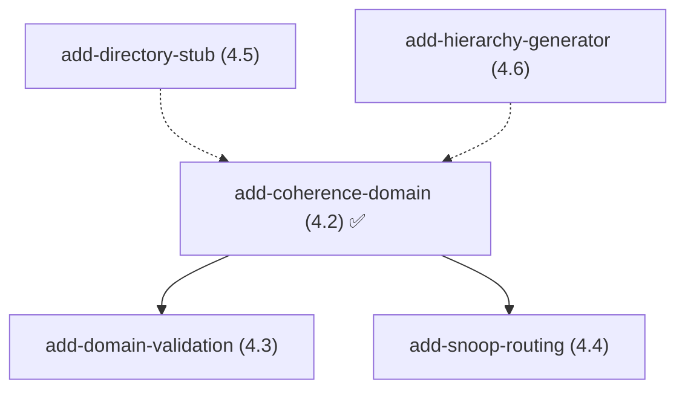

# OpenSpec 工作流状态

## 元信息
- **版本**: 5
- **创建时间**: 2026-05-27T04:15:00+08:00
- **最后更新**: 2026-05-28T18:30:00+08:00

## 工作流进度

### 阶段完成情况

| 阶段 | 状态 | 完成时间 |
|------|------|---------|
| setup | ✅ 完成 | 2026-05-27T04:15:00+08:00 |
| propose | ✅ 完成 | 2026-05-28T11:00:00+08:00 |
| deps | ✅ 完成 | 2026-05-28T11:15:00+08:00 |
| plan | ✅ 完成 | 2026-05-28T11:30:00+08:00 |
| execute | ✅ 完成 | 2026-05-28T18:20:00+08:00 |
| status_archive | ✅ 完成 | 2026-05-28T18:30:00+08:00 |
| cleanup | ✅ 完成 | 2026-05-28T18:30:00+08:00 |

## 当前状态

- **当前阶段**: 已完成
- **当前恢复点**: archive.complete
- **最后操作**: add-coherence-domain 已归档并合并到 main

### Changes（归档完成）

| 变更名称 | Worktree | Artifacts | 执行状态 | 当前操作 |
|----------|----------|-----------|---------|---------|
| add-coherence-domain | ✅ 已清理 | ✅ 已归档 | ✅ 完成 | 已合并到 main |

### 剩余 Changes（未开始）

| 变更名称 | Worktree | Artifacts | 执行状态 | Wave |
|----------|----------|-----------|---------|------|
| add-directory-stub | .zcf/add-directory-stub-wt | ✅ 已提交 | ⏳ 等待 | Wave 1 |
| add-domain-validation | .zcf/add-domain-validation-wt | ✅ 已提交 | ⏳ 等待 | Wave 2 |
| add-snoop-routing | .zcf/add-snoop-routing-wt | ✅ 已提交 | ⏳ 等待 | Wave 2 |
| add-hierarchy-generator | .zcf/add-hierarchy-generator-wt | ✅ 已提交 | ⏳ 等待 | Wave 3 |

## 执行依赖图

## 操作历史

| 时间 | 阶段 | 操作 | 结果 |
|------|------|------|------|
| 2026-05-27T04:15:00+08:00 | setup | env_check | ok |
| 2026-05-28T11:00:00+08:00 | propose | create_change | 5 个 change 已创建 |
| 2026-05-28T11:10:00+08:00 | propose | commit_artifacts | 全部提交到 git |
| 2026-05-28T11:15:00+08:00 | deps | auto_analysis | 依赖图生成完成 |
| 2026-05-28T11:25:00+08:00 | plan | worktree_created | 5 个 worktree 已创建 |
| 2026-05-28T11:30:00+08:00 | plan | plan_generated | TDD 计划已生成 |
| 2026-05-28T18:20:00+08:00 | execute | TDD_complete | 12 tests passed |
| 2026-05-28T18:25:00+08:00 | execute | merge | Fast-forward to e627b55 |
| 2026-05-28T18:30:00+08:00 | status_archive | archived | 归档为 2026-05-28-add-coherence-domain |
| 2026-05-28T18:30:00+08:00 | cleanup | worktree_removed | worktree + branch 已清理 |

## 归档 Change

- **2026-05-28-add-coherence-domain**: CoherenceDomain C++ module with TDD tests (Phase 4.2)